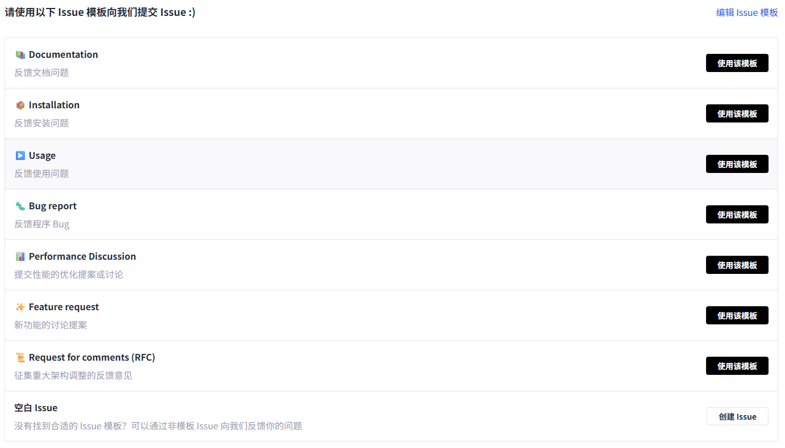

# Issue Submission and Handling Guide

## Contents

- [Issue Submission and Handling Guide](#issue-submission-and-handling-guide)
  - [Contents](#contents)
  - [Community Guide](#community-guide)
  - [New Issue Process](#new-issue-process)
    - [Issue Configuration Items](#issue-configuration-items)
  - [Label Description](#label-description)
    - [Content Labels](#content-labels)
    - [Priority Labels](#priority-labels)
  - [Committing Specifications](#committing-specifications)
    - [Title Requirements](#title-requirements)
    - [Content Requirements](#content-requirements)
    - [Code of Conduct](#code-of-conduct)
  - [Issue Lifetime](#issue-lifetime)

## Community Guide

This repository complies with the issue submission and handling process of the Ascend community. For details, see the following:

- [Issue Submission Guide in the Ascend Community](https://gitcode.com/Ascend/community/blob/master/docs/contributor/issue-guide.md)
- [Issue Handling Process in the Ascend Community](https://gitcode.com/Ascend/community/blob/master/docs/contributor/issue-workflow-guidelines.md)

## New Issue Process

To create an issue, perform the following steps:

1. Access the **Issues** page of a project.
2. Click **New Issue**.
3. Select an issue template. (Multiple templates are provided for you to choose from.)

### Issue Configuration Items

Enter the title and content of an issue on the left and set configuration items on the right.

- **Assignees**: Select the handler of an issue from all members of the current repository, including the owner and collaborator.
- **Labels**: Add a label to an issue for issue management and filtering.
- **Milestones**: Associate related issues with one milestone, which usually represents different versions or iterations.
- **Priorities**: Specify a priority to quickly identify important issues.

## Label Description

### Content Labels

| Label| Description|
| --- | --- |
| document | A need for improvements, additions, or updates to documentation.|
| installation | Installation and deployment problems, such as installation failure and dependency problems.|
| usage | Usage problems, such as feature usage and parameter configuration.|
| question | Consultation, such as technical consultation and feature suggestions.|
| bug | Incorrect feature or unexpected behavior.|
| feature | New feature requirements.|
| rfc | Suggestion on major architecture adjustment.|
| cve | Security vulnerabilities.|

### Priority Labels

| Label| Description|
| --- | --- |
| high-priority | High priority. The issue (for example, major bugs and core function impacts) needs to be handled as soon as possible.|
| medium-priority | Medium priority. The issue is handled according to the normal process.|
| low-priority | Low priority. The issue (for example, less important scenarios and optimization suggestions) can be handled later.|

## Committing Specifications

### Title Requirements

- **Clear and accurate**: Use one sentence to accurately describe your issue. Avoid using vague words.
- **Specific**: Include key information, such as the functional module and issue type.
- **Example**
  ✅ "The memory collection API process is suspended."
  ❌ "Collection failed."

### Content Requirements

1. Create an issue based on **template specifications**.
2. Make sure your issue include **key information**:
   - Reproduction procedure (step-by-step)
   - Expected result vs. Actual result
   - Operating environment (Ascend hardware information, CANN version, and installed software version)
   - Screenshots or minimum reproducible code
3. **Search before submitting**: Search for keywords on the **Issues** page to check whether your issue has been submitted.
4. Make sure each issue reports only one defect or proposes only one function requirement.
5. Select **appropriate labels** based on the issue type.

### Code of Conduct

1. **Timely response**: Provide supplementary information within seven days after receiving a reply from the maintainer. Otherwise, your issue will be marked as `stale` and may be closed.
2. **Be respectful**: Personal attacks, irrelevant advertisements, or privacy disclosure are prohibited.
3. **Timely issue closure**: The maintainer will close your issue after the problem is resolved. If you solve the problem by yourself, leave a message to describe the solution and close the issue.

## Issue Lifetime

1. **Submit**: You create an issue and fill in related information.
2. **Categorize**: The maintainer adds appropriate labels and priorities.
3. **Assignment**: The issue is assigned to a person in charge.
4. **Handle**: The person in charge analyzes the issue and provides a solution.
5. **Verification**: You verify whether the solution is effective.
6. **Closure**: The issue is closed after the problem is solved.

> We appreciate your every commit, and together, we all have the exciting opportunity to make this a community we can be proud of.
