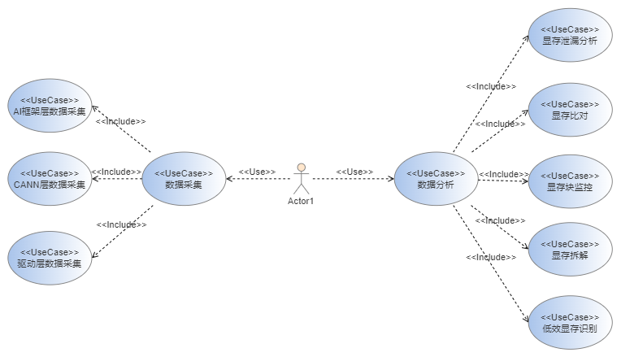
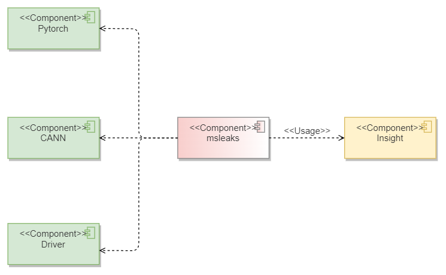
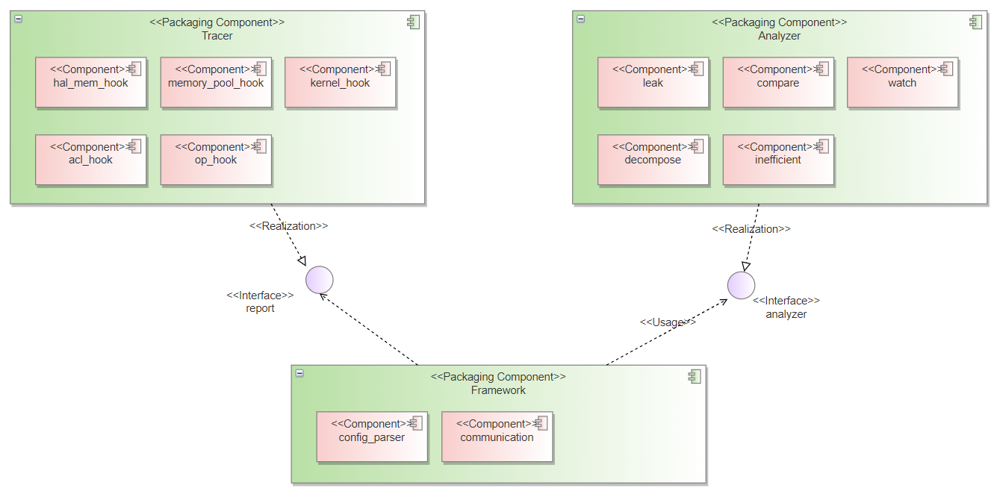
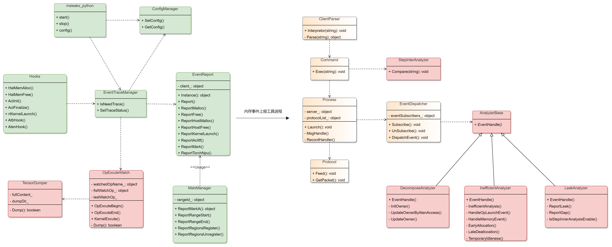
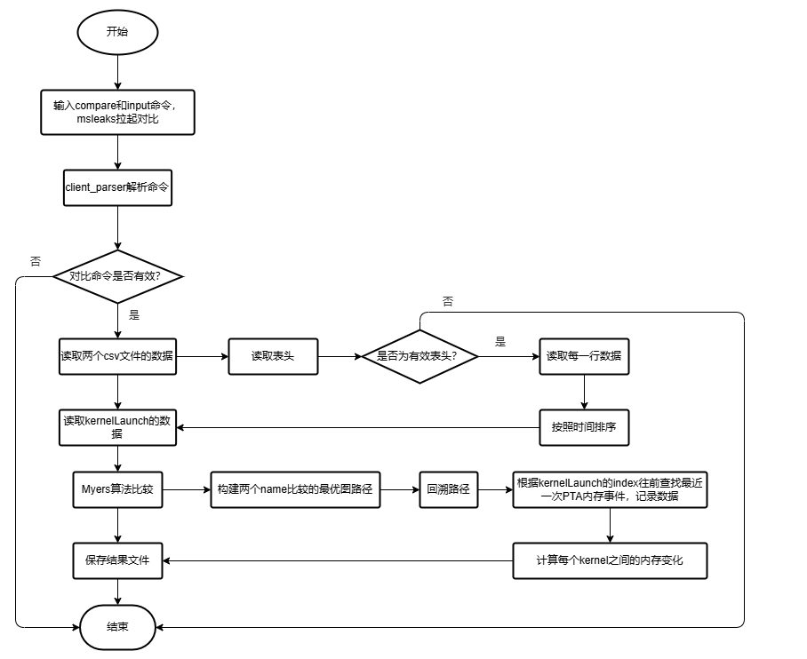
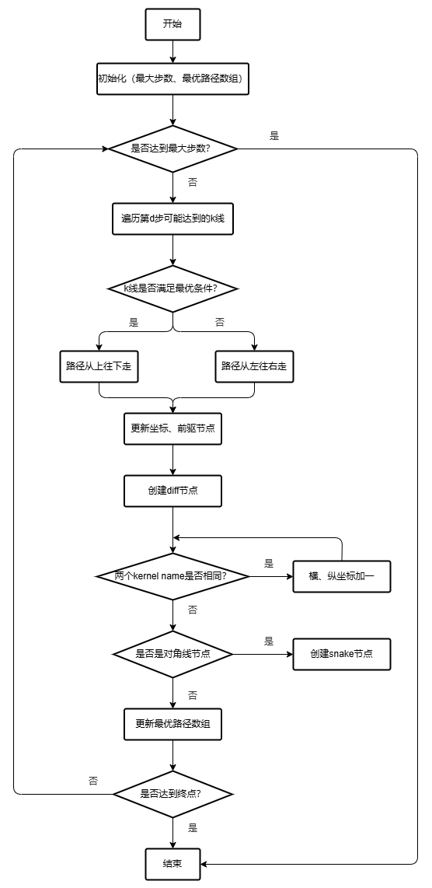
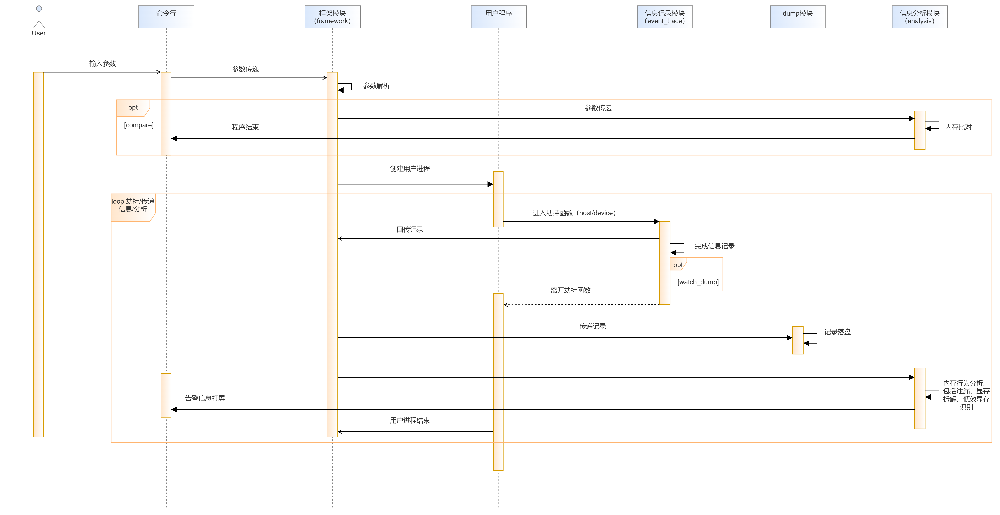
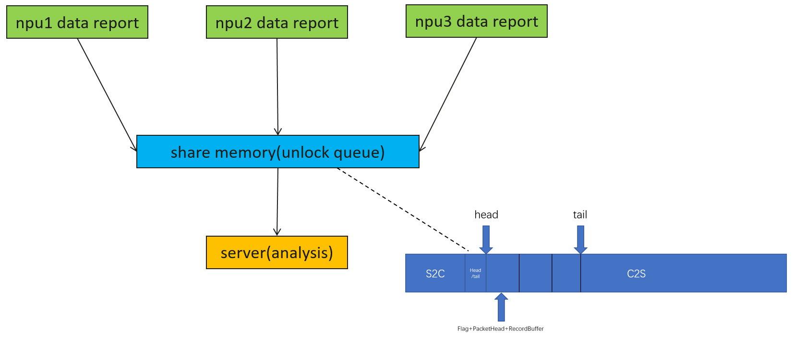

# memscope Component Implementation Design Specifications

    

Plan and design the following functional features and matching DFX capabilities:

| Type             | Function List                           | Function Description                                                                                                                    | Supported system functions      |
| ---------------- | --------------------------------------- | --------------------------------------------------------------------------------------------------------------------------------------- | ------------------------------- |
| Service function | Data Collection                         | Collects video memory usage data of the AI framework, CANN, and driver layers.                                                          | Data Collection                 |
| Service function | Custom Data Collection                  | Users can customize the collection scope and collection items.                                                                          | Data Collection                 |
| Service function | Leakage analysis                        | Supports memory pool leakage analysis in the PyTorch and Mindpore framework and video memory leakage analysis in the CANN component.    | Video buffer debugging          |
| Service function | Video buffer comparison                 | Compare the memory data collected by different software versions to find the differences.                                               | Video buffer debugging          |
| Service function | Video buffer block monitoring           | The operator is used as the monitoring event, and the specified video buffer is flushed before and after the event is executed.         | Video buffer debugging          |
| Service function | Video Memory Disassembly                | Decomposes the video memory usage and displays the video memory usage of each module in a visualized manner.                            | Video Memory Tuning             |
| Service function | Inefficient video memory identification | Identifies low-efficiency modes, including premature application, delayed release, and temporary idle.                                  | Video Memory Tuning             |
| DFX Function     | Log system                              | The C++ and Python modules share the same log system and support hierarchical control.                                                  | System maintainability          |
| DFX Function     | DT system                               | The overall functions of the white box care program through UT and FUZZ engineering                                                     | Program Function White Box Care |
| DFX Function     | Data collection plug-in                 | The hook component is isolated to facilitate expansion because collection items are easy to change and increase.                        | System Scalability              |
| DFX Function     | Smoked frame                            | Cover all functions in the main path of the tool and run the tool before the version is released and the code is stored in the library. | System reliability              |

## 3. Software implementation design objective analysis and key element design

### 3.1 Overall Design Objective Analysis

 * Data collection: Each data collection item is decoupled independently. A collection item can be quickly added, deleted, and modified without affecting other collection items.
 * Data analysis: The analysis module supports fast iteration and enables customers to define the analysis logic.
 * Strong code maintenance and test capabilities: When a fault occurs, the root cause can be quickly located based on the symptoms and logs.

### 3.2 Key Element Design

| Key elements     | Design Objective                                                                                                                                    |
| ---------------- | --------------------------------------------------------------------------------------------------------------------------------------------------- |
| Context View     | Provides the context of the component, and describes the interactions and dependencies outside the component.                                       |
| Logical View     | Describes the static relationships between functional modules of a component, and uses the component diagram to represent the static relationships. |
| Development view | Describes the submodules required for completing each functional module, and displays them in UML class diagrams.                                   |

\| Interaction view \| Displays the dynamic interaction relationships between modules, and describes the logic such as concurrency and synchronization. The logic is represented by a sequence diagram.

## 4. Development view

### 4.1 Implementation Model

#### 4.1.1 Overview

This section describes the software architecture of the components through the following views:

 * Context view: This view uses a component as a black box and describes the peripheral relationships of the component. From the dependency relationships, you can see the scope of data collected by the component, covering the AI framework, application layer, CANN layer, and driver.
 * Logical view: describes the interfaces and relationships between the three modules of the entire component. That is, the framework module relies on the information collection module to report data, invokes the analyzer to analyze data, and displays the submodules in each module.
 * UML class diagram: A class diagram shows the detailed internal and external interfaces and relationships of each module (including submodules) in a logical view. It is the finest static view.

#### 4.1.2 Context View

The tool depends on AI frameworks, CANN, and driver layers, and uses Insight to visualize and analyze data.

 * AI framework: Each AI framework has memory pool implementation. Therefore, only obtaining the overall memory usage is not enough. You need to obtain the memory behavior in the memory pool. Currently, the tool mainly depends on the pytorch and mindspore.
 * CANN: Under the AI framework, operator execution has a significant impact on the display memory. Therefore, the tool needs to detect the kernel launch and ACL status in the runtime.
 * Driver: The driver is at the bottom layer of the software stack. This layer can obtain the video memory allocation of all upper-layer applications and the actual execution status of the kernel.
 * Insight: The data collected by the tool is displayed by the visualization tool. You can view the video memory change trend and video memory usage details.
    
        

#### 4.1.3 Logical View

    

Similar to most memory analysis tools, it consists of three modules: data collection module, data analysis module, and framework module. Considering the efficient parallelism of data collection and data processing, the two modules run in different processes, data collection and data analysis are decoupled, and are connected in series through framework modules. The data collection module has hooks corresponding to each collection item and transfers data to the framework module through the report interface. The framework module parses the received data and forwards it to the concerned analyzer. The analysis module contains a series of analyzers. Each analyzer registers callback functions with the framework module. The reverse registration mode is weakly coupled and highly scalable. When new data is sent to the framework, the framework forwards the data based on the registered analyzer. The software unit list is as follows:

| Software unit           | Description                                                                                                                 | External interface       | Internal interface      | Relationship Description                                                                                                                                                                   |
| ----------------------- | --------------------------------------------------------------------------------------------------------------------------- | ------------------------ | ----------------------- | ------------------------------------------------------------------------------------------------------------------------------------------------------------------------------------------ |
| Data acquisition module | Collect memory-related data through hooks and send the data to the framework module.                                        | ReportRecordEvent        | Report_xx_hooks         | The entire module collects data through hook and registration callback, and then sends the data to the framework after certain processing.                                                 |
| Data analysis module    | Registers callback with the framework module and receives and analyzes the data sent by the collection module.              | RecordHandler            | xx_analyze              | Analyzes the collected data, including video buffer leakage, comparison, and monitoring.                                                                                                   |
| Frame module            | As the system entry, it parses command lines and connects data collection and analysis modules and instrumentation modules. | CommandParser, MsgHandle | DoLaunch, SetPreloadEnv | Parses the customer's CLI configuration, completes the configuration of the data collection and analysis module, and transmits the data from the collection module to the analysis module. |

#### 4.1.4 Software Implementation Unit Design

**UML class diagram**

    The class diagram is divided into three parts: data collection (green part), data analysis (red part), and frame (yellow part).

 * Data collection: Data collection includes LD_PRELOAD hijacking (hooks), MSTX dotting (MstxManager), runtime, and driver (kernel data in Hooks) reporting. The EventTraceManager class is used to determine whether data needs to be collected. If data needs to be reported, the EventReport interface is invoked to report the data to the framework. You can use the msmemscope_python module to set the collection scope and collection items.
 * Data analysis: Currently, the analysis module includes LeakAnalyzer, StepInterAnalyzer, OpExcuteWatch, DecomposeAnalyzer, and low efficiency. InefficientAnalyzer.
 * Framework module: Parses the Linux common command line (ClientParser), connects the data collection module and analysis module (Process and EventDispatcher), and communication module (server and client).
 * Tool modules: Not shown in the figure, mainly log modules, character string processing, numerical calculation, and file reading and writing.

### 4.2 Interfaces

#### 4.2.1 Overall Design

The interfaces are divided into three parts:

 * External interfaces: There are two types of external interfaces of the memory tool. One is the command line interface and the other is the python interface, that is, the interface that can be directly perceived by the client plane. The interface must be stable and compatible.
 * External interfaces of internal modules: Interfaces between internal modules and other modules, which are important for the stable software architecture. The interfaces must be abstract and extensible. This section describes the main objects.
 * Internal module internal interface: This part describes the internal interface organization form of a module, which is used to implement the specific functions of the module.

#### 4.2.2 Design Objectives

 * External interfaces must be orthogonal, easy-to-use, and compatible.
 * Stable interfaces are abstracted based on the main functions of the module. For the collection module, the external interfaces remain unchanged after collection items are added, deleted, or modified. The analysis module supports dynamic addition, deletion, and modification of analysis algorithms.

#### 4.2.3 Design Constraints

NA

#### 4.2.4 Technical selection

Generally, the training and promotion large model scripts use the Python language. Therefore, the Python interface must be supported. In addition, some device-side inference scenarios do not have the Python environment. Therefore, the command line interface must be supported.

#### 4.2.5 Software Unit

The following describes the main interfaces based on the framework module, data collection module, and data analysis module.

##### 4.2.5.1 Frame module

1. Interface Description
    
    ```text
    The framework module provides the following functions (interfaces):
    * Parses Linux commands and generates data collection and analysis configurations.
    * Forks a subprocess to start the customer script.
    * Provides process communication interfaces, including the read and write functions of the server and client, and the message packaging and unpacking functions.
    * Provides the message forwarding mechanism to forward messages from the data collection module to the data analysis module.
    ```

2. Interface List
    
    ```text
    Interface name: UserCommand Parse(int32_t argc, char **argv)
    Interface function: Parses the command line and generates configurations.
    Direction: from the command line input to the framework module
    Input parameter: number of command line parameters and their values.
    Output parameter: N/A.
    Return value: configurations obtained after parsing, including the data to be collected and the analysis algorithm.
    Precautions: The command line input must comply with the preset rules. Otherwise, the parsing fails, the process is terminated, and the help information is returned.
    ```

    ```text
    Interface name: void Process::Launch(const std::vector<std::string> &execParams)
    Interface function: Forks a process and works with execvpe to start the customer script. (The LD_PRELOAD variable must be set before this.)
    Direction: internal important interface of the framework module
    Input parameter: command and input parameters of the customer script.
    Output parameter: N/A.
    Return value: N/A.
    Precautions: After the customer subprocess is started, the main process enters the waiting state until the subprocess ends or exits abnormally.
    ```

    ```text
    Interface name: int ServerProcess::Notify(std::size_t clientId, const std::string& msg)
    Interface function: Sends data using the shared memory.
    Direction: from the server to the client
    Input parameter: ID of the client that needs to receive data and the data packet.
    Output parameter: N/A.
    Return value: size of the sent data packet. If the value is greater than or equal to 0, the data packet is successfully sent, and the return value indicates the number of bytes that are actually sent. If the value is less than 0, the data packet fails to be sent.
    Precautions: When the data packet fails to be sent, the corresponding maintenance and testing or resending mechanism is required. (The ClientProcess has a symmetric interface, which is not described here.)
    ```

    ```text
    Interface name: int ServerProcess::Wait(std::size_t clientId, std::string& msg);
    Interface function: Receives data using the shared memory.
    Direction: from the client to the server
    Input parameter: ID of the client that needs to receive data and the data packet.
    Output parameter: N/A.
    Return value: size of the received data packet. If the value is greater than or equal to 0, the data packet is successfully received, and the return value indicates the number of bytes that are actually received. If the value is less than 0, the data packet fails to be received.
    Precautions: When the data packet fails to be received, the corresponding maintenance and testing or resending mechanism is required. (The ClientProcess has a symmetric interface, which is not described here.)
    ```

    ```text
    Interface name: void Process::MsgHandle(size_t &clientId, std::string &msg)
    Interface function: This interface is used to unpack the data packets sent from the client to the server and distribute the packets at the first layer. For log messages, the interface forwards them to the log module for processing. For record messages, the interface forwards them to the record processing module.
    Direction: from the client to the server
    Input parameter: ID of the client that needs to receive data and data packets.
    Output parameter: N/A
    Return value: N/A
    Precautions: When multiple clients send messages to the server concurrently, the unpacking buffer of each pipe must be independent to avoid mutual impact.
    ```

    ```text
    Interface name: void EventDispatcher::DispatchEvent(std::shared_ptr<EventBase>& event, MemoryState* state)
    Interface function: This interface is used to distribute the data packets sent from the client to the server at the second layer and process the data record events.
    Direction: from the framework module to the analysis module
    Input parameter: data record event and memory block buffer.
    Output parameter: N/A
    Return value: N/A
    Precautions: Only the registered analyzer forwards the corresponding event. If the analyzer is not registered, the event is not forwarded.
    ```

    ```text
    Interface name: void EventDispatcher::Subscribe(const SubscriberId& id, const std::vector<EventBaseType>& eventTypes, const Priority& priority, const HandlerFunc& func)
    Interface function: This interface is used by the analyzer to send the registration request to the data forwarding module.
    Direction: from the analysis module to the framework module
    Input parameter: ID of the analyzer, event types to be monitored, priority of the notification, and callback function.
    Output parameter: N/A
    Return value: N/A
    Precautions: Only the registered analyzer forwards the corresponding event. If the analyzer is not registered, the event is not forwarded. In addition, the forwarding priority is specified by the priority parameter.
    ```

    ```text
    Interface name: void EventDispatcher::UnSubscribe(const SubscriberId& id)
    Interface function: This interface is used by the analyzer to send the deregistration request to the data forwarding module.
    Direction: from the analysis module to the framework module
    Input parameter: ID of the analyzer.
    Output parameter: N/A
    Return value: N/A
    Precautions: N/A
    ```

##### 4.2.5.2 Data acquisition module

1. Interface Description
    
    ```text
    The data collection module provides the following functions (interfaces):
    * Hook interface for each data collection item
    * Interface for controlling whether the current system needs to collect data and which data to be collected
    * Interface for reporting data to the framework module.
    ```

2. Interface List
    
    ```text
    Interface name: drvError_t halMemAlloc(void **pp, unsigned long long size, unsigned long long flag);
    drvError_t halMemFree(void *pp);
    Interface description: This interface is used to hijack the memory allocation and usage at the HAL layer.
    Direction: driver -> tool
    Input parameters: address, size, and flag. The flag contains information such as the module ID and memory attributes.
    Output parameter: N/A
    Return value: Driver error code.
    Precautions: N/A
    ```

    ```text
    Interface name: atb::Status _ZN3atb6Runner7ExecuteERNS_17RunnerVariantPackE(atb::Runner* thisPtr, atb::RunnerVariantPack& runnerVariantPack)
    Interface description: This interface is used to hijack the ATB op execution interface and obtain the ATB op execution information.
    Direction: atb -> tool
    Input parameters: runner instance pointer and input and output information related to the op.
    Output parameter: N/A
    Return value: ATB error code.
    Precautions: N/A
    ```

    ```text
    Interface name: void _ZN3atb9StoreUtil15SaveLaunchParamEPvRKN3Mki11LaunchParamERKSs(aclrtStream stream, const Mki::LaunchParam& launchParam, const std::string& dirPath)
    Interface description: This interface is used to hijack the ATB kernel execution interface and obtain the ATB kernel execution information.
    Direction: atb -> tool
    Input parameters: stream status, operator input and output information, and operator information.
    Output parameter: N/A
    Return value: N/A
    Precautions: N/A
    ```
    
    ```text
    API name: aclError aclInit(const char *configPath)
    aclError aclFinalize()
    API description: Hijacks the ACL initialization and termination APIs.
    Direction: runtime -&gt; tool
    Input parameter: ACL path information
    Output parameter: N/A
    Return value: N/A
    Precautions: N/A
    ```
    
    ```text
    API name: rtError_t rtKernelLaunch(const void *stubFunc, uint32_t blockDim, void *args, uint32_t argsSize, rtSmDesc_t *smDesc, rtStream_t stm)
    API function: Hijacks the kernellaunch-related APIs. (There are several similar APIs, which are not described here.)
    API direction: runtime -&gt; tool
    Input parameter: operator registration function, blockdim, output and output information, stream status, etc.
    Output parameter: runtime error code.
    Return value: N/A.
    Precautions: N/A.
    ```
    
    ```text
    Interface name: bool EventTraceManager::IsNeedTrace(const RecordType type)
    Interface function: Determines whether a collection item needs to be collected.
    Interface direction: inside the collection module
    Input parameter: record type
    Output parameter: N/A
    Return value: Boolean value.
    Precautions: N/A.
    ```
    
    ```text
    Interface name: bool EventReport::ReportXXX(RecordBuffer &infoBuffer)
    Interface function: Sends a collection item from the data collection module to the framework module.
    Interface direction: internal of the collection module
    Input parameter: records detailed information.
    Output parameter: N/A
    Return value: Boolean value.
    Precautions: N/A.
    ```

##### 4.2.5.3 Data Analysis Module

1. Interface Description
    
    ```text
    The data collection module provides the following functions (interfaces):
    * Entry of the analysis module (abstract interface)
    * Entry of each analyzer (specific interface)
    ```
    
2. Interface List
    
    ```text
    Interface name: void AnalyzerBase::EventHandle(std::shared_ptr<EventBase>& event, MemoryState* state) = 0;
    Interface description: External abstract interface of the analysis module
    Direction: from the framework module to the analysis module
    Input parameter: information about the currently received event
    Output parameter: N/A
    Return value: N/A
    Precautions: N/A
    ```

    ```text
    Interface name: void Dump::EventHandle(std::shared_ptr<EventBase>& event, MemoryState* state)
    Interface description: Main interface of the dump module
    Direction: from the framework module to the analysis module
    Input parameter: information about the currently received event
    Output parameter: N/A
    Return value: N/A
    Precautions: N/A
    ```

    ```text
    Interface name: void InefficientAnalyzer::EventHandle(std::shared_ptr<EventBase>& event, MemoryState* state)
    Interface description: Main interface for identifying the inefficient memory mode
    Direction: from the framework module to the analysis module
    Input parameter: information about the currently received event
    Output parameter: status of the memory block
    Return value: N/A
    Precautions: N/A
    ```
    
    ```text
    Interface name: void DecomposeAnalyzer::EventHandle(std::shared_ptr<EventBase>& event, MemoryState* state)
    Interface description: Main interface for memory decomposition
    Direction: from the framework module to the analysis module
    Input parameter: information about the currently received event
    Output parameter: status of the memory block
    Return value: N/A
    Precautions: N/A
    ```

### 4.3 Algorithm Implementation

#### 4.3.1 Design Objectives

This component involves the memory comparison in the data analysis module. This function aims to unify the memory used by model parameters in different CANN, PyTorch, and MindSpore versions.

#### 4.3.2 Design Constraints

1. The algorithm needs to accurately compare the memory usage before and after the same kernel is invoked and calculate the difference.
2. The algorithm must be able to identify and locate the key differences between different versions of data when different kernels are invoked.
3. The algorithm needs to achieve efficient, stable and scalable performance under the premise of ensuring precision and recall.

#### 4.3.3 Technical selection

For this algorithm, the core challenge is to accurately identify and locate the differences between the kernel invoking in different versions of data. The ideal effect should be similar to the diff function in Git - efficiently identifying the kernel call locations for new, deleted, or sequential changes in two copies of data.

Considering that the data between versions is very similar and only a few kernel calls are added or deleted or sequenced, Myers algorithm is used as the core difference comparison strategy. When the sequence similarity is high and the difference is small (namely, the minimum editing distance D is small), the time complexity is O(ND), where N is the sum of the lengths of two sequences and D is the minimum editing distance. The O(N2) complexity is much better than the traditional dynamic programming method. In actual scenarios, kernel invoking in different versions is basically the same, only partial changes, which fits the optimal application scenario of Myers algorithm, and thus can achieve efficient and accurate difference locating, while considering performance and precision.

#### 4.3.4 Algorithm Implementation

**Memory comparison flowchart**

    

1. Parse the command line parameters and the corresponding data in the CSV file, and obtain the kernel launch data for comparison.
2. Myers algorithm is used to compare the names of KernelLaunch of two files. The core of this algorithm is to transform the text sequence comparison problem into the path search problem of editing graph. After the optimal graph path of the two sequences is constructed, the path is a backtracking path from the end point. The path contains the same position and different kernel names. When the backtracking is performed at each point, the memory change data is searched and calculated based on the KernelLaunch ID.
3. Save the recorded kernel memory change data to the comparison result file.

**Myers algorithm graph construction path flowchart**

    

First, the algorithm combines two text A`[a, b, c, d]`(length: m), B`[e, f, g, h]`The length is n, which is constructed as an m\*n grid. The horizontal axis indicates the position of text A, and the vertical axis indicates the position of text B. Each point in the grid is`(x, y)`Indicates that the first x elements of text A and the first y elements of B have been compared, and from the start point`(0, 0)`To the end`(m, n)`Path of. Each step corresponds to an editing operation.

 * If you move one step to the right, the element in A is deleted, that is, the element names in A are different.
 * Moving one step down indicates that the element in B is inserted, that is, the name of the element in B is different.
 * A step along the diagonal indicates that A and B have the same element name.

At the same time, the algorithm introduces the concept of k-line:`k=x-y`d indicates the number of steps to the right or down. The ultimate goal is to find the`(0, 0)`To the`(m, n)`Shortest path for. Myers algorithm initializes the distance and path data when constructing the optimal graph path, then records the furthest x coordinate that each k line can reach, increases the distance d, and searches for a new k line. (The value ranges from -d to d, with a step of 2.) Calculate the farthest reachable coordinates on the k-line. Know until you find the end. snake is used to represent diagonal nodes, and the text at this position of the two sequences is the same; The Diff node is used to represent the difference node, and the text at the position of the two sequences is different.

### 4.4 Security Implementation Design

#### 4.4.1 Security Design Objectives

> The tool is mainly used to run the customer training script, flush the data related to memory behavior, and analyze the data. The main security design objective of the tool is to collect memory behavior based on the complete running of the customer's training and promotion script. The corresponding data meets the confidentiality requirements and the tool availability must be maintained. The security items involved include external file input security protection, generated file and log security verification, secure hash algorithm, and memory access security.

#### 4.4.2 Security Design Context

> The northbound interface of the tool mainly includes the commands entered by customers, Python interfaces, and file input and output. For the Python and command lines, parameter validity is verified at the entry, and file input and output are protected based on security requirements. Southbound components, such as runtime, driver, PyTorch, mindspore, and atb, trace their memory behavior, legalize obtained data, and expose it to customers.

#### 4.4.3 Identification of High Risks

##### 4.4.3.1 Identification of High-Risk Modules

> List modules that are considered high risk and describe why they are considered high risk.

| Module name                       | Module Function Description                                                   | Analysis of High-Risk Modules in the Design Domain            | Corresponding code directory       | Language Type | Remarks |
| --------------------------------- | ----------------------------------------------------------------------------- | ------------------------------------------------------------- | ---------------------------------- | ------------- | ------- |
| Parameter parsing module          | Parse and record command line parameters.                                     | Verify the correctness of the input parameters.               | framework/client_parser.cpp        | C++           |         |
| File read-in and write-out module | Read and write files                                                          | Verify the file path, permission, type, and content validity. | utility/path.cpp                   | C++           |         |
| Hash calculation module           | Performs the hash operation on the tensor binaries that are flushed to disks. | Secure hash algorithms must be used to prevent cracking.      | utility/calculate_data_check_sum.h | C++           |         |

##### 4.4.3.2 High-Risk API Identification

> List the APIs that are considered high-risk and describe why they are considered high-risk.

| High-risk API                                | Interface Description                                                                                          | Analysis of High-Risk Interface Functions                                                                                | Corresponding code directory       | Language Type | Remarks |
| -------------------------------------------- | -------------------------------------------------------------------------------------------------------------- | ------------------------------------------------------------------------------------------------------------------------ | ---------------------------------- | ------------- | ------- |
| ClientParser.Parse                           | Parses command parameters and completes initial configuration.                                                 | The validity of each command line input must be verified and the input of customers must be controlled by the trustlist. | framework/client_parser.cpp        | C++           |         |
| CheckIsValidInputPath/CheckIsValidOutputPath | Verify the paths of input and output files, including the readability, path length, soft link, and permission. | Verify the validity of the input and output files.                                                                       | utility/path.cpp                   | C++           |         |
| CalculateDataCheckSum64                      | Calculate the hash value of the tensor value.                                                                  | Secure random algorithms are used to prevent cracking.                                                                   | utility/calculate_data_check_sum.h | C++           |         |

#### 4.4.4 Code Implements Security Prevention Processing

> For each identified high-risk module and API, describe the security protection measures to be taken in detail.

High-risk module security hardening

**1. Data protection does not involve customer privacy data.**

**2. The input of the module dependency and third-party library on the northbound interface is verified in the ClientParser.Parse/CheckIsValidInputPath/CheckIsValidOutputPath interface, avoiding pollution of the internal running environment. Southbound interfaces are standardized in their hijacking interfaces to ensure that the data to be flushed to disks is unified and valid.**

**3. Error Handling If the input parameters in the command line fail to be verified, the system prompts the user to output help information and terminates the program. If the input file path, permission, soft link, invalid characters, writable, owner group, and owner are verified, If the verification fails, the process exits and no further operation is required. Output files are flushed to disks with the permission of folder 750, file 640, and read-only file 400. If the flushing fails, the tool generates a log indicating the current exception. If an error occurs when the hash algorithm is used, the program stops immediately and the corresponding print is recorded in the log module.**

**4. Log audit**

1. When the function is normal, information of the ERROR and WARNING levels cannot be printed.
2. Do not print in loop and high-frequency APIs to avoid massive screen brushing.
3. Pay attention to the number of debug logs. Do not print massive logs to cover important information.

### 4.5 Developer Test Model

#### 4.5.1 Design Objectives

Developer self-testing is an important step in achieving high-quality software release. Generally, white-box and black-box tests are used to cover functions.

 * White-box test objective: The coverage rate of code lines is greater than 80%, and the coverage rate of branches is greater than 60%. In addition, the FUZZ test project is added to verify the code before the code is uploaded to the database.
 * Objective of the black-box test: Build the smoke platform, perform full test cases before the version is released, and complete basic test cases before the code is uploaded to the library.

#### 4.5.2 Design Constraints

The test directory is added to the home directory for white-box test monitoring. The code is mainly C++ and the gtest framework is used. In the black box, the new code repository is used to integrate smoke code and use cases.

#### 4.5.3 Testability Design

 * White-box test: Based on the gtest framework and mock mechanism, most code interfaces can be covered. A few private interfaces cannot be accessed. The problem can be solved by replacing macro definitions to meet the white-box test coverage requirements of the PDU.
 * Black-box test: Test suites are divided based on large function blocks, test cases are added based on features, and the smoke environment is started using the Python interface. In addition, test suites and test cases can be selected. If a test case fails, the running of other test cases is not affected.

#### 4.5.4 Layered Test

Generally, the test is divided into three modules: unit test (UT), interface test (IT), and system test (ST). Due to the particularity of the tool, the interfaces of the test are relatively few and can be directly covered by the UT because the UT is divided into two layers: UT and ST. The UT monitors the logic errors of the code units, intercepts problems at the front end, and ensures that a large number of problems are found and solved before the board is put into use. ST is an end-to-end test, which is also the most important for tools. The smoke test is also divided into two layers. Level 1 is the primary path for monitoring most functions (more than 80%) and the efficiency is high (minute-level). Level 1 is used as the verification before large-granularity code is uploaded to the database. Level 2 provides complete test case monitoring, covering all test cases and analysis. Tests are performed before each version is released and iteration is transferred to the test.

#### 4.5.5 Key test technical solution

The test technical scheme is described from the white box and black box perspectives.

1. Test engineering design UT directory test and source code csrc directory are at the same level. The internal subdirectory and function code are symmetrical.
    
    ```text
    memscope
    |-- build
       |-- build.py
    |-- csrc
       |-- framework
       |-- event_trace
       |-- analysis
       |-- main.cpp
    |-- output
       |-- bin
          |-- msmemscope
    |-- test
       |-- framework
       |-- event_trace
       |-- analysis
       |-- test_main.cpp
    ```
    
    The smoke project directory contains the msmemscope deliverable directory (msmemscope), smoke case source code directory (csrc), test script directory (testfile), and product and log directory (workbench). The subdirectories in the workbench correspond to test suites, facilitating fault locating.
    
    ```text
    memscope_case
    |-- msmemscope
       |-- output
    |-- csrc
       |-- test_suit
       |-- utils
    |-- testfile
       |-- csvfile
       |-- script
    |-- workbench
    ```

2. The physical design is not involved.
3. The white-box running environment is a common Linux environment. The source code and test project can be compiled. The ST needs to run on the Ascend server. A maximum of eight NPU cards are required based on the script. There is no requirement on the chip model.
4. In the white-box test, functions such as dlopen and dlsym must be mocked. Otherwise, a failure message will be returned in the general Linux environment without the Ascend environment, and most test scenarios cannot be covered.

## 5. Running view

### 5.1 Interaction Model

#### 5.1.1 Design Objectives

It provides two functions: data collection and data analysis. The framework module is connected and transitioned. Data collection and analysis are performed in different processes. Data and scheduling do not affect each other. The framework module provides memory sharing process communication mode to maximize interaction efficiency.

#### 5.1.2 Design Constraints

NA

#### 5.1.3 Interaction Model Design

**In the sequence diagram, after the customer enters the corresponding command line, the framework module parses the parameters entered by the customer, forks the subprocess, and starts the tested program in the subprocess. During the running of the tested program, the hijacking module in the event_trace hijacks and records the memory time in the tested program, and sends the data to the framework module through the communication between socket processes. The framework module cleans the data and forwards the data to the corresponding analysis module for analysis. Specially, if the step-to-step comparison mode is used, the processing is offline, and the data collection process is not involved. If the watch function is used, the judgment and flushing functions are processed by the client module because the watch function does not require data aggregation. The overall running view is as follows:**

    

### 5.2 Concurrency Model

#### 5.2.1 Design Objectives

Currently, the single-server-multiple-client interaction mode is used. Multiple clients (usually one client corresponds to one NPU card) send messages to the server concurrently. The design must ensure that the communication module can read and write data in an orderly and efficient manner without data loss when processing high-concurrency client messages. There is a fault tolerance mechanism.

#### 5.2.2 Design Constraints

Currently, the size of the shared memory is designed to be 200 MB (based on historical experience). When the system memory is insufficient, the maximum remaining memory is used.

#### 5.2.3 Concurrent Model Design

Each NPU corresponds to a client to report data. The tool process receives data from all NPUs for the server, and summarizes and analyzes the data. \* \* Therefore, the concurrency model is designed as a multi-producer and single-consumer model. Shared memory + lockless queue is considered as the most efficient inter-process communication mode, and is also the communication mode adopted by this component. As shown in the following figure, the shared memory is divided into two segments. The first segment is the configuration request message sent from the server to the client. The global configuration is performed only once. In the other part, the client sends data to the server. Multiple processes where the NPUs are located write data to the shared memory at the same time. In this example, lock-free queues and atomic variables are used to ensure that data does not conflict when data is written to multiple NPUs. The server uses a resident thread to read data. Each time one more data is written, the tail moves one bit backward. When one data is read, the head moves one bit backward. When head=tail, no data is stored in the queue.    
