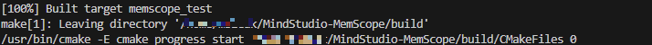
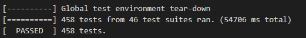
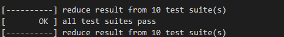

# msMemScope Development Guide

## 1. Development Environment Settings

Ensure that your environment meets the following requirements. A Linux environment is recommended.

| Software| Version Requirement| Description|
| --- | --- | --- |
| Python | v3.10.x (recommended)| Tool script|
| GCC | ≥ 5.1 | Compiler|
| GIT | None| Code pulling and submitting|
| CMake| Earliest version: 3.16<br> Latest version: 4.1.3| Backend project building and compilation|

## 2. Procedure

### 2.1 Downloading Code

Fork the repository to your private repository and clone the project in the private repository to the local host.

Note: If you use HTTPS to clone the repository, set a token as the password as required by GitCode.

### 2.2 Downloading Third-Party Dependencies and Compiling Projects

Before the first compilation and building, you need to download some dependencies of the repository. The repository provides scripts to assist in dependency download, compilation, and building.

Before running the following commands, ensure that your terminal has accessed the local repository directory and the network is normal.

```shell
cd build
python build.py local test
```

Parameters:

- `local`: local building. If this parameter is added, dependencies such as gtest, json, and secure are downloaded for local building. Generally, these dependencies are downloaded only for the first building unless they are updated.
- `test`: test cases.

After the dependencies are successfully downloaded, the following information is displayed.

```shell
============ download thirdparty done ============
```

After the compilation is successful, the following information is displayed.



### 2.3 Developing Functions

The implementation code of msMemScope is divided into three main modules: csrc, python, and test. The directory structure is as follows:

```shell
|-- csrc                 # C++ source code
   |-- framework         # Command line parsing, interacting with event_trace to obtain memory events and send the events to analysis for processing.
   |-- event_trace      # Records memory events and submits them to framework.
   |-- analysis         # Analyzes and processes memory events.
   |-- utility          # General non-service functions
   |-- python_itf        # Provides the Python-bound interface layer binding for C++.
   |-- main.cpp
|-- python              # Python source code
   |-- msmemscope
|-- test                # UT and ST
```

When modifying, adding, or deleting service code, modify the corresponding test code.

### 2.4 Verifying Functions

After a function is developed, you need to debug and verify the function locally. Run the following commands to complete function building and deployment.

```shell
cd build
cmake ..
make
```

You can specify the `-j` parameter during compilation to enable parallel compilation. For example, to enable eight threads for parallel compilation, run the following command:

```shell
make -j8
```

The compilation output is deployed in the `output` directory. The directory structure is as follows:

```shell
output
├── bin
│   ├── msmemscope
│   └── msmemscope.bin
├── lib64
│   ├── _msmemscope.so
│   ├── libascend_kernel_hook.so
│   ├── libascend_leaks.so
│   ├── libascend_mstx_hook.so
│   ├── libatb_abi_0_hook.so
│   ├── libatb_abi_1_hook.so
│   └── libleaks_ascend_hal_hook.so
```

#### 2.4.1 Performing UT

The UT cases are stored in the `./test` directory. The gtest framework is used to perform UT. The rules for adding UT cases are as follows:

1. The case directory structure must be the same as the code directory structure. The naming format is `test_functional module`.
2. To facilitate fault locating, the case name format is `Functional module_Function to be tested_Expected result`.
3. If you add a directory and source code to `./csrc`, add a directory with the same name to `./test` and add test cases when compiling UT cases. In addition, add the source code directory to `./test/CMakeLists.txt`.

After a test case is developed, run the following commands to automatically build and run the test case. Ensure that all test cases pass.

```shell
cd ..
bash ./build/run_test_case.sh
```

If all UT cases pass, the following information is displayed.



Note: UT cases must meet the following coverage requirements.

| Category| Coverage|
| --- | --- |
| Line coverage rate| 80.0% |
| Branch coverage rate| 60.0% |

Typically, when code is committed, the gated check-in automatically runs and generates a coverage report. (You are advised to view the coverage report in the gated check-in. The local coverage report may be different from that in the gated check-in.) To generate a report locally, run the following commands:

```shell
# Ensure that the test cases have been run before the report is generated.
bash ./build/run_test_case.sh
bash ./build/generate_coverage.sh
```

The report is generated in the `./coverage/report.tar.gz` directory. You can download the report and open the **index.html** file using a browser.

#### 2.4.2 Performing ST

After an ST case is developed, run the following commands to automatically build and run it. Ensure that all ST cases pass.

```shell
cd ./test/smoke
bash run_st.sh
```

If all ST cases pass, the following information is displayed.



### 2.5 Adding an Example

If you have developed a new function and need to add an example to show the function, perform the following steps:

1. Add the function directory based on the format in the `./example` directory.
2. Add the README file of your function to describe the features, preparations, execution examples, and results.
3. Add sample execution code in API mode. Both Python and bash scripts are required.
4. Add the following environment variable settings of API mode to the bash script:

```shell
#!/bin/bash

TOOL_PATH='msmemscope_path'
export LD_PRELOAD=${TOOL_PATH}/lib64/libleaks_ascend_hal_hook.so:${TOOL_PATH}/lib64/libascend_mstx_hook.so:${TOOL_PATH}/lib64/libascend_kernel_hook.so
export LD_LIBRARY_PATH=${TOOL_PATH}/lib64/:${LD_LIBRARY_PATH}
```
