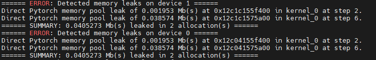
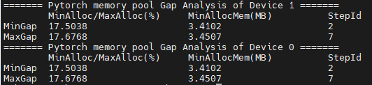
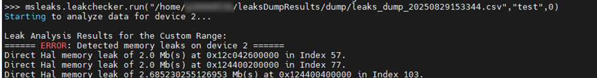

# **Memory Analysis**

## Overview

msMemScope provides analysis capabilities such as leak detection, comparison, monitoring, decomposition, and identification of inefficient memory based on the collected memory data, helping you quickly diagnose and optimize memory problems.

|Analysis Capability|Description|
|--|--|
|Memory leak|If memory is not released for a long time or memory leaks occur, msMemScope provides memory leak analysis and kernel-launch-based memory change analysis to locate and analyze problems.|
|Memory comparison|If the memory usage differs between two steps, it may lead to excessive memory usage or even out of memory (OOM) errors. In this case, use the memory comparison analysis function of msMemScope to locate and analyze the problem.|
|Memory block monitoring|In foundation model scenarios, if it is difficult to locate memory corruption, msMemScope can monitor the specified memory blocks before and after operator execution through Python APIs and CLIs. Based on changes in the memory block data, it can quickly determine the scope or exact location of memory corruption between operators.|
|Memory decomposition|msMemScope supports memory decomposition to analyze the memory usage of the CANN layer and Ascend Extension for PyTorch framework and outputs model weights, activations, gradients, and optimizer and other component memory usage.|
|Identification of inefficient memory|During model training and inference, some memory blocks may not be used immediately after being allocated or may not be deallocated in a timely manner after being used. msMemScope identifies the inefficient memory usage to optimize model training and inference.|
|One-click analysis|msMemScope supports on-click memory decomposition and memory snapshot to improve memory analysis usability, allowing core functions of vLLM, FSDP, and verl to be automatically dotted for quick analysis.|

## Preparations

For details about how to install msMemScope, see [msMemScope Installation Guide](./install_guide.md).

## Memory Leak Analysis

### Function Description

Memory issues include memory leak, corruption, and fragmentation, which may cause excessive memory usage. msMemScope can locate memory leak issues.

### Precautions

- If the **--events** parameter needs to be set when the memory analysis function is used, ensure that the **--events** parameter contains **alloc** and **free**.
- Do not set the **--steps** parameter when using the memory analysis function.
- Currently, offline analysis mode supports only HAL memory leak analysis.
- Currently, memory leak analysis does not apply to vLLM-Ascend.

### Usage Example

Memory leak analysis supports both online and offline modes.

**Online Mode**

During memory analysis, use the mstx instrumentation function to locate issues. For details about mstx instrumentation, see [MindStudio Tools Extension Library Interfaces](<>).

1. Use msMemScope to start the user program (represented by **Application**).

    ```shell
    msmemscope ${Application}
    ```

2. Check the command output after the command is executed.
    - If the information shown in [Figure 1 Memory leak](#leak) is displayed, a memory leak occurs. The command output displays the summary information about memory leaks of each device, including the number of steps where memory leak occurs, associated kernel, address, and leak size.

        Figure 1 Memory leak<a id="leak"></a>
        

    - If the information shown in [Figure 2 Memory fluctuation](#fluctuation) is displayed, the memory fluctuates. The command output displays the memory fluctuation in a single step (defined by the ratio of the minimum memory pool allocation to the maximum memory pool allocation) and the minimum memory pool allocation. The minimum ratio and maximum ratio are provided as references. Users can determine whether there is a memory leak risk based on the ratio.

        > [!NOTE]Note 
        > The memory is not stable in the first step. Therefore, only the memory fluctuation from the second step can be analyzed. The memory fluctuation in the first step can be ignored.

        Figure 2 Memory fluctuation <a id="fluctuation"></a>

        

**Offline Mode**

msMemScope supports offline leak analysis of memory events in a specified range. After using mstx to mark the memory leak analysis range, you can use this function to analyze the dumped files.

1. Apply the mstx mark function to the range where leak detection is required. For details about mstx instrumentation, see [MindStudio Tools Extension Library Interfaces](<>).

    > [!NOTE]Note  
    > - The mark information is used as the input of the offline analysis interfaces.
    > - Use the mark function to mark three points, which are referred to as A, B, and C. The memory allocated within the range from A to B must be deallocated before point C. Otherwise, the memory is considered as a memory leak.

2. Use the msMemScope to start the user program (represented by **Application**) and obtain the dumped .csv file.

    ```shell
    msmemscope ${Application}
    ```

3. Call the Python interface to perform offline leak analysis on the .csv file.

    ```python
    import msmemscope
    msmemscope.check_leaks(input_path="user/memscope.csv",mstx_info="test",start_index=0)
    ```

    The parameters are as follows:

    - **input_path**: path of the .csv file. An absolute path is required.
    - **mstx_info**: mstx text information used for mark instrumentation, which is used to mark the range of leak analysis.
    - **start_index**: ID of the instrumentation location where the memory leak analysis starts, that is, the sequence number of the mstx instrumentation location that meets the analysis conditions.

    If the information shown in [Figure 3 Offline leakage analysis](#analysis) is displayed, a memory leak occurs.

    Figure 3 Offline leakage analysis <a id="analysis"></a>

    

## Memory Comparison

### Function Description

If the training and inference parameters are the same but the CANN version does not match the version of Ascend Extension for PyTorch or MindSpore, memory usage of two different steps of training and inference jobs may be different, causing excessive memory usage or even OOM. msMemScope then can be used to compare memory to effectively locate memory issues.

### Precautions

Before using this function, collect data of two different steps.

### Usage Example

1. Disable the optimization of the **task_queue** operator dispatch queue.

    ```shell
    export TASK_QUEUE_ENABLE=0
    ```

2. Add the mstx instrumentation code to the training/inference code. For details, see [Memory Leak Analysis](#memory-leak-analysis).
3. Use msMemScope to collect memory data of two different steps. You are advised to collect data of only one step at a time. After the data of two different steps is collected, the data can be used for memory comparison between steps.

    ```shell
    msmemscope [options] ${Application} --steps=Required Step --level=kernel
    ```

    The parameters are as follows:
    - **options**: command line options. For details, see [Collection via CLI](./memory_profile.md#collection-via-cli).
    - **Application**: user program.
    - **steps**: ID of a specified step.

4. Compare the memory usage between the two steps.

    ```shell
    msmemscope --compare --input=path1,path2 --level=kernel
    ```

    **--compare** and **--input** must be used together. The two file paths specified by **--input** must be separated by a comma (full-width or half-width). **--level** can also be set to **op**.

5. Check the result directory generated after the comparison between steps.

    ```shell
    |- memscopeDumpResults
           |- compare
                   |- memory_compare_{timestamp}.csv
    ```

### Output Description

You can query and locate the memory issues between steps based on output files. For details, see [Output File Specifications](./output_file_spec.md).

## Memory Block Monitoring

### Function Description

In foundation model scenarios, the computing task of a single card is highly complex. If memory corruption occurs, it is very difficult to locate the problem. msMemScope monitors the specified memory block before and after operator execution through Python interfaces. Based on the changes of the memory block data, it locates the range or specific location of memory corruption between operators.

### Precautions

 - The memory block monitoring function supports only Aten single-operator and ATB operators. You can set **--level** to specify the memory block monitoring at the op and kernel levels.
 - In the Ascend Extension for PyTorch scenario, kernel monitoring is only performed through the Python interfaces and is not supported via **watch**. For monitoring via the Python interfaces, see [3](#3).
 - You need to limit the range of operators to be monitored and the memory block size to prevent longer dump times and excessive drive space consumption due to overly large value settings.
 - The memory block monitoring function is not supported by VLLM-Ascend because VLLM-Ascend does not support the setting of **ASCEND_LAUNCH_BLOCKING=1**.

### Usage Example

1. Disable multi-task dispatch.

    ```shell
    export ASCEND_LAUNCH_BLOCKING=1
    ```

2. Enable memory block monitoring.

    ```shell
    msmemscope ${Application} --watch=start:outid,end,full-content
    ```

    **Table 1** Parameters

    |Parameter|Description|
    |--|--|
    |Application|Executable scripts of the user. If you need to use the Python interfaces to specify the tensor to be monitored, see [3](#3).|
    |--watch|Enables the memory block monitoring function.<br> - **start**: optional, string type. It indicates the start of operator monitoring.<br> - **outid**: optional. It indicates the output ID of the operator. When the tensor is a list, you can specify the tensor that needs to be dumped to a given path. The value is the subscript number of the tensor in the list.<br> - **end**: mandatory, string type. It indicates the end of operator monitoring.<br> - **full-content**: optional. It indicates that all memory data is dumped to the specified path, meaning the binary file of each tensor is dumped to the path. If this value is not selected, the light-weight dump is performed, and only the hash value of the tensor is dumped to the path.<br> Example: **--watch=token0/layer0/module0/op0,token0/layer0/module0/op1,full-content**|

3. <a id="3"></a>In the executable script of the user, invoke the Python interfaces to specify the tensor to be monitored.

    The interfaces of the Python watcher module are added. The **watch** interface indicates that the memory block is monitored, and the **remove** interface indicates that the memory block monitoring is canceled. There are two methods to enable memory block monitoring. For details about the parameters in the sample code, see [Table 2 Parameters-for-enabling-memory-block-monitoring](#parameters-for-enabling-memory-block-monitoring).

    > [!NOTE]Note   
    > You are advised to use method 1 to specify the tensor to be monitored. If method 2 is used, confirm the validity of the memory block address and length.

    - Method 1: Input the tensor directly.

        The example script is as follows:

        ```python
        import torch
        import torch_npu
        import msmemscope
        
        torch.npu.synchronize()
        test_tensor = torch.randn(2,3).to('npu:0')        # Create or select the tensor to be monitored as required.
        msmemscope.watcher.watch(test_tensor, name="test", dump_nums=2)
        ...
        torch.npu.synchronize()
        msmemscope.watcher.remove(test_tensor)
        ```

    - Method 2: Input the address and length of the memory block.

        The example script is as follows:

        ```python
        import torch
        import torch_npu
        import msmemscope
        
        torch.npu.synchronize()
        test_tensor = torch.randn(2,3).to('npu:0')       
        msmemscope.watcher.watch(test_tensor.data_ptr(), length=1000, name="test", dump_nums=2)
        ...
        torch.npu.synchronize()
        msmemscope.watcher.remove(test_tensor.data_ptr(), length=1000)
        ```

    Table 2 Parameters for enabling memory block monitoring<a id="parameters-for-enabling-memory-block-monitoring"></a>

    |Parameter|Description|
    |--|--|
    |name|Mandatory. It identifies the monitored tensor to be dumped.|
    |dump_nums|Optional. It specifies the number of dumps. If no value is specified, the number of dumps is unlimited.|
    |test_tensor.data_ptr()|Mandatory. It indicates the address of the monitored tensor. This parameter is required only when method 2 is used to enable memory block monitoring.|
    |length|Mandatory. It indicates the length of the monitored memory block. When **length** is specified, the non-keyword argument can only be an integer variable of the address type. It is recommended that the **length** value be less than or equal to the size of the known monitored tensor memory block. This parameter is required only when method 2 is used to enable memory block monitoring.|

4. Check the result directory of memory block monitoring after command execution.

    ```text
    ├── memscopeDumpResults             
    │    └── watch_dump
          │    ├── {deviceid}_{tid}_{opName}_{Number of calls}-{watchedOpName}_{outid}_{before/after}.bin       # A .bin file is flushed if full-content is specified.
          │    ├── watch_dump_data_check_sum_{deviceid}_{timestamp}.csv         # A .csv file is flushed if full-content is not specified.
    ```

### Output Description

The output of the memory block monitoring function is stored in a .bin or .csv file.

- The .bin file records the detailed dump result of the tensor.
- The .csv file records only the hash value of the tensor.

## Memory Decomposition

### Function Description

msMemScope adds Python interfaces to allow users to describe code segments.

### Precautions

- Methods 1 and 2 in the following support a maximum of three unique tags.
- You can enable memory decomposition in automatic mode (described in the following part) or one-click mode ([One-Click Analysis](#one-click-analysis)). Memory decomposition applies to the following scenarios.

    |Scenario|Description|
    |----|-----|
    |Training|You can enable memory decomposition for weights, gradients, and optimizers during training.|
    |Inference|You can enable memory decomposition for the vLLM inference framework to analyze the memory usage of **load_weight**, **profile_run**, **kv_cache**, and **activate** during inference.|
    |Reinforcement learning|Reinforcement learning (verl) involves two phases: inference and training. Currently, the one-click analysis function can be used to enable memory decomposition only during the inference phase. During training, you can enable memory decomposition in automatic mode.|

### Usage Example

msMemScope provides Python interfaces and uses **describe** to mark a tensor, function, or code segment. There are three usage methods.

- Method 1: Use the decorator to decorate a function. The **owner** attribute of all memory allocation events in the function will be tagged with **test1**.

    ```python
    import msmemscope.describe as describe
    
    @describe.describer(owner="test1")
    def train1():
        pass
    ```

- Method 2: Use the **with** statement to mark the code block. The **owner** attribute of all memory allocation events in the block will be tagged with **test2**.

    Code example 1:

    ```python
    import msmemscope.describe as describe
    
    with describe.describer(owner="test2"):
        train2()
    ```

    Code example 2:

    ```python
    import msmemscope.describe as describe
    
    describe.describer(owner="test3").__enter__()
    train3()
    describe.describer(owner="test3").__exit__()
    ```

- Method 3: Mark a tensor. The **owner** attribute of the memory allocation event corresponding to the tensor is added with a user-specified tag.

    ```python
    import msmemscope.describe as describe
    
    t = torch.randn(10,10).to('npu:0')
    describe.describer(t, owner="test4")
    ```

### Output Description

The result is saved in the **memscope_dump_{_timestamp_}.csv** file. For details, see [Output File Specifications](./output_file_spec.md).

## Identification of Inefficient Memory

### Function Description

During model training and inference, some memory blocks may not be used immediately after being allocated or may not be deallocated in a timely manner after being used. As a result, the memory usage increases, leading to inefficient memory.

Inefficient memory refers to a tensor object whose memory allocation, deallocation, and access operations are improper on the device during model running.

msMemScope can identify three types of inefficient memory at the operator level: early allocation, late deallocation, and temporary idleness. For details, see [Table 1 Inefficient memory types](#inefficient-memory-types).

Table 1 Inefficient memory types<a id="inefficient-memory-types"></a>

|Type|Description|
|--|--|
|Early allocation|A tensor object is considered to be allocated early if other tensor objects are deallocated between its memory allocation operator and its first access operator.|
|Late deallocation|A tensor object is considered to be deallocated late if other tensor objects are allocated between its last access operator and its memory deallocation operator.|
|Temporary idleness|A tensor object is considered temporarily idle if the number of operators between any two of its memory access operations exceeds a given threshold.|

### Precautions

msMemScope can identify only inefficient memory in ATB LLM and Ascend Extension for PyTorch single-operator scenarios.

### Usage Example

Run the following command to enable identification of inefficient memory. **Application** is the user script.

```shell
msmemscope ${Application} --analysis=inefficient
```

Inefficient memory can also be identified offline via custom APIs. For details, see [API Reference](./api.md).

### Output Description

The result is saved in the **memscope_dump_{_timestamp_}.csv** file. For details, see [Output File Specifications](./output_file_spec.md).

## One-Click Analysis

### Function Description

msMemScope allows memory decomposition or memory snapshot in one-click mode in mainstream training or inference scenarios.

### Precautions

The one-click analysis function can quickly enable memory decomposition or memory snapshot collection. For details, see [Memory Decomposition](#memory-decomposition) and [Memory Snapshot Collection](./memory_profile.md#collection-via-python-apis).

### Syntax

The one-click analysis function contains two APIs.

- **init_framework_hooks(framework,version,component,type)**

    This API is used to initialize the analysis patch. The following table describes its parameters.

    |Parameter|Description|
    |-----|-------|
    |framework|Supported framework. Currently, only vLLM-Ascend is supported.|
    |version|Framework version. Currently, only vLLM-Ascend 11.0 is supported.|
    |component|Component or module to be hooked. For example, worker corresponds to vLLM-Ascend, and actor_rollout\ref\critic\reward corresponds to verl.<br> Currently, only worker is supported. |
    |hook_type|Hook function. Currently, **decompose** (for memory decomposition) and **snapshot** (for memory snapshot) are supported.|

- **cleanup_framework_hooks()**

    This API is used to clear all previously applied patch functions.

### Usage Example

The following describes how to enable one-click memory decomposition in the vLLM inference framework.

1. Set the configuration file to importing msMemScopre, clear historical records through `cleanup_framework_hooks`, and use `init_framework_hooks` to configure the required framework type, version, component, and feature.

    The following is an example:

    ```python
    import msmemscope
    msmemscope.config(
    events="alloc,free",
    data_format="db",
    analysis="decompose",
    output="/vllm-ascend/wlz_data_test"
    )
    msmemscope.cleanup_framework_hooks()
    msmemscope.init_framework_hooks("vllm_ascend","11.0","worker","decompose")
    ```

2. Set `msmemscope.start()` and `msmemscope.stop()` to collect data. After the collection is complete, the flushed data contains the **owner** field for memory decomposition.

### Output Description

The one-click analysis function supports only memory decomposition and memory snapshot. For details about the output information, see [Memory Decomposition](#memory-decomposition) and [Memory Snapshot Collection](./memory_profile.md#collection-via-python-apis).
