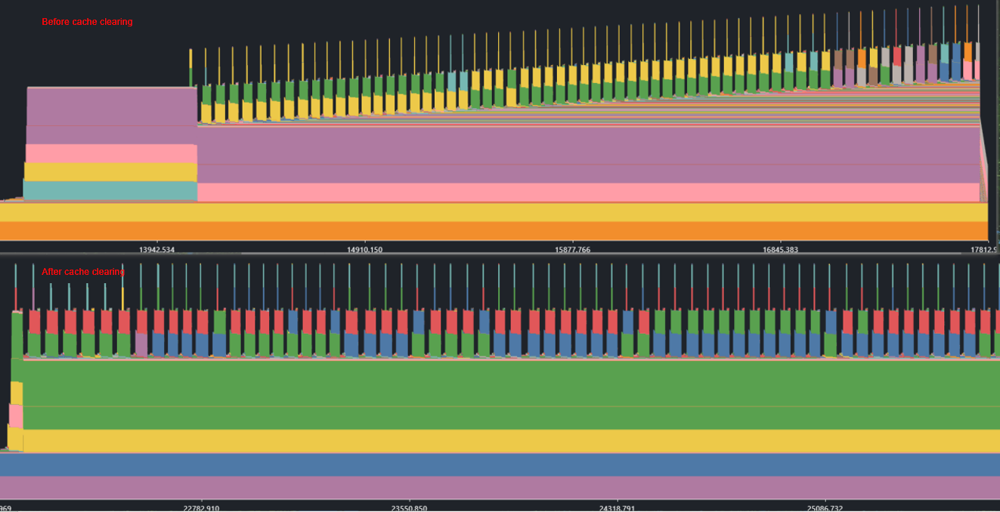
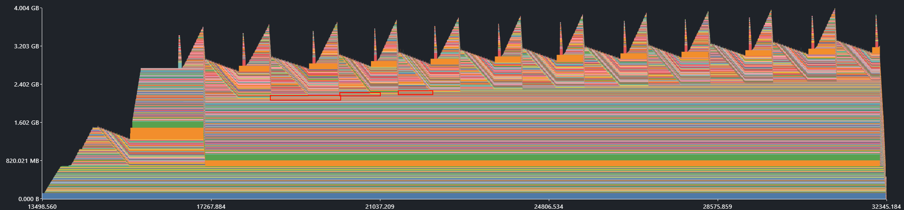
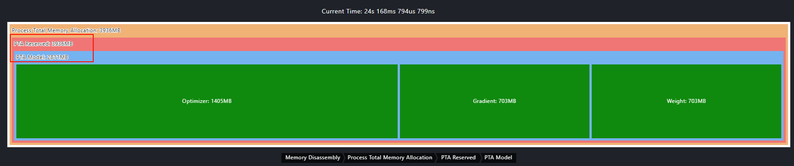

# Memory Leak

- Symptom: The total memory usage keeps increasing over time and cannot be converged. This is a common recurring issue.
- Impact factors: memory allocation algorithm and cache mechanism

| Problem| Definition                                  | Symptom                                                          | Common Cause                                                      |
| -------- | -------------------------------------- | -------------------------------------------------------------- | -------------------------------------------------------------- |
| Memory leak| Memory that has outlived its lifecycle remains unreleased for extended periods.      | The physical memory usage keeps increasing, which is a common recurring issue.                          | 1. The release interface is not called in the code. 2. Inappropriate reference relationships cause unnecessary object references to be retained for long periods.|
| Memory fragmentation| The available memory is fragmented, and large contiguous memory blocks cannot be allocated.| The physical memory usage keeps increasing (or the suite memory pool keeps expanding), but the allocated memory in the suite memory pool does not increase significantly.| 1. The service logic frequently alternates between requesting and releasing both large and small memory blocks, while some small memory blocks remain resident. 2. The memory defragmentation logic fails.|

## Clarifying Problem Information

At its core, a memory usage problem comes down to answering four questions: who should use the memory, who should not, how much memory each block should receive, and how long each block should live.

**Before locating problems, confirm certain information to facilitate subsequent data collection and analysis.**

| Category                                      | Main Information                                                    | Description                                                        |
| ------------------------------------------ | ------------------------------------------------------------ | ------------------------------------------------------------ |
| Symptom                                  | Symptom                                                    | Memory usage increased, OOM, and memory exception                                      |
| Environment                                  | Scenario                                                        | Training or inference scenario                                          |
| Framework                                      | PyTorch, ATB, MindSpore, GE, etc. Some memory pools support multiple methods to monitor memory.|                                                              |
| Single-operator or graph mode                            | The information collected in graph mode is limited, making analysis relatively difficult.                  |                                                              |
| Model                                      | If a self-developed model is involved, you are advised to understand its structure (such as LLaMA-like or GPT-like architectures).        |                                                              |
| Specifications                                  | Number of devices and servers                                                |                                                              |
| Parallelism strategy                                  | Specific parallel parameter configurations                                        |                                                              |
| Version                                      | Framework and version                                                  | Clarify the CANN and MindSpore/Torch versions. Check for recent version changes, that is, confirm whether the problem is caused by version changes.|
| Memory optimization objective                              | Time required for reproducing a problem                                                | If reproducing a problem takes more than one hour, exercise caution when configuring the collection tool's parameters. The goal is to avoid collecting invalid data while still fully supporting problem analysis.|
| Problem location scope and expectations| It is recommended that you understand the customer's optimization objectives. This helps reduce redundant work and facilitates problem localization with clear goals.|                                                              |

Some memory management configurations are set through environment variables. The following table lists the known configurations for related scenarios. **You can first check the status of these environment variables.**

| Scenario                                                     | Environment Variable                                                  |
| --------------------------------------------------------- | ---------------------------------------------------------- |
| PTA used for memory allocation, with virtual memory enabled to optimize the idle memory in the memory pool| **export PYTORCH_NPU_ALLOC_CONF=expandable_segments:True** |
| GE used for idle memory optimization in the memory pool: CANN 8.0.RC3.beta1 or later| **export GE_USE_STATIC_MEMORY=3**                          |
| Optimizing operator workspace reuse in the ATB scenario                         | **export ATB_WORKSPACE_MEM_ALLOC_GLOBAL=1**                |

## Troubleshooting Method

A common symptom of the on-chip memory leak is an unexpected, continuous increase in the device's physical memory usage, which often occurs periodically. Common scenarios of periodic leakage are as follows:

- Memory usage increases after each step/token/output ends.

- Memory usage increases each time the configuration is dynamically modified (common in serving inference).

### Cache Clearing

Symptom 1: During the training of a foundation model, the on-chip memory usage keeps increasing after each step ends, eventually leading to an OOM error. 
This is likely caused by the cache mechanism of PyTorch. Temporary tensors are generated during each forward and backward propagation, and these tensors are cached but not released in a timely manner.

Try clearing the cache at appropriate points to eliminate leak-like symptoms caused by cache accumulation:

- **Training scenario**: after the end of each epoch and step

- **Inference scenario**: after each inference request is processed and after batch processing is complete

- **Serving scenario**: after each request is processed and before configuration changes

At these points, memory usage may fluctuate. Clearing the cache can effectively prevent continuous memory usage increase caused by cache accumulation.

```shell
# Clear unreachable Python objects.
gc.collect()
# Clear the torch_npu cache.
torch_npu.npu.empty_cache()
```



The comparison before and after cache clearing shows that memory usage continuously increases beforehand but stabilizes afterward.

Clearing the cache is the first step in resolving on-chip memory leaks. However, if the problem persists after clearing, memory fragmentation may be the culprit. The following section describes the process of troubleshooting and resolving memory fragmentation issues.

### Memory Fragmentation Troubleshooting

In some scenarios, the continuous accumulation of memory fragments in the memory pool can also result in symptoms similar to memory leaks. A typical characteristic of these symptoms is that the memory pool continues to expand before memory is allocated. There are three common troubleshooting methods. If any of the following situations occur, it is highly likely that memory fragments have accumulated.

1. Use msMemScope to collect and visualize memory data. Select a later time point and view the breakdown of on-chip memory usage, which shows a significant difference between **PTA Reserved** and **PTA Model**.

2. Use the Profiler tool to collect and visualize memory data. The memory curve shows that **operators allocated** does not increase significantly, but **operators reserved** increases intermittently.

3. Enable snapshot to collect data and visualize it. On the **state history** tab page, select a time point with high memory usage and view the memory pool status diagram, which reveals a large number of small, white (unallocated) memory blocks.

The following figure shows memory fragmentation when the virtual memory is not enabled, using snapshot data as an example.


If PTA memory fragmentation occurs, try enabling the virtual memory:

```shell
export PYTORCH_NPU_ALLOC_CONF=expandable_segments:True
```

The following figures memory fragmentation when the virtual memory is enabled, using snapshot data as an example.


In this case, you can trigger memory defragmentation at a proper time, for example, after each epoch ends, after batch processing completes, or during off-peak hours for request processing.

```python
torch_npu.npu.empty_cache()
```

If the on-chip memory leak persists after memory fragmentation is resolved, you need to further filter memory blocks that are not released for a long time.

### Filtering Long-Term Memory

After collecting and analyzing memory data, if you find that several large memory blocks have remained unreleased for a long time, view their allocation call stacks to locate the code causing the memory leak.

When using msMemScope to collect memory data, you are advised to follow the following configurations:

- **Enable call stack collection**: Set the `call_stack` parameter to record the complete call chain of memory allocation.

- **Skip the initialization phase**: Some reasonable resident memory may exist during the initialization phase.

- **Extend the collection time appropriately**: If the data volume permits, extend the collection time as needed.

#### Example

To help you better understand the troubleshooting process, we create a simple memory leak scenario to demonstrate the end-to-end data collection and analysis process.

**Scenario**

During training, the global on-chip memory usage continuously increases.

**Data Collection Procedure**

1. Prepare a collection script to enable leak detection, on-chip memory decomposition, and call stack collection.

    ```python
    import msmemscope
    msmemscope.config(analysis="leaks, decompose", call_stack="python")  # Enable leak detection, on-chip memory decomposition, and call stack collection.
    ```

2. Configure environment variables and execute the collection script to collect data.

3. View the outputs of the collection process.

    

    As shown in the figure, multiple on-chip memory blocks of about 1.5 MB are leaked in each step, and a total of about 398 MB on-chip memory is leaked.

4. Use MindStudio Insight for analysis.

Use MindStudio Insight to open the trace file.

Step 1: Open the data file.


Step 2: View the memory block graph.

In the memory block graph, you can observe that peak memory usage increases with each training epoch. Additionally, some memory blocks are generated during each epoch but never released. This reasonably suggests that these blocks are leaked on-chip memory, which drives the increase in peak on-chip memory usage.



Step 3: Locate the leaked block.

Click the suspected leaked memory block to view its details.


From the figure, you can observe that **memory address** is 0x000012c067600200 and **size** is 2,096,640 bytes.

In the **System View**, search for the observed address to view the allocation call stack of the memory block.


The call stack information is as follows:

***

"/opt/miniconda3/envs/torch2.6/lib/Python3.11/site\-packages/torch/\_ops.py\(723\): \_\_call\_\_
./memscope/build/msmemscope/Python/msmemscope/aten\_collection.py\(187\): \_\_torch\_dispatch\_\_
./memscope/example/memory\_leak\_demo.py\(99\): create\_memory\_leak
./memscope/example/memory\_leak\_demo.py\(150\): main
./memscope/example/memory\_leak\_demo.py\(163\): &lt;module>"

***

Step 4: View the on-chip memory decomposition graph.



Memory used by the framework:

- **Weight** represents the on-chip memory occupied by model parameters

- **Gradient** represents the on-chip memory occupied by gradients during backward propagation.

- **Optimizer** (optimizer_state) represents the on-chip memory occupied by the state variables maintained by the optimizer.

Memory used by the memory pool:

- **PTA Reserved** (memory pool reserved for the PyTorch Ascend framework): 3936 MB

- **PTA Model** (on-chip memory actually used by the model): 2811 MB

The difference between the two values is 1125 MB, indicating that memory fragmentation may occur. The following figure shows the data collected by Snapshot, indicating that a large number of memory fragments exist.


**Conclusion**

Based on the call stack information, line 99 of `memory_leak_demo.py` is the memory leak source, that is, `leak_tensor = torch.randn(512, 512).to\(device)`. The leaked size is 398 MB. According to the on-chip memory decomposition graph, the reserved on-chip memory is 1125 MB more than the on-chip memory occupied by the model, indicating that on-chip memory fragmentation occurs.

In addition to the preceding methods, for Python processes, we need to pay special attention to Python object leaks. The following section describes how to troubleshoot on-chip memory leaks caused by Python objects.

### Troubleshooting Python Object Leaks

For Python processes, memory leaks are often closely related to the reference of Python objects. In Python processes, memory leaks are often closely related to the referencing of Python objects. The recommended troubleshooting approach follows a logical sequence: first, determine whether the leak is attributable to Python objects; second, identify the leaked objects; and third, locate their allocation points.

#### 1. Check whether Python object leaks occur

Periodically collect statistics on the total memory usage of Python objects at key locations to check whether there is a periodic increase.

```python
import gc
import sys

# Obtain all traced objects.
objects = gc.get_objects()
# Calculate the memory used by all objects.
total_memory = sum(sys.getsizeof(obj) for obj in objects)
print(f"Total memory used by tracked objects: {total_memory} bytes")
```

**Suggested location**:

- **Training scenario**: after each step
- **Inference scenario**: after each inference request is processed
- **Serving scenario**: after each request is processed

If memory usage increases periodically, a Python object leak occurs. If not, there is no need to check for Python object leaks.

#### 2. Locate the leaked Python objects

Method 1: Proactively trigger garbage collection.

The lifecycle of Python objects is managed through reference counting. In special scenarios (such as cyclic references), objects may not be automatically reclaimed.

```python
import gc
gc.collect()
```

After garbage collection is triggered, check whether the memory usage falls back to the expected level.

Method 2: Compare snapshots to identify where memory growth occurs.

Use the `tracemalloc` module to compare memory snapshots taken at different time points.

```python
import tracemalloc
tracemalloc.start()

def train():
    # Service code
    if self.step == n:
        # Take the first memory snapshot, preferably after step 3 has been completed.
        self.snapshot1 = tracemalloc.take_snapshot()
    
    if self.step == n + 1:
        # Take the second memory snapshot.
        self.snapshot2 = tracemalloc.take_snapshot()
        
        # Compare the two snapshots to identify memory allocation differences.
        top_stats = self.snapshot2.compare_to(self.snapshot1, 'lineno')
        
        # Print the memory allocation differences.
        for stat in top_stats[:10]:
            print(stat)
```

Since the first few steps may involve many initialization operations, it is recommended that the first memory snapshot be taken at or after the third step or the initialization phase be skipped based on the actual service situation.
Output example:

```shell
/home/test.py:3: size=576 B (+576 B), count=1 (+1), average=576 B
/home/test.py:6: size=144 B (+144 B), count=1 (+1), average=144 B
```

In this way, you can locate the memory growth point.

##### 3. Search for the object allocation point

Check the object reference relationship based on the locating result.

Case 1: logic code bug

If an object is not released due to a bug in the code, fix the bug based on the service logic.

Case 2: residual implicit reference

If the code does not explicitly reference an object but the object is not released, check the reference relationship.

```python
import sys
import gc
import objgraph

# Obtain the object reference count.
print(sys.getrefcount(obj_global_ref))

# Obtain all object referrers.
referrers = gc.get_referrers(obj_global_ref)
for ref in referrers:
    print(f"referrer: {ref}")

# Use a visualization library to display the reference relationship topology.
objgraph.show_refs([obj_global_ref], filename="refs.png", max_depth=5)
```

The reference topology can clearly show the reference links of objects and help to locate improper reference points.

#### Advanced Debugging: Tracing the Container Creation Stack

If an object is not released in time due to improper references, you can locate the reference points of the residual object by following the steps described above. If the reference points are objects such as `frame`, `code`, and `func` (the residual object is a local variable), the attributes of these objects contain relevant code information. If the reference point is a common object, such as a list container, and the code corresponding to the reference point cannot be directly identified, you can add debugging information by attaching a hook to `gc`. Assume that the result of `gc.get\_referrers` shows that the residual object is referenced by a tuple, but the code location associated with that tuple is unknown.

```python
import gc
import inspect
import threading

# Store the creation stack of the target object.
creation_stack = {}
lock = threading.Lock()

def gc_callback(phase, info):
    """gc callback function: records the object's creation stack."""
    if phase != 'start':
        return
    for obj in info.get('uncollectable', []) + info.get('collected', []):
        if isinstance(obj, tuple) and id(obj) not in creation_stack:
            with lock:
                creation_stack[id(obj)] = inspect.stack()

# Register the gc callback.
gc.callbacks.append(gc_callback)
gc.collect()

# ... Target code segment...

# Trigger gc again to obtain the creation stack.
gc.collect()
target_obj = gc.get_referrers(obj)[0]
if id(target_obj) in creation_stack:
    stack = creation_stack[id(target_obj)]
    print("Object creation stack:")
    for frame in stack:
        print(f"  File: {frame.filename}, Line number: {frame.lineno}")

# Remove the callback.
gc.callbacks.remove(gc_callback)
```

By following the preceding troubleshooting process, you can quickly locate the root cause of Python object leaks.
