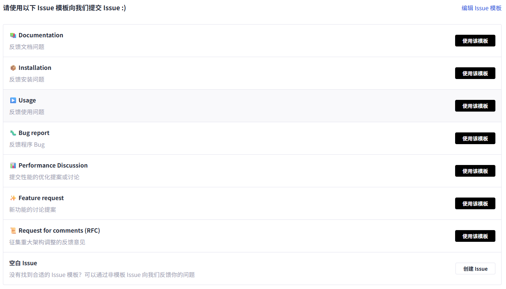

# Issue提交指南

## 目录

- [社区指南](#社区指南)
- [新建Issue流程](#新建issue流程)
- [标签说明](#标签说明)
  - [内容类型标签](#内容类型标签)
  - [优先级标签](#优先级标签)
- [提交规范](#提交规范)
  - [标题要求](#标题要求)
  - [内容要求](#内容要求)
  - [行为规范](#行为规范)
- [Issue生命周期](#issue生命周期)

## 社区指南

本仓库遵守Ascend社区的Issue提交指南和Issue处理流程，具体请参见：
- [Ascend社区Issue提交指南](https://gitcode.com/Ascend/community/blob/master/docs/contributor/issue-guide.md)
- [Ascend社区Issue处理流程](https://gitcode.com/Ascend/community/blob/master/docs/contributor/issue-workflow-guidelines.md)

## 新建Issue流程

如果您想新建Issue，按照以下步骤操作：

1. 进入项目的Issues页面
2. 点击「新建 Issue」按钮
3. 选择合适的Issue模板（我们提供了多种模板供您选择）

### Issue配置项说明

左侧填入Issue的标题和内容，右侧是几个配置项：

- **负责人**：从当前repository的所有成员内指派对该Issue的处理人员，包括负责人和协作者
- **标签**：给Issue贴上标签，便于分类管理和过滤筛选
- **里程碑**：将相关Issue放到一个里程碑里，通常代表不同版本或迭代
- **优先级**：给Issue置顶优先级，便于快速识别重要问题

## 标签说明

### 内容类型标签

| 标签名称 | 含义说明 |
| --- | --- |
| document | 文档类问题（如文档错误、缺失或需要更新） |
| installation | 安装部署类问题（如安装失败、依赖问题） |
| usage | 使用类问题（如功能使用方法、参数配置） |
| question | 咨询类问题（如技术疑问、功能建议） |
| bug | 功能错误或不符合预期行为 |
| feature | 新功能需求 |
| rfc | 重大架构调整建议 |
| cve | 安全漏洞相关内容 |

### 优先级标签

| 标签名称 | 含义说明 |
| --- | --- |
| high-priority | 高优先级，需紧急处理（如严重bug、核心功能影响） |
| medium-priority | 中优先级，按常规流程处理 |
| low-priority | 低优先级，可延后处理（如边缘场景、优化建议） |

## 提交规范

### 标题要求

- **清晰准确**：用一句话准确概括问题，避免模糊词汇
- **具体明确**：包含关键信息，如功能模块、问题类型
- **示例**：
  ✅ 「内存采集功能API接口方式进程卡住」
  ❌ 「采集出问题了」

### 内容要求

1. **使用模板**：新建Issue时请按模板填写
2. **包含关键信息**：
   - 复现步骤（Step-by-step）
   - 期望结果 vs 实际结果
   - 运行环境（昇腾硬件信息、CANN软件版本、安装的对应软件版本）
   - 相关截图或最小可复现代码
3. **先搜后提**：在「Issues」搜索关键词，确认没有重复后再提交
4. **单一问题**：一个Issue只报告一个缺陷或提出一个功能需求
5. **标签规范**：根据问题类型选择合适的标签

### 行为规范

1. **及时响应**：收到维护者回复后，请在7日内提供补充信息；否则Issue将被标记为`stale`并可能被关闭
2. **文明沟通**：禁止人身攻击、无关广告或泄露隐私
3. **合理关闭**：问题解决后由维护者关闭；若自行解决，请留言说明解决方案并关闭

## Issue生命周期

1. **提交**：用户创建新的Issue并填写相关信息
2. **分类**：维护者添加合适的标签和优先级
3. **分配**：指派负责人进行处理
4. **处理**：负责人分析问题并提供解决方案
5. **验证**：用户验证解决方案是否有效
6. **关闭**：问题解决后关闭Issue

> 感谢你的每一次认真反馈，让项目变得更好！

