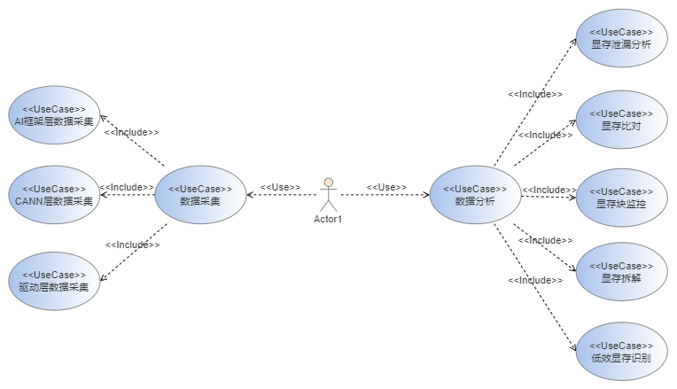
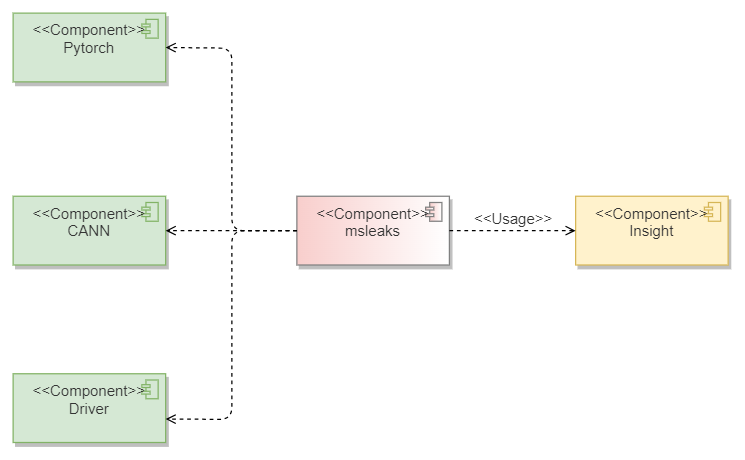
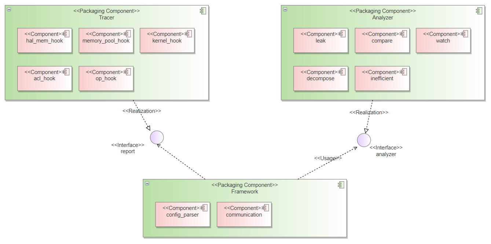
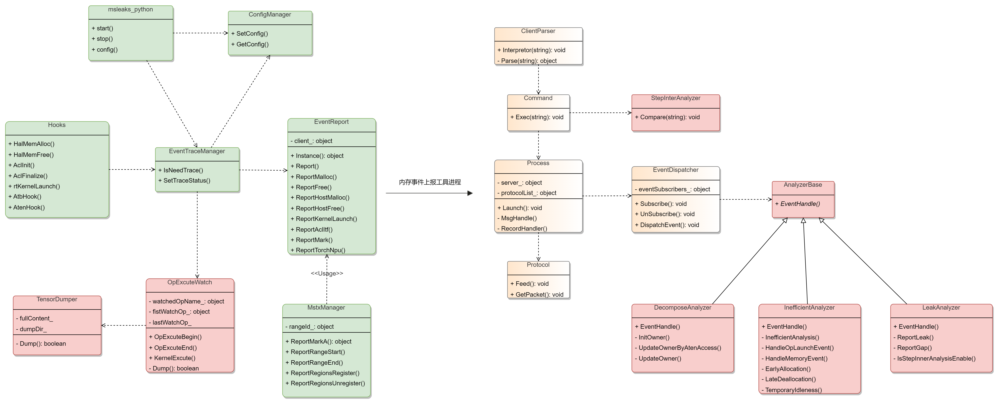
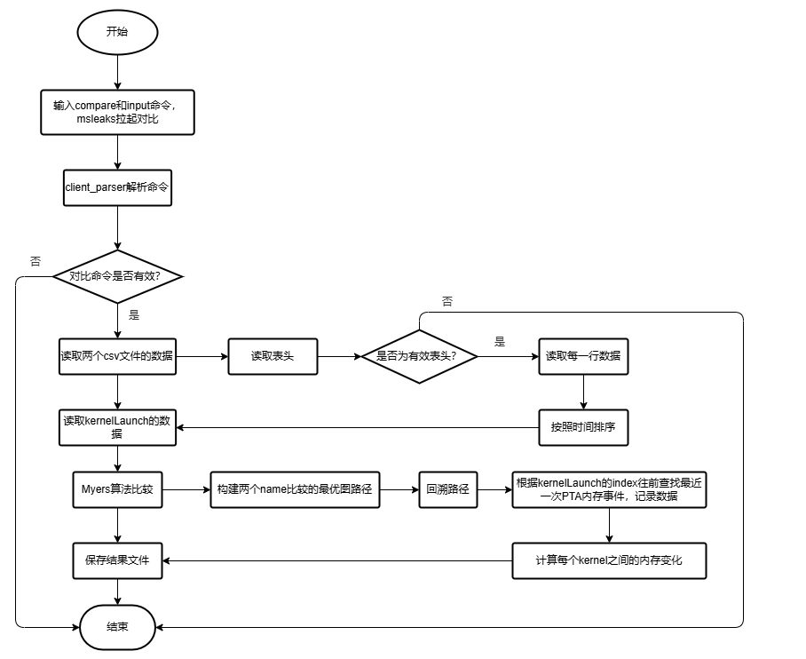
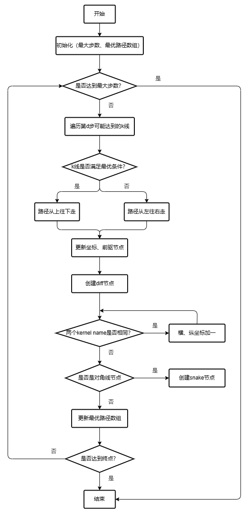
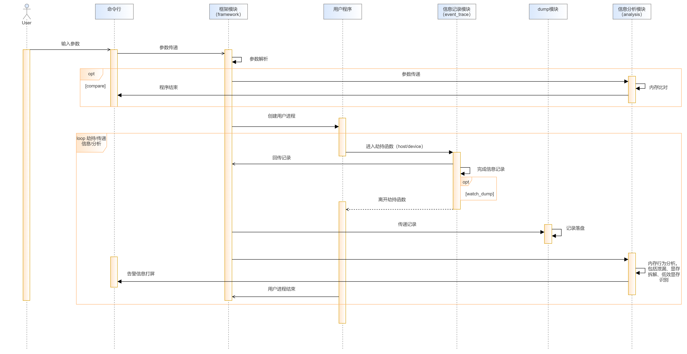
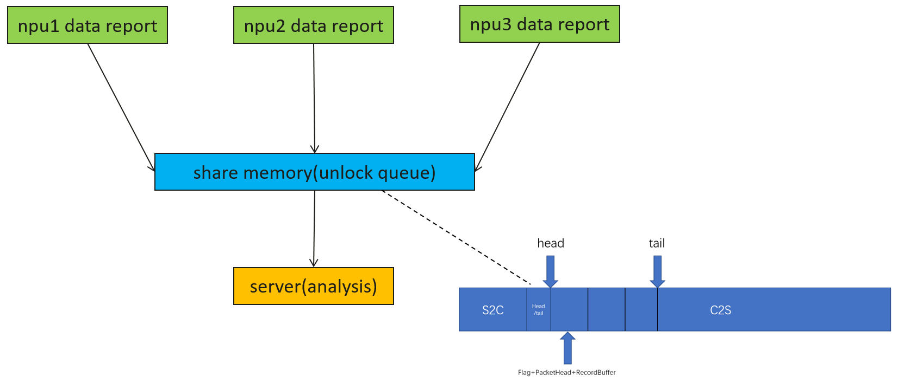

规划和设计如下功能特性及配套的DFX能力：

| 类型     | 功能清单       | 功能描述                                                     | 支撑的系统功能                       |
| -------- | -------------- | ------------------------------------------------------------ | ------------------------------------ |
| 业务功能 | 数据采集       | 支持AI框架、CANN、driver层显存使用相关数据采集 | 数据采集     |
| 业务功能 | 自定义数据采集       | 支持客户自定义采集范围和采集项 | 数据采集     |
| 业务功能 | 泄漏分析       | 支持PTA、mindspore框架内存池泄漏分析、CANN组件显存泄漏分析 |    显存调试 |
| 业务功能 | 显存比对       | 对不同软件版本采集到的内存数据进行比对，找到差异点 |  显存调试   |
| 业务功能 | 显存块监控       | 以算子为监控事件，在事件运行前后对指定显存值进行落盘 |    显存调试 |
| 业务功能 | 显存拆解       | 对显存使用情况进行分解，以可视化形式展示各个模块的显存使用情况 |    显存调优 |
| 业务功能 | 低效显存识别       | 对显存低效模式进行识别，包括过早申请、过迟释放、临时闲置 |   显存调优  |
|DFX功能|日志系统 | C++和python模块共用一个日志系统且支持分级控制| 系统可维护性|
|DFX功能|DT系统 | 通过UT、FUZZ工程白盒看护程序整体功能| 程序功能白盒看护|
|DFX功能|数据采集插件化 | 针对采集项容易变化和增加的特点，对hook组件进行隔离，方便扩展| 系统扩展性|
|DFX功能|冒烟框架 | 对整个工具的所有主路径功能进行100%覆盖，在版本发布和代码上库前运行| 系统可靠性|

## 3. 软件实现设计目标分析与关键要素设计

### 3.1 整体设计目标分析

* 数据采集：各数据采集项独立解耦，能够支持某个采集项快速的增删和修改，且不影响其他采集项。
* 数据分析：分析模块支持快速迭代，同时使能客户自主定义分析逻辑。
* 代码维测能力强：当出现问题时，可以根据现象和日志快速定位问题根因。

### 3.2 关键要素设计

| 关键要素 | 设计目标                                                                                                                                                                       |
| -------- | ------------------------------------------------------------------------------------------------------------------------------------------------------------------------------ |
| 上下文视图 | 给出组件的上下文，说明组件外部的交互和依赖关系 |
| 逻辑视图 | 阐述组件的各个功能模块的静态关系，通过组件图来表示 |
| 开发视图 | 表达完成各个功能模块所需要的子模块，以UML类图的形式展示                              |
| 交互视图 | 展示各个模块之间的动态交互关系，阐述其并发、同步等逻辑，主要以时序图进行表示

## 4.开发视图

### 4.1 实现模型

#### 4.1.1 概述

本节通过期望通过以下几个视图描述组件的软件架构：

* 上下文视图：这一视图将组件作为一个黑盒，描述组件的周边关系，从依赖关系中可以看到组件采集数据的范围，涵盖了AI框架和应用层、CANN层以及driver。
* 逻辑视图：描绘了整个组件三大模块之间的接口和关系，即框架模块依赖信息采集模块上报数据，调用分析器进行数据分析，同时展示了各个模块内部的子模块。
* UML类图：类图将逻辑视图中各个模块（包括子模块）的详细内外部接口和关系进行展示，是最细粒度的静态视图。

#### 4.1.2 上下文视图

工具整体上依赖各个AI框架、CANN和驱动层，同时利用insight完成数据可视化和分析。

* AI框架：由于各个AI框架内部都有内存池的实现，仅仅获取整体内存使用是不够的，需要获取内存池内部的内存行为。工具目前主要依赖的有pytorch、mindspore。
* CANN：在AI框架之下，还有一部分对显存有显著影响，就是算子执行，因此工具还需要感知runtime中kernellaunch以及acl状态。
* Driver：驱动在软件栈的最底层，这一层能够得到上层所有应用的显存分配情况以及kernel真实的执行情况。
* insight：工具采集到的数据通过可视化工具进行展示，可以看到显存变化趋势、显存使用详情等。
  
  

#### 4.1.3 逻辑视图



和大多数内存分析工具类似，主要由三个模块组成，数据采集模块、数据分析模块以及框架模块，考虑到数据采集和数据处理的高效并行，将二者运行在不同进程下，数据采集和数据分析解耦，通过框架模块进行串联。数据采集模块包括有各个采集项对应的hook，通过report接口统一向框架模块传递数据；框架模块负责将收到的数据进行解析并转发给关心的分析器；分析模块中包含一系列分析器，每个分析器向框架模块注册回调函数，通过反向注册的方式弱耦合，扩展性强，当有新数据发送到框架侧时，框架侧根据注册的分析器进行转发。软件单元清单如下：

| 软件单元 | 描述                  | 外部接口               | 内部接口      | 关系描述                                          |
| ---------- | ----------------------- | ------------------------ | --------------- | --------------------------------------------------- |
| 数据采集模块     | 通过hook等方式采集内存相关数据，并发送给框架模块 |ReportRecordEvent |Report_xx_hooks   | 整个模块通过hook，注册回调方式等采集数据，经过一定处理后将数据发送给框架侧        |
| 数据分析模块     | 向框架模块注册回调，对采集模块发来的数据进行接收和分析 | RecordHandler          | xx_analyze  | 对采集到的数据进行分析，包括显存泄漏、比对 、监控等功能 |
| 框架模块     | 作为系统的入口，负责解析命令行，串联数据采集和分析模块以及插桩 | CommandParser、MsgHandle     | DoLaunch、SetPreloadEnv   | 解析客户命令行配置，完成对数据采集和分析模块的配置，将采集模块的数据传送给分析模块  |

#### 4.1.4 软件实现单元设计

**UML类图**


整个类图分为三大块：数据采集（绿色部分）、数据分析（红色部分）、框架（黄色部分）。

* 数据采集：数据采集当前有LD_PREALOD劫持（Hooks）、MSTX打点（MstxManager）、runtime和driver（Hooks中的kernel数据）上报等方式。通过EventTraceManger类来判断数据是否需要采集，如果需要上报，调用EventReport的接口上报到框架侧。可以通过msleaks_python模块来设置采集的范围和采集项。
* 数据分析：分析模块目前主要包括泄漏分析（LeakAnalyzer）、内存比对（StepInterAnalyzer）、显存块监控（OpExcuteWatch）、显存拆解（DecomposeAnalyzer）、低效模式识别（InefficientAnalyzer）。
* 框架模块：负责解析linux通用命令行（ClientParser）、串联数据采集模块和分析模块（Process、EventDispatcher）以及通信模块（server和client）。
* 工具模块：没有在图中展示，主要是一些LOG模块、字符串处理、数值计算、文件读写等。

### 4.2 接口

#### 4.2.1 总体设计

接口大体分为三大部分：

* 对外接口：内存工具对外接口有两种形式，一种是命令行，一种是python接口，即客户面可以直接感知到的接口，需要保持稳定和兼容性。
* 内部模块对外接口：内部主要模块对其他模块的接口，是软件架构稳定的重要体现，接口设计上要足够抽象，且有一定扩展性，是本章节的主要描述对象。
* 内部模块内部接口：这一部分描述一个模块的内部接口组织形式，用于完成模块的具体功能。

#### 4.2.2 设计目标

* 对外接口要确保正交性、易用性和兼容性。
* 根据模块主要功能抽象出稳定的接口，对于采集模块而言，后续增删改采集项，对外接口基本不变；对于分析模块而言，支持动态增删改分析算法。

#### 4.2.3 设计约束

NA

#### 4.2.4 技术选型

训推大模型脚本一般以python语言为主，因此需要支持python接口，另外部分端侧推理的场景，没有python环境，因此还需要支持命令行形式的接口。

#### 4.2.5 软件单元

下面按照框架模块、数据采集模块、数据分析模块三个模块描述其主要接口。

##### 4.2.5.1 框架模块

1. 接口描述

```
框架模块主要有几大功能（接口）：  
*支持解析linux命令行，生成数据采集和分析配置
*fork子进程拉起客户脚本
*提供进程通信接口，包括server的读写功能、client的读写功能、消息组包和解包功能
*提供消息转发机制，负责将数据采集模块传过来的消息转发给数据分析模块
```

2. 接口清单

```
接口名：UserCommand Parse(int32_t argc, char **argv)
接口功能：解析命令行，生成配置。
接口方向：从命令行输入到框架模块
输入参数名：命令行参数个数和具体参数取值。
输出参数名：NA。
返回值：解析得到的配置，包含需要采集的数据信息以及分析算法。
注意事项：命令行输入需要符合预先设置的规则，否则会解析失败，流程终止，返回help信息打屏。
```

```
接口名：void Process::Launch(const std::vector<std::string> &execParams)
接口功能：fork进程，配合execvpe拉起客户脚本。（在此之前需要设置LD_PRELAOD变量）
接口方向：框架模块内部重要接口
输入参数名：客户脚本的命令和入参
输出参数名：NA。
返回值：NA。
注意事项：拉起客户子进程后，主进程进入等待状态，直到子进程自然结束或者异常退出。
```

```
接口名：int ServerProcess::Notify(std::size_t clientId, const std::string& msg)
接口功能：利用共享内存发送数据
接口方向：从server端到client端
输入参数名：需要接收数据的client Id，数据包。
输出参数名：NA。
返回值：发送的数据包大小（>= 0 发送成功，并且返回值表示实际发送的字节数，<  0 发送失败）。
注意事项：当发送失败时需要有对应的维测或者重发机制。（ClientProcess有对称的接口，此处不再赘述）
```

```
接口名：int ServerProcess::Wait(std::size_t clientId, std::string& msg);
接口功能：利用共享内存接收数据
接口方向：从client端到server端
输入参数名：需要接收数据的client Id，数据包。
输出参数名：NA。
返回值：发送的数据包大小（>= 0 接收成功，并且返回值表示实际接收到的字节数，<  0 接收失败）。
注意事项：当接收失败时需要有对应的维测或者重发机制。（ClientProcess有对称的接口，此处不再赘述）
```

```
接口名：void Process::MsgHandle(size_t &clientId, std::string &msg)
接口功能：对client传给server的数据包进行解包和第一层分发，对于log消息，转发log模块处理，对于记录消息，转发记录处理模块。
接口方向：从client端到server端
输入参数名：需要接收数据的client Id，数据包。
输出参数名：NA。
返回值：NA。
注意事项：存在多client并发往server发送消息的情况，因此各个管道的解包缓冲带需要独立，避免相互影响。
```

```
接口名：void EventDispatcher::DispatchEvent(std::shared_ptr<EventBase>& event, MemoryState* state)
接口功能：对client传给server的数据包进第二层分发，专门处理数据记录事件。
接口方向：从框架模块到分析模块。
输入参数名：数据记录事件、内存块缓存。
输出参数名：NA。
返回值：NA。
注意事项：仅对注册了的分析器转发对应的event，不注册不转发。
```

```
接口名：void EventDispatcher::Subscribe(const SubscriberId& id, const std::vector<EventBaseType>& eventTypes, const Priority& priority, const HandlerFunc& func)
接口功能：分析器向数据转发模块发送注册接口
接口方向：从分析模块到框架模块
输入参数名：本身的分析器id、关注的事件类型、被通知的优先级、回调函数。
输出参数名：NA。
返回值：NA。
注意事项：仅对注册了的分析器转发对应的event，不注册不转发，且转发有优先级，由priority参数控制。
```

```
接口名：void EventDispatcher::UnSubscribe(const SubscriberId& id)
接口功能：分析器向数据转发模块发送解注册接口
接口方向：从分析模块到框架模块
输入参数名：本身的分析器id
输出参数名：NA。
返回值：NA。
注意事项：NA。
```

##### 4.2.5.2 数据采集模块

1. 接口描述

```
数据采集模块主要有几大功能（接口）：  
*各个数据采集项的hook接口
*控制当前系统是否需要采集数据以及采集哪些数据的接口
*向框架模块上报数据的接口
```

2. 接口清单

```
接口名：drvError_t halMemAlloc(void **pp, unsigned long long size, unsigned long long flag);
drvError_t halMemFree(void *pp);
接口功能：用于劫持hal层显存分配和使用的接口
接口方向：driver->工具
输入参数名：地址、大小以及flag，flag中包含module id、内存属性等信息
输出参数名：NA。
返回值：driver的错误码。
注意事项：NA。
```

```
接口名：atb::Status _ZN3atb6Runner7ExecuteERNS_17RunnerVariantPackE(atb::Runner* thisPtr, atb::RunnerVariantPack& runnerVariantPack)
接口功能：劫持atb op执行接口，获取atb op执行的信息
接口方向：atb->工具
输入参数名：runner的实例指针以及op相关的输入输出信息
输出参数名：NA。
返回值：atb错误码。
注意事项：NA。
```

```
接口名：void _ZN3atb9StoreUtil15SaveLaunchParamEPvRKN3Mki11LaunchParamERKSs(aclrtStream stream, const Mki::LaunchParam& launchParam, const std::string& dirPath)
接口功能：劫持atb kernel执行接口，获取atb kernel执行信息
接口方向：atb->工具
输入参数名：流状态、算子输入输出等信息、算子信息
输出参数名：NA。
返回值：NA。
注意事项：NA。
```

```
接口名：aclError aclInit(const char *configPath)
aclError aclFinalize()
接口功能：劫持acl初始化和结束接口
接口方向：runtime->工具
输入参数名：acl路径信息
输出参数名：NA。
返回值：NA。
注意事项：NA。
```

```
接口名：rtError_t rtKernelLaunch(const void *stubFunc, uint32_t blockDim, void *args, uint32_t argsSize, rtSmDesc_t *smDesc, rtStream_t stm)
接口功能：劫持kernellaunch相关的接口（类似的还有几个，此处不再赘述）
接口方向：runtime->工具
输入参数名：算子注册函数、blockdim、输出输出信息、流状态等
输出参数名：runtime错误码。
返回值：NA。
注意事项：NA。
```

```
接口名：bool EventTraceManager::IsNeedTrace(const RecordType type)
接口功能：判断某个采集项当前是否需要采集
接口方向：采集模块内部
输入参数名：记录的类型
输出参数名：NA
返回值：布尔值。
注意事项：NA。
```

```
接口名：bool EventReport::ReportXXX(RecordBuffer &infoBuffer)
接口功能：将某个采集项从数据采集模块发送到框架模块
接口方向：采集模块内部
输入参数名：记录具体的信息
输出参数名：NA
返回值：布尔值。
注意事项：NA。
```

##### 4.2.5.3 数据分析模块

1. 接口描述

```
数据采集模块主要有几大功能（接口）：  
*分析模块的入口（抽象接口）
*各个分析器的分析入口（具体接口）
```

2. 接口清单

```
接口名：void AnalyzerBase::EventHandle(std::shared_ptr<EventBase>& event, MemoryState* state) = 0;
接口功能：分析模块对外的抽象接口
接口方向：从框架模块到分析模块
输入参数名：当前接收到的事件信息
输出参数名：NA。
返回值：NA。
注意事项：NA。
```

```
接口名：void Dump::EventHandle(std::shared_ptr<EventBase>& event, MemoryState* state)
接口功能：dump模块的主要接口
接口方向：从框架模块到分析模块
输入参数名：当前接收到的事件信息
输出参数名：NA。
返回值：NA。
注意事项：NA。
```

```
接口名：void InefficientAnalyzer::EventHandle(std::shared_ptr<EventBase>& event, MemoryState* state)
接口功能：低效显存模式识别的主要接口
接口方向：从框架模块到分析模块
输入参数名：当前接收到的事件信息
输出参数名：内存块状态信息。
返回值：NA。
注意事项：NA。
```

```
接口名：void DecomposeAnalyzer::EventHandle(std::shared_ptr<EventBase>& event, MemoryState* state)
接口功能：显存拆解的主要接口
接口方向：从框架模块到分析模块
输入参数名：当前接收到的事件信息
输出参数名：内存块状态信息。
返回值：NA。
注意事项：NA。
```

### 4.3 算法实现

#### 4.3.1 设计目标

本组件涉及算法的主要是数据分析模块中的内存比对。该功能的主要的目标是实现不同CANN/PTA/MindSpore版本下，统一模型参数使用内存的差异。

#### 4.3.2 设计约束

1. 算法需实现对相同 Kernel 调用前后内存使用情况的精确比对与差异计算。
2. 算法需能够识别并定位不同版本数据在调用不同 Kernel 时的关键差异点。
3. 算法需在保证查准率与查全率的前提下，实现高效、稳定、可扩展的性能表现。

#### 4.3.3 技术选型

对于该算法而言，核心挑战在于精准识别并定位不同版本数据中调用 Kernel 的差异点。理想效果应类似于 Git 中的diff功能——能够高效识别出两份数据中新增、删除或顺序变化的 Kernel 调用位置。

考虑到版本间数据通常高度相似，仅存在少量 Kernel 调用的增删或顺序调整，因此选用 Myers 算法作为核心差异比对策略尤为合适。该算法在序列相似性高、差异较小（即最小编辑距离 D 较小）时展现出显著性能优势，时间复杂度为 O(ND)，其中 N 为两序列长度之和，D 为最小编辑距离，远优于传统动态规划方法的 O(N²) 复杂度。在实际场景中，不同版本间的 Kernel 调用比较基本一致，仅局部变动，这恰好契合 Myers 算法的最优适用场景，因而可实现高效、准确的差异定位，兼顾性能与精度。

#### 4.3.4 算法实现

**内存对比主流程图**



1. 解析对比的命令行参数，并且csv中对应的数据，然后取出kernelLaunch的数据进行比较。
2. 对两个文件的KernelLaunch的名称进行Myers算法比较，该算法的核心是将文本序列比较问题转化为编辑图的路径搜索问题。当构建出两个序列的最优图路径后，就是从终点回溯路径，该路径包含了 Kernel 名称存在差异和相同的位置，当回溯到每个点时，再根据KernelLaunch的Id查找并计算内存变化的数据即可。
3. 最后将记录的每个 Kernel 内存变化数据保存到比较的结果文件。

**Myers算法构建图路径流程图**



首先，该算法将两个文本A`[a, b, c, d]`(长度为m)，B`[e, f, g, h]`长度为n)，构建成了一个m*n的网格，横轴表示文本A的位置，纵轴表示文本B的位置，网格中的每个点`(x，y)`表示已经对比完文本A的前x个和B的前y个元素，并且从起点`(0, 0)`到终点`(m, n)`的路径，每一步都对应一种编辑操作：

* 往右移动一步表示删除A中的元素，也就是A的元素名称有差异。
* 往下移动一步表示插入B中的元素，也就是B的元素名称有差异。
* 沿对角线移动一步表示，A和B的元素名称相同。

同时该算法引入了k线概念：`k=x-y`；d则表示往右或者往下移动的步数。最终的目标是找到从`(0, 0)`到`(m, n)`的最短路径。Myers算法在构建最优图路径时会初始化距离和路径数据，然后记录每条k线上能到达的最远x坐标，并增加距离d，并搜寻新的k线（范围为-d到d，步长为2），计算k线上最远能达到的坐标。知道找到找到终点为止。其中使用snake表示对角线节点表示，两个序列该位置的文本是相同的；使用Diff节点表示差异节点，两个序列该位置的文本是不同的。

### 4.4 安全实现设计

#### 4.4.1 安全设计目标

> 工具主要的功能为运行客户训推脚本，落盘内存行为相关的数据并进行分析。工具主要的安全设计目标是在完整运行客户训推脚本的基础上，对内存行为进行采集，对应的数据符合保密性要求，同时需要保持工具的可用性。主要涉及的安全项有外部文件输入安全防护、生成的文件和日志安全校验、使用安全的哈希算法、内存访问安全等。

#### 4.4.2 安全设计上下文

> 工具的北向主要是客户输入的命令行、python接口以及文件的输入输出，对于python和命令行，在入口处均有校验参数有效性，对于文件的输入输出，按照安全要求进行防护。
> 工具的南向主要涉及runtime、driver、pta、mindspore、atb等组件，对其内存行为进行trace，对获取的数据进行合法化处理后向客户暴露。

#### 4.4.3 高风险模块识别

##### 4.4.3.1 高风险模块识别

> 列出被认为高风险的模块，并描述为什么它们被认为是高风险的。

| 模块名称 | 模块功能简要说明                                                                        | 设计域高风险模块分析                                                                                  | 对应代码目录     | 语言类型 | 备注 |
| -------- | --------------------------------------------------------------------------------------- | ----------------------------------------------------------------------------------------------------- | ---------------- | -------- | ---- |
| 参数解析模块    | 解析并记录命令行参数 | 对输入的参数进行正确性校验 | framework/client_parser.cpp | C++        |      |
| 文件读入写出模块  | 读取文件和写入文件                                           | 对文件的路径、权限、类型、内容合法性等进行校验                                                                                      | utility/path.cpp       | C++   | |
| 哈希计算模块  | 负责对落盘的tensor二进制进行哈希运算                           | 需要使用安全的哈希算法，避免被破解             | utility/calculate_data_check_sum.h     | C++   | |

##### 4.4.3.2 高风险API识别

> 列出被认为高风险的API，并描述为什么它们被认为是高风险的。

| 高风险API                   | 接口说明                          | 高风险接口函数分析                                            | 对应代码目录              | 语言类型 | 备注 |
| --------------------------- | --------------------------------- | ------------------------------------------------------------- | ------------------------- | -------- | ---- |
|ClientParser.Parse | 对命令行参数进行解析，完成初始化配置|需要对每个命令行输入做合法性校验，以白名单形式控制客户输入 | framework/client_parser.cpp | C++        |      |
| CheckIsValidInputPath/CheckIsValidOutputPath                 | 对输入输出文件路径做校验，包括可读性，路径长度，是否为软链接，权限校验                     | 对输入和输出的文件做合法性校验                                             | utility/path.cpp        |C++ |  |
| CalculateDataCheckSum64                 | 计算tensor值的哈希值    | 使用安全的随机算法，避免被破解   | utility/calculate_data_check_sum.h     | C++   | |

#### 4.4.4 代码实现安全防范处理

> 针对每个已识别的高风险模块和API，详细描述将采取的安全防护措施。

高风险模块安全加固

**1. 数据保护**
不涉及客户隐私数据

**2. 模块依赖和第三方库**
对于北向接口的输入，在ClientParser.Parse/CheckIsValidInputPath/CheckIsValidOutputPath等接口中做统一校验，避免污染内部运行环境。南向接口在各自的劫持接口中做规范化处理，确保落盘的数据是统一有效的。

**3. 错误处理**
如果命令行输入参数校验失败，会提示客户输出帮助信息，并终止程序。
如果会校验输入文件的路径、权限、是否为软链接、是否包含非法字符、是否可写、属组、属主是否正确。若校验失败则进程退出，不进行后续操作。
输出文件是会最少按照文件夹750、文件640、只读文件400权限落盘。如果落盘失败，工具会输出日志提示当前异常。
如果使用哈希算法出现错误，程序会立即停止，并在日志模块有对应打印。

**4.日志审计**

1. 功能正常的情况下不能打印ERROR、WARNING等级信息。
2. 不能在循环和高频API中进行打屏，避免造成海量刷屏。
3. 需要注意debug等级的日志的数量，不可打印海量日志掩盖重要信息。

### 4.5 开发者测试模型

#### 4.5.1 设计目标

开发者自测试是实现软件高质量发布的重要环节，一般通过白盒和黑盒测试两部分要覆盖功能。

* 白盒测试目标：代码行覆盖率大于80%，分支覆盖率大于60%，同时增加FUZZ测试工程，在代码上库前校验。
* 黑盒测试目标：构建冒烟平台，在版本发布前进行全量用例测试，在代码上库前，完成基础用例测试。

#### 4.5.2 设计约束

在主目录下新增test目录用于白盒测试看护，由于代码主要是C++，采用gtest框架。黑盒方面新增代码仓用于冒烟代码和用例的集成。

#### 4.5.3 可测试性设计

* 白盒测试：基于gtest框架和mock机制，可以涵盖绝大部分代码接口，少量私有接口无法访问，可以用宏定义替换的方式解决，可以达到PDU对白盒测试的覆盖率要求。
* 黑盒测试：根据大功能块划分测试套、根据特性添加测试用例，并用python接口拉起冒烟环境，同时支持可以选择测试套和测试用例，当某个测试用例失败之后，不影响其他测试用例的运行。

#### 4.5.4 分层测试

通常测试分为三个模块，单元测试（UT）、接口测试（IT）、系统测试（ST），由于工具的特殊性，其接口相对少且可以由UT直接涵盖，因为这里主要分为两层：UT和ST。UT负责看护代码单元的逻辑错误，在前端拦截问题，确保大量问题都在上板之前被发现和解决；ST是端到端的测试，对工具来说，也是最重要的，将冒烟测试也分为两层，level1为看护绝大多数功能的主路径（80%以上），且效率要高（分钟级），作为在大颗粒度代码上库前的校验，level2为完整的用例看护，覆盖全部用例和分析，在每个版本发布和迭代转测前进行测试。

#### 4.5.5 关键测试技术方案

从白盒和黑盒两个角度分别阐述测试技术方案。

1. 测试工程设计
   UT目录test和源码csrc目录齐平，内部子目录和功能代码对称。

```
leaks
|-- build
   |-- build.py
|-- csrc
   |-- framework
   |-- event_trace
   |-- analysis
   |-- main.cpp
|-- output
   |-- bin
      |-- msleaks
|-- test
   |-- framework
   |-- event_trace
   |-- analysis
   |-- test_main.cpp
```

冒烟工程目录如下：包含msleaks交付件目录（msleaks）、冒烟用例源码目录（csrc）、测试脚本目录   （testfile）以及产物和日志目录（workbench），workbench下的子目录和测试套一一对应，方便问题定位。

```
leaks_case
|-- msleaks
   |-- output
|-- csrc
   |-- test_suit
   |-- utils
|-- testfile
   |-- csvfile
   |-- script
|-- workbench
```

2. 物理设计
   不涉及。
3. 运行环境
   白盒运行环境为普通linux环境即可，源码和测试工程均可源码编译。
   ST需要运行在昇腾服务器上，根据脚本的不同，最多需要8张 NPU环境，对芯片型号没有要求。
4. 测试替身设计
   白盒测试中需要对dlopen/dlsym等函数进行mock替换，否则在没有昇腾环境的通用linux环境下，会返回失败导致无法覆盖大部分用例场景。

## 5. 运行视图

### 5.1 交互模型

#### 5.1.1 设计目标

对外提供数据采集和数据分析两大功能，框架模块进行串联和过渡。采集和分析各自在不同的进程，数据和调度互不影响，框架模块提供共享内存的进程通信方式，最大化提高交互效率。

#### 5.1.2 设计约束

NA

#### 5.1.3 交互模型设计

**时序图**
在客户输入对应命令行后，框架模块会根据客户输入的参数进行解析，同时fork子进程，在子进程中拉起被测程序。在被测程序运行过程中，event_trace中的劫持模块会对被测程序中的内存时间进行劫持并且记录，通过socket进程间通信的方式将数据传回到框架模块，框架模块完成数据清洗后转发给对应的分析模块进行分析。特别地，如果是step间比对模式，是离线处理的，不涉及数据采集过程；另外如果是watch功能，由于其无需数据汇总，其判断和落盘功能统一在client模块处理。整体运行视图如下：



### 5.2 并发模型

#### 5.2.1 设计目标

当前是单server-多client的交互模式，存在多个client（通常一个client对应一张npu卡）并发往server发消息的情况，设计上需要保障当应对高并发的client消息时，通信模块能够有序高效读写数据，不丢失数据，有容错机制。

#### 5.2.2 设计约束

共享内存大小目前设计为200M（根据历史经验），当系统的内存不足时，取当前系统的剩余最大内存。

#### 5.2.3 并发模型设计

每张npu卡对应一个client进行上报数据，工具进程为server接收所有卡的数据，进行汇总和分析。**因此并发模型设计为多生产者单消费者的模式。共享内存+无锁队列被认为是通信效率最高的进程间通信方式，也是本组件采用的通信方式。**从下图中可以看到，共享内存一共分为两段，第一段是server往client发送配置请求消息，全局只配置一次。另一段是client往server发送数据，会存在同时有多个npu所在的进程往共享内存中写入数据，这里采用无锁队列结合原子变量的方式确保多个npu写入时不会冲突。server侧采用一个常驻线程进行读取。每当多一个数据写入，tail往后挪一位，当有一个数据读出，head往后挪一位，当head=tail，认为队列中没有数据。



