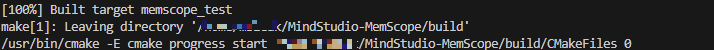
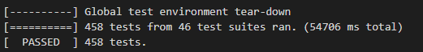
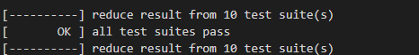

# MSMemScope开发指南
## 1. 开发环境配置
在开发之前请确保您的环境满足以下环境要求。推荐在Linux环境下进行开发。
| 软件名 | 版本要求 | 用途 |
| --- | --- | --- |
| Python | v3.10.x (推荐) | 工具脚本 |
| GCC | 最低版本：5.1  | 编译程序 |
| GIT | 无 | 代码的拉取与提交 |
| CMake| 最低版本：3.16 <br> 最高版本：4.1.3 | 后端项目构建与编译 |

## 2. 开发步骤
### 2.1 代码下载
Fork本仓库到个人私仓，并将个人私仓中的项目通过Clone下载到本地。

注：若您使用Https方式进行克隆，请按照GitCode要求**设置令牌作为密码**。

### 2.2 下载第三方依赖库和编译项目
在第一次编译构建之前，需要下载仓库的一些依赖，仓库提供脚本协助完成依赖下载和编译构建。

运行以下命令时，请确保您的终端已进入到本地仓库目录下，并确保网络畅通。

```shell
cd build
python build.py local test
```

其中参数说明如下：

- `local`：代表是否本地构建，添加会下载gtest、json、secure等依赖库用于本地构建，一般只有第一次需要，除非依赖库有更新。
- `test`：代表是否要构建测试用例。

当依赖成功下载之后，终端将会输出如下信息。

```shell
============ download thirdparty done ============
```

当编译成功后，终端输出如下图所示。



### 2.3 开发功能

Memscope的实现代码分为三个主要模块：csrc、python、test，目录如下。

```shell
|-- csrc                 # c++ 源码
   |-- framework         # 命令行解析，完成和 event_trace 模块的交互，获取内存事件并发送给 analysis 模块进行处理
   |-- event_trace       # 完成对内存事件的记录并提交框架模块
   |-- analysis          # 内存事件处理和分析
   |-- utility           # 通用非业务功能
   |-- python_itf        # 为 C++ 模块提供 Python 绑定的接口层
   |-- main.cpp
|-- python               # python 源码
   |-- msmemscope
|-- test                 # UT 测试、ST 测试
```
修改、新增、删除业务代码同时请修改对应的测试代码。

### 2.4 功能验证

功能开发完成后，需要先进行本地的功能调试和验证，通过如下命令完成构建和部署。

```shell
cd build
cmake ..
make
```

在编译时指定`-j`参数即可开启并行编译比，如想要开启8个线程并行编译，可执行如下命令。

```shell
make -j8
```

构建的产物会被部署在`output`目录下，目录结构如下。

```shell
output
├── bin
│   ├── msmemscope
│   └── msmemscope.bin
├── lib64
│   ├── _msmemscope.so
│   ├── libascend_kernel_hook.so
│   ├── libascend_leaks.so
│   ├── libascend_mstx_hook.so
│   ├── libatb_abi_0_hook.so
│   ├── libatb_abi_1_hook.so
│   └── libleaks_ascend_hal_hook.so
```

#### 2.4.1 UT测试
UT测试用例路径为`./test`, 使用gtest框架进行UT测试，新增UT用例规则如下。
1. 用例目录结构需与代码目录结构一致，命名风格为：`test_功能模块`。
2. 为方便定位，用例命名格式统一为：`功能模块_测试功能点_期望结果`。
3. 若您在`./csrc`下新增了目录和源码，请在编写UT测试用例时，在`./test`下新增同名的目录，并新增测试用例。同时，在`./test/CMakeLists.txt`下，添加源码目录。

用例开发完成后运行如下命令自动构建和运行用例，需要确保所有用例运行通过。

```shell
cd ..
bash ./build/run_test_case.sh
```

UT用例全部测试通过时，显示如下。



注：UT测试用例需要满足覆盖率要求，要求如下。
| 类别 | 覆盖率 |
| --- | --- |
| 行覆盖率 | 80.0% |
| 分支覆盖率 | 60.0% |

一般来说，代码提交时门禁会自动运行并生成覆盖率报告（建议直接查看门禁中的覆盖率报告，本地和门禁可能会有差异）。如果希望在本地生成报告可以运行如下命令。

```shell
# 确保生成报告前已运行过一次测试用例
bash ./build/run_test_case.sh
bash ./build/generate_coverage.sh
```
报告会生成在`./coverage/report.tar.gz`路径，可以下载并通过浏览器打开其中的index.html文件查看。

#### 2.4.2 ST测试

用例开发完成后运行如下命令自动构建和运行ST用例，需要确保所有ST用例运行通过。

```shell
cd ./test/smoke
bash run_st.sh
```
ST用例全部通过时，显示如下。



### 2.5 新增example示例。
若您开发了新功能，需要添加example样例呈现给用户了解功能时，请您按照如下流程新增实例。
1. 请你按照`./example`目录中的格式，添加对应功能目录。
2. 添加对应功能的README文件，详细说明功能特性、前期准备、执行示例、结果说明。
3. 添加执行示例代码，请准备API接口方式的样例，需要准备一个Python脚本和一个Bash脚本。
4. Bash脚本中需要添加API方式的环境变量设置，如下所示。

```shell
#!/bin/bash

TOOL_PATH='msmemscope_path'
export LD_PRELOAD=${TOOL_PATH}/lib64/libleaks_ascend_hal_hook.so:${TOOL_PATH}/lib64/libascend_mstx_hook.so:${TOOL_PATH}/lib64/libascend_kernel_hook.so
export LD_LIBRARY_PATH=${TOOL_PATH}/lib64/:${LD_LIBRARY_PATH}
```
