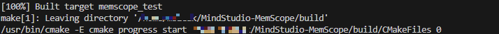
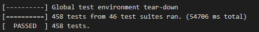
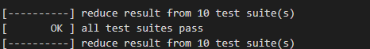

# msMemScope 开发指南

## 1. 开发环境配置

按照《[msMemScope 安装指南 — 源码安装](../install_guide/install_guide.md#231-环境准备)》章节完成编译和测试环境的搭建。

> **说明：** 环境镜像的构建方法及配套软件版本由 MindStudio 统一镜像制作指南维护，本仓库不重复定义。

### 1.1 容器化开发环境

msMemScope 基于 [devcontainer](https://containers.dev/) 提供一致的容器化开发环境，在 VS Code 中打开仓库即可一键进入容器、一键构建、一键图形化调试，代码智能跳转开箱即用。

**前置条件**：PC 安装 VS Code，并为 VS Code 安装 Dev Containers 和 Remote-SSH 插件；Linux 服务器提供 Docker 服务（含 Ascend 环境）。

**进入容器**：VS Code 打开仓库 → 右下角提示 "Reopen in Container" → 等待 `post-create.sh` 自动完成初始化（Git 身份同步、Python 3.11、pre-commit Hook 安装、clangd 等，幂等且失败不阻塞）。

**一键构建**（任务面板 `Terminal → Run Task`）：

| 任务 | 功能 |
| --- | --- |
| `Build: Release Mode` | Release 全量构建（等价命令行 `python3 build.py`） |
| `Build: Debug Mode` | 下载三方依赖后 Debug 编译（带 `-g -O0` 调试符号，不 strip） |
| `Test: Build Unit Tests` | 仅编译单元测试（供调试用） |
| `Test: Run Unit Tests` | 构建并运行单元测试（等价命令行 `python3 build.py test`） |
| `Clean: All Workspace` | 清理构建产物 |

**一键调试**（F5 选择配置）：`GDB: Launch Main Program` 调试 `output/bin/msmemscope.bin`；`GDB: Debug Unit Test (UT)` 调试 `build/test/memscope_test`。调试前会自动执行 Debug 构建。

**代码跳转**：C++ 经 clangd 读取 `build/compile_commands.json`（首次构建后生成），Python 经 Pylance 提供语义跳转。

**注意事项**：

- 编译必须在容器内进行；容器外命令行入口（`python3 build.py`）保持可用。
- Debug 与 Release 产物同路径覆盖，两种模式切换时请重新构建目标模式。
- `.vscode/settings.json` 本地个人化修改不会进入 `git status`（skip-worktree 治理）。

## 2. 开发步骤

### 2.1 代码下载

Fork本仓库到个人私仓，并将个人私仓中的项目通过Clone下载到编译容器内。

注：若您使用Https方式进行克隆，请按照GitCode要求**设置令牌作为密码**。

### 2.2 下载第三方依赖库和编译项目

在第一次编译构建之前，需要下载仓库的一些依赖，仓库提供脚本协助完成依赖下载和编译构建。

运行以下命令时，请确保您的终端已进入到容器内的代码仓库目录下，并确保网络畅通。

```shell
cd <path>/memscope   # 进入memscope代码仓目录，path为代码仓项目所在路径
python3 build.py local test
```

其中参数说明如下：

- `local`：代表是否本地构建，添加会下载gtest、json、secure等依赖库用于本地构建，一般只有第一次需要，除非依赖库有更新。
- `test`：代表是否要构建测试用例。

当依赖成功下载之后，终端将会输出如下信息。

```shell
============ download third-party done ============
```

当编译成功后，终端输出如下图所示。



#### 2.2.1 Debug 构建与 UT 调试

默认构建为 Release（`-O2` + strip）。如需使用 GDB 断点调试，请执行 Debug 构建（`-g -O0`，不 strip）：

```shell
cd <path>/memscope   # 进入memscope代码仓目录，path为代码仓项目所在路径
python3 build.py -e only_down_deps=true   # 仅下载三方依赖后退出
cd build
cmake .. -DCMAKE_BUILD_TYPE=Debug
make -j$(nproc)
```

Debug 产物与 Release 产物同路径覆盖（`output/bin`、`output/lib64`），切换构建模式时请重新构建目标模式。

单元测试调试：先执行 Debug 构建（`-DBUILD_TESTS=ON`），再对 `build/test/memscope_test` 设置断点调试：

```shell
cd build
cmake .. -DBUILD_TESTS=ON -DCMAKE_BUILD_TYPE=Debug
make -j8
```

> 使用 devcontainer 开发时无需手工执行上述命令，VS Code 任务面板提供 `Build: Debug Mode`、`Test: Build Unit Tests` 等一键入口，F5 可直接启动 GDB 调试。

### 2.3 开发功能

msMemScope的实现代码分为三个主要模块：csrc、python、test，目录如下。

```shell
|-- csrc                 # c++ 源码
   |-- framework         # 命令行解析，完成和 event_trace 模块的交互，获取内存事件并发送给 analysis 模块进行处理
   |-- event_trace       # 完成对内存事件的记录并提交框架模块
   |-- analysis          # 内存事件处理和分析
   |-- utility           # 通用非业务功能
   |-- python_itf        # 为 C++ 模块提供 Python 绑定的接口层
   |-- main.cpp
|-- python               # python 源码
   |-- msmemscope
|-- test                 # UT 测试、ST 测试
```

修改、新增、删除业务代码同时请修改对应的测试代码。

### 2.4 功能验证

功能开发完成后，需要先进行本地的功能调试和验证，通过如下命令完成构建和部署。

```shell
cd build
cmake ..
make
```

在编译时指定`-j`参数即可开启并行编译，如想要开启8个线程并行编译，可执行如下命令。

```shell
make -j8
```

构建的产物会被部署在`output`目录下，目录结构如下。

```shell
output
├── bin
│   ├── msmemscope
│   └── msmemscope.bin
├── lib64
│   ├── _msmemscope.so
│   ├── libascend_kernel_hook.so
│   ├── libascend_leaks.so
│   ├── libascend_mstx_hook.so
│   ├── libatb_abi_0_hook.so
│   ├── libatb_abi_1_hook.so
│   └── libleaks_ascend_hal_hook.so
```

#### 2.4.1 UT测试

UT测试用例路径为`./test`, 使用gtest框架进行UT测试，新增UT用例规则如下。

1. 用例目录结构需与代码目录结构一致，命名风格为：`test_功能模块`。
2. 为方便定位，用例命名格式统一为：`功能模块_测试功能点_期望结果`。
3. 若您在`./csrc`下新增了目录和源码，请在编写UT测试用例时，在`./test`下新增同名的目录，并新增测试用例。同时，在`./test/CMakeLists.txt`下，添加源码目录。

用例开发完成后运行如下命令自动构建和运行用例，需要确保所有用例运行通过。

```shell
cd ..
bash ./build/run_test_case.sh
```

UT用例全部测试通过时，显示如下。



注：UT测试用例需要满足覆盖率要求，要求如下。

| 类别 | 覆盖率 |
| --- | --- |
| 行覆盖率 | 80.0% |
| 分支覆盖率 | 60.0% |

一般来说，代码提交时门禁会自动运行并生成覆盖率报告（建议直接查看门禁中的覆盖率报告，本地和门禁可能会有差异）。如果希望在本地生成报告可以运行如下命令。

```shell
# 确保生成报告前已运行过一次测试用例
bash ./build/run_test_case.sh
bash ./build/generate_coverage.sh
```

报告会生成在`./coverage/report.tar.gz`路径，可以下载并通过浏览器打开其中的index.html文件查看。

#### 2.4.2 ST测试

用例开发完成后运行如下命令自动构建和运行ST用例，需要确保所有ST用例运行通过。

```shell
cd ./test/smoke
bash run_st.sh
```

> [!NOTE]
>
> 使用 devcontainer 开发时，容器环境不会自动挂载NPU设备，因此ST无法执行。此时需要自行搭建可运行环境。

ST用例全部通过时，显示如下。



### 2.5 新增example示例

若您开发了新功能，需要添加example样例呈现给用户了解功能时，请您按照如下流程新增实例。

1. 请你按照`./example`目录中的格式，添加对应功能目录。
2. 添加对应功能的README文件，详细说明功能特性、前期准备、执行示例、结果说明。
3. 添加执行示例代码，请准备API接口方式的样例，需要准备一个Python脚本和一个Bash脚本。
4. Bash脚本中需要添加API方式的环境变量设置，如下所示。

```shell
#!/bin/bash

TOOL_PATH='msmemscope_path'
export LD_PRELOAD=${TOOL_PATH}/lib64/libleaks_ascend_hal_hook.so:${TOOL_PATH}/lib64/libascend_mstx_hook.so:${TOOL_PATH}/lib64/libascend_kernel_hook.so
export LD_LIBRARY_PATH=${TOOL_PATH}/lib64/:${LD_LIBRARY_PATH}
```
