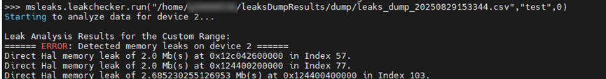

# **内存分析**

## 简介

msMemScope工具基于采集的内存数据，提供泄漏、对比、监测、拆解，以及低效识别等分析能力，帮助开发者快速诊断和优化内存问题。

|分析能力|说明|
|--|--|
|内存泄漏|针对内存长时间未释放和内存泄漏等问题，需要进行内存分析时，msMemScope工具提供内存泄漏分析和kernelLaunch粒度的内存变化分析功能，实现告警定位与分析。|
|内存对比|当两个Step内存使用存在差异时，可能会导致内存使用过多，甚至出现OOM（Out of Memory，内存溢出）的问题，则需要使用msMemScope工具的内存对比分析功能来定位并分析问题。|
|内存块监测|在大模型场景中，当遇到内存踩踏定位困难时，msMemScope工具支持通过Python接口和命令行两种方式，在算子执行前后对指定的内存块进行监测。根据内存块数据的变化，快速确定算子间内存踩踏的范围或具体位置。|
|内存拆解|msMemScope工具提供内存拆解功能，支持对CANN层和Ascend Extension for PyTorch框架的内存使用情况进行拆解，输出模型权重、激活值、梯度，以及优化器等组件的内存占用情况。|
|低效内存识别|在训练推理模型过程中，可能存在部分内存块申请后未立即使用，或使用完毕后未及时释放的低效情况。msMemScope工具可帮助识别这种低效内存的使用现象，从而优化训练推理模型。|

## 使用前准备

msMemScope工具的安装，请参见[《msMemScope工具安装说明》](./install_guide.md)。

## 内存泄漏分析功能介绍

### 功能说明

内存问题主要包括内存泄漏、踩踏、内存碎片，可能导致内存过多等问题，msMemScope工具支持内存泄漏问题的定位。

### 注意事项

- 在使用内存分析功能时，如果需要设置--events参数，请确保--events参数中包含alloc和free。
- 在使用内存分析功能时，请勿设置--steps参数。
- 内存泄漏分析的离线方式目前仅支持HAL内存泄漏分析。
- 内存泄漏分析暂不支持场景：VLLM-Ascend。

### 使用示例

内存泄漏分析能力支持在线和离线两种方式。

**在线方式**

在进行内存分析时，需配合使用mstx打点功能进行问题定位，mstx打点详情参考[MindStudio Tools Extension Library接口](https://gitcode.com/Ascend/mstx/blob/master/docs/zh/mstx_api_reference.md)。

1. 使用msMemScope工具启动用户程序，Application为用户程序。

    ```shell
    msmemscope ${Application}
    ```

2. 执行完成后，会出现如下两种回显信息。
    - 如果出现如[**图 1**  memory leak](#leak)的回显信息，表示存在内存泄漏问题。回显信息中分别展示了每张卡内存泄漏的汇总信息，包括泄漏发生的Step数、关联的kernel、地址以及泄漏大小等信息。

        **图 1**  memory leak<a id="leak"></a>

        

    - 如果出现如[**图 2**  memory fluctuation](#fluctuation)的回显信息，表示存在内存波动。回显信息中展示了单个Step内的内存波动（用最小和最大的内存池分配占用比值定义）以及最小的内存池分配占用，同时给出最小比值和最大比值作为参考，用户可根据该值判断是否存在内存泄漏风险。

        > [!NOTE] 说明  
        > 在第一个Step时，内存尚未稳定，所以只支持分析从第二个Step开始的内存波动，第一个Step内存波动可忽略。

        **图 2**  memory fluctuation <a id="fluctuation"></a>

        

**离线方式**

msMemScope支持对指定范围内的内存事件进行离线泄漏分析。使用mstx标识好泄漏分析的范围后，可以使用该功能对落盘文件进行分析。

1. 对需要检测泄漏的范围进行mstx的mark打点。mstx打点详情参考[MindStudio Tools Extension Library接口](https://gitcode.com/Ascend/mstx/blob/master/docs/zh/mstx_api_reference.md)。

    > [!NOTE] 说明   
    > - 打点的mark信息将用于离线分析接口的输入。
    > - 使用mark打点功能标记三个点，分别称为A、B、C。在A到B范围内申请的内存，需要在C点前全部释放，否则会被判定为内存泄漏。

2. 执行以下命令，使用msMemScope工具启动用户程序，获取落盘csv文件，Application为用户程序。

    ```shell
    msmemscope ${Application}
    ```

3. 执行以下命令，调用Python接口，对输出文件中的csv文件进行离线泄漏分析。

    ```python
    import msmemscope
    msmemscope.check_leaks(input_path="user/memscope.csv",mstx_info="test",start_index=0)
    ```

    其中参数信息如下：

    - input_path：csv文件所在路径，需使用绝对路径。
    - mstx_info：mark打点使用的mstx文本信息，用于标识泄漏分析的范围。
    - start_index：内存泄漏分析开始的打点位置编号，即从第几个符合条件的mstx打点位置开始分析。

    如果出现[**图 3**  offline leakage analysis](#analysis)的回显信息，表示存在内存泄漏问题。

    **图 3**  offline leakage analysis <a id="analysis"></a>

    

## 内存对比分析功能介绍

### 功能说明

如果训练和推理的参数设置一致，但是CANN和Ascend Extension for PyTorch或MindSpore框架的版本不配套，训练推理任务的两个不同Step的内存使用可能存在差异，会造成内存占用过多，甚至OOM的问题。msMemScope工具可帮助进行内存对比分析，从而有效定位内存相关问题。

### 注意事项

使用本对比功能之前，需要先采集两个不同Step的数据。

### 使用示例

1. 使用环境变量关闭task_queue算子下发队列优化。

    ```shell
    export TASK_QUEUE_ENABLE=0
    ```

2. 在训练推理代码中添加mstx打点代码，可参考[内存泄漏分析功能介绍](#内存泄漏分析功能介绍)。
3. 执行以下命令，使用msMemScope工具采集指定Step的内存数据，需要采集两个不同Step的数据。建议每次只采集一个Step的数据，两个不同Step的数据采集完成后，用来进行Step间内存对比分析。

    ```shell
    msmemscope [options] ${Application} --steps=Required Step --level=kernel
    ```

    其中参数信息如下：
    - options：命令行参数，具体信息可参见[命令行采集功能介绍](./memory_profile.md#命令行采集功能介绍)。
    - Application：用户程序。
    - steps：指定的Step编号。

4. 执行以下命令，对比采集到的两个Step的内存使用差异。

    ```shell
    msmemscope --compare --input=path1,path2 --level=kernel
    ```

    其中--compare和--input参数必须一起使用，单个使用无效，同时--input输入的两个文件路径需要逗号（全角半角逗号均可）隔开，--level也可选为op。

5. Step间对比生成的结果目录如下。

    ```shell
    |- memscopeDumpResults
           |- compare
                   |- memory_compare_{timestamp}.csv
    ```

### 输出说明

Step间内存问题可通过输出文件查询定位，输出文件详解可参见[输出文件说明](./output_file_spec.md)。

## 内存块监测功能介绍

### 功能说明

大模型场景下，单卡的计算任务十分复杂，如果内存踩踏一旦发生，定位非常困难。msMemScope工具支持通过Python接口在算子执行前后监测指定内存块，根据内存块数据的变化，定位算子间内存踩踏的范围或具体位置。

### 注意事项

 - 内存块监测功能仅支持Aten单算子和ATB算子，且可以通过--level指定op维度和kernel维度的内存块监测。
 - Ascend Extension for PyTorch场景下，kernel算子的监测仅支持调用Python接口的方式，暂不支持watch命令行方式。调用Python接口的监测方式请参见[3](#3)。
 - 需控制内存监测算子的范围和内存块大小，避免由于设置过大，导致的dump数据耗时增加，以及磁盘空间占用过多的问题。
 - 内存块监测功能暂不支持场景：VLLM-Ascend，原因为VLLM-Ascend不支持设置`ASCEND_LAUNCH_BLOCKING=1`环境变量。

### 使用示例

1. 执行以下命令，关闭多任务下发。

    ```shell
    export ASCEND_LAUNCH_BLOCKING=1
    ```

2. 执行以下命令，开启内存块监测。

    ```shell
    msmemscope ${Application} --watch=start:outid,end,full-content
    ```

    **表 1**  参数说明

    |参数|说明|
    |--|--|
    |Application|用户的可执行脚本。如果需要使用Python接口指定被监测的Tensor，具体设置请参见[3](#3)。|
    |--watch|开启内存块监测功能。<br> - start：可选，字符串形式，表示开始监测算子。<br> - outid：可选，表示算子的output编号。当Tensor为一个列表时，可以指定需要落盘的Tensor，取值为Tensor在列表中的下标编号。<br> - end：必选，字符串形式，表示结束监测算子。<br> - full-content：可选，表示全量落盘内存数据，会将每个Tensor对应的二进制文件进行落盘。如果不选择该值，表示轻量化落盘，仅落盘Tensor对应的哈希值。<br> 示例：--watch=token0/layer0/module0/op0,token0/layer0/module0/op1,full-content|

3. <a id="3"></a>在用户的可执行脚本中，调用Python接口指定被监测的Tensor。

    增加Python的watcher模块的接口，其中watch接口表示开始监测该内存块，remove接口表示取消监测该内存块。内存块监测有两种开启方式，示例代码中的参数说明可参见[**表 2**  开启内存块监测的参数说明](#开启内存块监测的参数说明)。

    > [!NOTE] 说明    
    > 建议使用方式一指定被监测的Tensor。如果需要使用方式二，需自行确认内存块地址和长度的有效性。

    - 方式一：直接输入Tensor

        示例脚本如下：

        ```python
        import torch
        import torch_npu
        import msmemscope
        
        torch.npu.synchronize()
        test_tensor = torch.randn(2,3).to('npu:0')        # 请根据实际情况自行创建或选择需要监测的Tensor
        msmemscope.watcher.watch(test_tensor, name="test", dump_nums=2)
        ...
        torch.npu.synchronize()
        msmemscope.watcher.remove(test_tensor)
        ```

    - 方式二：输入内存块的地址和长度

        示例脚本如下：

        ```python
        import torch
        import torch_npu
        import msmemscope
        
        torch.npu.synchronize()
        test_tensor = torch.randn(2,3).to('npu:0')       
        msmemscope.watcher.watch(test_tensor.data_ptr(), length=1000, name="test", dump_nums=2)
        ...
        torch.npu.synchronize()
        msmemscope.watcher.remove(test_tensor.data_ptr(), length=1000)
        ```

    **表 2**  开启内存块监测的参数说明 <a id="开启内存块监测的参数说明"></a>

    |参数|说明|
    |--|--|
    |name|必选，用来最后dump的时候标识监测的Tensor。|
    |dump_nums|可选，表示指定dump的次数，不输入取值表示无限制。|
    |test_tensor.data_ptr()|必选，表示被监测Tensor的地址。仅当使用方式二开启内存块监测时需输入该参数。|
    |length|必选，表示输入监测内存块的长度，当输入length时，无关键字的参数只能为地址整型变量。length的大小建议小于等于已知被监测Tensor的内存块的大小。仅当使用方式二开启内存块监测时需输入该参数。|

4. 命令执行完成后，内存块监测生成的结果目录如下。

    ```text
    ├── memscopeDumpResults             
    │    └── watch_dump
          │    ├── {deviceid}_{tid}_{opName}_{调用次数}-{watchedOpName}_{outid}_{before/after}.bin        # 当输入full-content参数时，落盘bin文件
          │    ├── watch_dump_data_check_sum_{deviceid}_{timestamp}.csv         # 当未输入full-content参数时，落盘csv文件
    ```

### 输出说明

内存块监测功能输出的文件为bin文件或csv文件。

- bin文件记录的是Tensor的详细落盘结果。
- csv文件仅记录了Tensor对应的哈希值。

## 内存拆解功能介绍

### 功能说明

msMemScope工具通过增加Python接口，支持用户自行对代码段做描述。

### 注意事项

使用示例中的方式一和方式二，最多可添加3个不重复的标签。

### 使用示例

在msMemScope工具中，增加Python接口，使用describe标记一个Tensor、一个函数或一段代码，共有三种使用方式。

- 方式一：通过装饰器修饰某个函数，函数内所有内存申请事件的owner属性都会打上标签test1。

    ```python
    import msmemscope.describe as describe
    
    @describe.describer(owner="test1")
    def train1():
        pass
    ```

- 方式二：通过with语句，对代码块做标记，代码块内所有内存申请事件的owner属性都会打上标签test2。

    代码示例1：

    ```python
    import msmemscope.describe as describe
    
    with describe.describer(owner="test2"):
        train2()
    ```

    代码示例2：

    ```python
    import msmemscope.describe as describe
    
    describe.describer(owner="test3").__enter__()
    train3()
    describe.describer(owner="test3").__exit__()
    ```

- 方式三：标记Tensor，该Tensor对应的内存申请事件的owner属性会添加用户指定的标记。

    ```python
    import msmemscope.describe as describe
    
    t = torch.randn(10,10).to('npu:0')
    describe.describer(t, owner="test4")
    ```

### 输出说明

低效内存识别的结果会保存在memscope_dump_{_timestamp_}.csv文件中，具体信息可参见[输出文件说明](./output_file_spec.md)。

## 低效内存识别功能介绍

### 功能说明

在训练推理模型时，可能存在部分内存块申请后没有立即使用，或者使用结束后未及时释放等情况，从而导致内存使用增高的现象，对于内存来说，这种现象是低效的。

低效内存（Inefficient Memory）是指在模型运行过程中，Device侧有关内存申请、释放以及访问操作的时机不合理的某个Tensor对象。

msMemScope工具针对op算子粒度支持**过早申请**（Early Allocation）、**过迟释放**（Late Deallocation）、**临时闲置**（Temporary Idleness）三种低效内存的识别，具体说明如[**表 1**  低效内存说明](#低效内存说明)所示。

**表 1**  低效内存说明 <a id="低效内存说明"></a>

|分类|说明|
|--|--|
|过早申请|对于某个Tensor对象，在其申请内存的算子与第一次访问的算子之间，存在着其他算子包含了其他Tensor对象的释放操作，这个Tensor对象就是过早申请了。|
|过迟释放|对于某个Tensor对象，在其最后一次访问的算子与释放内存的算子之间，存在着其他算子包含了其他Tensor对象的申请操作，这个Tensor对象就是过迟释放了。|
|临时闲置|对于某个Tensor对象，其任意两次内存访问操作的算子之间，存在超过某个阈值的算子数量，则这个对象即为临时闲置对象。|

### 注意事项

msMemScope工具仅支持识别ATB LLM和Ascend Extension for PyTorch单算子场景的低效内存。

### 使用示例

执行以下命令，开启低效内存识别功能。其中Application为用户脚本。

```shell
msmemscope ${Application} --analysis=inefficient
```

低效内存识别也可离线进行分析，可通过接口自定义设置，具体操作可参见[API参考](./api.md)。

### 输出说明

低效内存识别的结果会保存在memscope_dump_{_timestamp_}.csv文件中，具体信息可参见[输出文件说明](./output_file_spec.md)。
