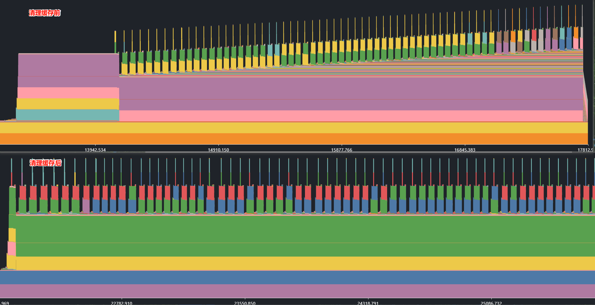
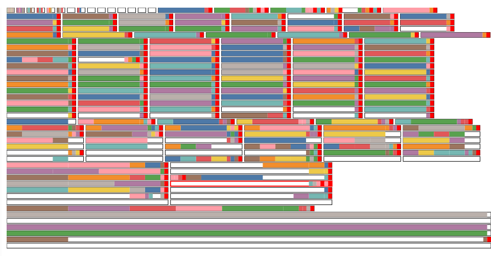
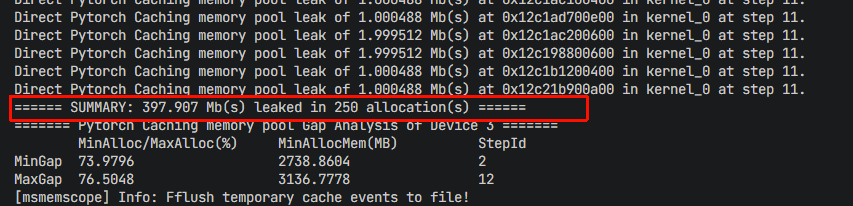
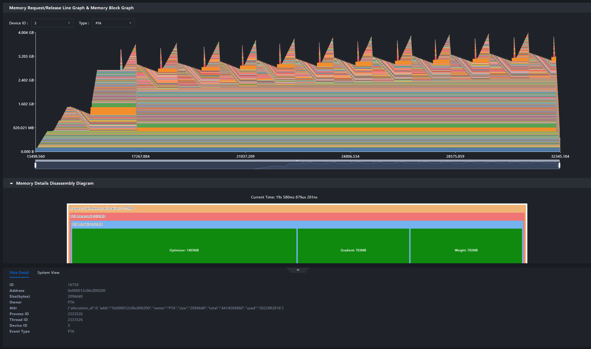
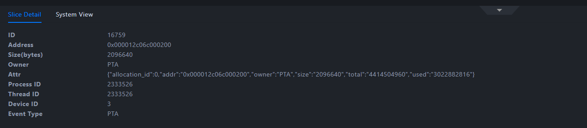
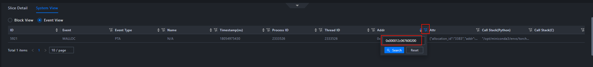
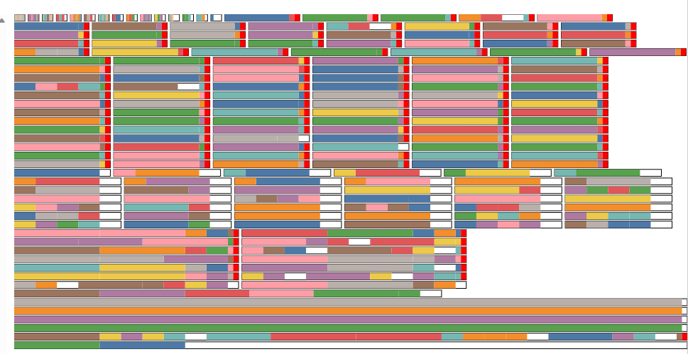

# 显存泄漏

- 现象：显存总使用量随时间持续上涨，始终无法收敛，常见周期性
- 影响因子：内存分配算法、缓存机制

| 问题子类 | 定义                                   | 特征                                                           | 常见原因                                                       |
| -------- | -------------------------------------- | -------------------------------------------------------------- | -------------------------------------------------------------- |
| 内存泄漏 | 已超出生命周期的内存长期不释放       | 物理内存使用量持续上涨，常见周期性                           | 1. 代码中漏调用释放接口；2. 不合理的引用关系导致长期持有无用对象引用 |
| 内存碎片 | 可用内存碎片化，无法申请连续大块内存 | 物理内存占用值持续上涨(或套件内存池持续扩容)，但套件内存池已分配内存值未明显上涨 | 1. 业务逻辑频繁交替申请释放大小块内存，且存在常驻小内存块；2. 内存重整逻辑失效 |

## 明确问题信息

内存使用问题的本质是谁该用内存、谁不该用内存、每块内存该分配多大、每块内存生命周期多长的问题

**在问题定位之前可以先确认一些事情，有利于下一步的数据采集和分析：**

| 类别                                       | 主要信息                                                     | 说明                                                         |
| ------------------------------------------ | ------------------------------------------------------------ | ------------------------------------------------------------ |
| 问题现象                                   | 问题现象                                                     | 显存使用增多/oom、异常                                       |
| 环境信息                                   | 场景                                                         | 训练场景或推理场景                                           |
| 框架                                       | 如pytorch、atb、mindspore、GE：有些内存池可以使用多种方法监测内存 |                                                              |
| 单算子or图模式                             | 图模式场景采集的信息有限，分析起来相对困难                   |                                                              |
| 模型                                       | 若涉及自研模型，建议了解模型结构（类Llama、类GPT等）         |                                                              |
| 具体规格                                   | 卡数、机器数                                                 |                                                              |
| 并行策略                                   | 明确具体并行参数配置                                         |                                                              |
| 版本                                       | 框架及版本                                                   | 明确CANN、MindSpore/Torch版本。确认近期是否存在版本变更（问题是否是版本变更后出现的）。 |
| 显存优化目标                               | 复现问题时间                                                 | 复现问题需要1h以上时，需要慎重选择采集工具的参数配置，目标是既能避免采集无效数据，也能完全支持问题分析 |
| 当前定位缩小到什么范围，下一步的期望是什么 | 建议了解客户优化目标的来源，有利于减少重复工作，有较为清楚的目标进行定位。 |                                                              |

一些内存管理配置通过环境变量设置，下面是一些目前已知的相关场景的配置，**可以先确认这些环境变量的状态**：

| 场景                                                      | 环境变量                                                   |
| --------------------------------------------------------- | ---------------------------------------------------------- |
| 使用PTA进行内存分配的场景，开启虚拟内存优化内存池空闲内存 | **export PYTORCH_NPU_ALLOC_CONF=expandable_segments:True** |
| GE优化内存池空闲内存占用：CANN 8.0.RC3.beta1 及以上版本| **export GE_USE_STATIC_MEMORY=3**                          |
| ATB场景优化算子workspace内存复用                          | **export ATB_WORKSPACE_MEM_ALLOC_GLOBAL=1**                |

## 排查方法

片上内存泄漏一般现象为设备物理内存出现非预期的持续上涨，而且常见周期性。对于周期性泄漏，常见场景有：

- 每个step/token/输出结束后内存增长

- 每次动态更改配置（多见于服务化推理）时内存增长

### 缓存清理

现象一：在训练大模型时，发现每个step结束后片上内存使用量持续上涨，最终导致OOM。  
这很有可能是由于PyTorch的缓存机制导致的——每次前向传播和反向传播都会产生临时张量，这些张量会被缓存起来但未及时释放。

在以下合适的地方尝试清理缓存，消除缓存堆积导致的类似泄漏的表项：

- **训练场景**：每个epoch结束后、每个step结束后

- **推理场景**：每次推理请求处理完成后、批次处理完成后

- **服务化场景**：每次请求处理完成后、配置变更前

这些位置是内存使用可能出现波动的关键点，清理缓存可以有效避免缓存堆积导致的内存占用持续上涨。

```shell
# 清除不可达的python对象
gc.collect()
# 清除torch_npu的缓存
torch_npu.npu.empty_cache()
```



从缓存清理的前后对比中，可以清晰的看出清理缓存前内存持续增长，清理后内存稳定。

缓存清理是解决片上内存泄漏的第一步，但如果清理缓存后问题仍未解决，可能是内存碎片在作祟。接下来，我们将介绍如何排查和解决内存碎片问题。

### 内存碎片排查

在一些场景下，内存池中内存碎片的持续累计也会造成类似于内存泄漏的表象，其典型特征为内存池未分配完就继续扩容。此时有三种常用排查方法，如果出现以下情况，大概率是内存碎片堆积：

1. 使用msMemScope工具采集内存数据并可视化，选择较靠后的时间点，查看片上内存占用拆解图，**PTA预留**与**模型占用**两个块差距较大

2. 使用profiler工具采集内存数据并可视化，内存曲线中**operators allocated**没有明显上涨，但是**operators reserved**间歇性上涨

3. 使用snapshot采集数据并可视化，在state history页签选择一个内存占用总量较高的时间点，查看内存池状态图，存在大量白色\(未分配\)小块内存

以snapshot数据为例，未开虚拟内存场景，内存碎片堆积情况呈下图状：



若出现PTA内存碎片，可尝试开启虚拟内存开关：

```shell
export PYTORCH_NPU_ALLOC_CONF=expandable_segments:True
```

若已开虚拟内存，仍存在较多内存碎片，snapshot结果呈下图状：


此时可在每个epoch结束后、批次处理完成后、请求处理低峰期等合适位置显示触发内存重整。

```python
torch_npu.npu.empty_cache()
```

解决了内存碎片问题后，如果片上内存泄漏仍未解决，我们需要进一步筛选长期不释放的内存块。

### 筛选长期内存

采集内存数据并分析后，如果发现有几个大块内存长期不释放，可以通过查看这些内存块的申请调用栈，最终定位到引入内存泄漏的代码位置。

使用msMemScope工具采集内存数据时，建议遵循以下配置：

- **打开调用栈采集**：设置call_stack参数，记录内存申请的完整调用链

- **跳过初始化阶段**：初始化阶段会存在一些合理的常驻内存

- **适当延长采集时间**：在数据量可接受的前提下，采集时间适当长一些

#### 简单示例

为了更好地理解排查过程，我们构建一个简单的内存泄漏场景，演示完整的数据采集和分析流程。

**场景描述**：

在训练过程中，全局片上内存持续增长。

**数据采集步骤**：

1. **准备采集脚本**，开启泄漏检测、片上内存拆解功能，采集调用栈。

    ```python
    import msmemscope
    msmemscope.config(analysis="leaks, decompose", call_stack="python")  # 开启泄漏检测、片上内存拆解、调用栈采集
    ```

2. **执行数据采集** 配置环境变量，执行采集脚本。

3. **采集过程输出**

    

    从输出可以看到，每个step内部泄漏了多个约1.5MB小块片上内存，总共泄漏片上内存约398MB，这是典型的内存泄漏特征。

4. 使用**MindStudio Insight**分析

使用MindStudio Insight工具打开采集文件：

步骤1：打开数据文件



步骤2：查看内存块图

在内存块图（Memory Block Graph）中，可以观察到，内存峰值随每个训练epoch增长，同时可以观察到每个epoch过程中，生成了一些不会释放的内存块，合理怀疑这些内存块为泄漏片上内存块，并顶高了片上内存峰值。 


步骤3：定位泄漏点

点击怀疑的泄漏内存块，查看详细信息：



得到**内存地址**：0x000012c067600200，**大小**：2096640 字节等信息。

在System View中，通过查找地址查看该内存块的申请调用栈：



得到调用栈信息：

***

"/opt/miniconda3/envs/torch2.6/lib/Python3.11/site\-packages/torch/\_ops.py\(723\): \_\_call\_\_
./memscope/build/msmemscope/Python/msmemscope/aten\_collection.py\(187\): \_\_torch\_dispatch\_\_
./memscope/example/memory\_leak\_demo.py\(99\): create\_memory\_leak
./memscope/example/memory\_leak\_demo.py\(150\): main
./memscope/example/memory\_leak\_demo.py\(163\): &lt;module>"

***

步骤4：查看片上内存拆解图


在片上内存拆解视图中，框架层面占用量：

- 模型权重（weight）：模型参数占用的片上内存

- 梯度（gradient）：反向传播过程中梯度占用的片上内存

- 优化器状态（optimizer_state）：优化器维护的状态变量占用的片上内存

内存池层占用量：

- **PTA预留（PyTorch Ascend框架预留的内存池）**：3936 MB

- **模型占用（实际被模型使用的片上内存）**：2811 MB

两者之间相差1125MB，说明很可能存在内存碎片的现象。通过Snapshot采集数据得到下图，证明确实存在大量内存碎片。



**分析结论**：

通过调用栈信息，可以快速定位到泄漏代码位置：`memory_leak_demo.py` 第99行，即 `leak_tensor = torch.randn(512, 512).to\(device)`，泄漏大小为398MB。通过片上内存拆解视图信息，发现预留片上内存比模型占用片上内存多出了1125MB，具有片上内存碎片。

除了上述方法外，对于Python进程，我们还需要特别关注Python对象的泄漏问题。接下来，我们将介绍如何排查Python对象导致的片上内存泄漏。

### Python对象泄漏排查

对于Python进程，显存泄漏往往与Python对象的引用关系密切相关。排查流程应遵循"先确认是否为Python对象泄漏→定位泄漏对象→查找对象申请点"的逻辑。

#### 一、确认是否存在Python对象泄漏

在关键位置定期统计周期性的Python对象内存占用总和，判断是否存在周期性上涨：

```python
import gc
import sys

# 获取所有被跟踪的对象
objects = gc.get_objects()
# 计算所有对象的内存占用
total_memory = sum(sys.getsizeof(obj) for obj in objects)
print(f"Total memory used by tracked objects: {total_memory} bytes")
```

**插入位置建议**：

- **训练场景**：每个step结束后
- **推理场景**：每次推理请求处理完成后
- **服务化场景**：每次请求处理完成后

若内存占用存在明显的周期性上涨，可确认存在Python对象泄漏；否则无需继续排查Python对象泄漏。

#### 二、定位泄漏的Python对象

方法1：主动触发垃圾回收

Python对象生命周期通过引用计数管理。在特殊场景（如循环引用）下，对象可能无法自动回收：

```python
import gc
gc.collect()
```

触发垃圾回收后，观察内存是否能降回预期水平。

方法2：对比快照筛选内存增长点

使用tracemalloc模块对比不同时间点的内存快照：

```python
import tracemalloc
tracemalloc.start()

def train():
    # 业务代码
    if self.step == n:
        # 拍摄第一个内存快照（建议在第3个step后）
        self.snapshot1 = tracemalloc.take_snapshot()
    
    if self.step == n + 1:
        # 拍摄第二个内存快照
        self.snapshot2 = tracemalloc.take_snapshot()
        
        # 比较两个快照，找出内存分配差异
        top_stats = self.snapshot2.compare_to(self.snapshot1, 'lineno')
        
        # 打印内存分配差异
        for stat in top_stats[:10]:
            print(stat)
```

由于前几个step可能存在较多初始化操作，一般建议首个内存快照在第3个或以后的step采集，或根据实际业务情况跳过初始化阶段。
结果示例：

```shell
/home/test.py:3: size=576 B (+576 B), count=1 (+1), average=576 B
/home/test.py:6: size=144 B (+144 B), count=1 (+1), average=144 B
```

由此可定位内存增长点。

#### 三、查找对象申请点

根据定位结果，排查对象引用关系：

情况1：代码逻辑bug

若代码本身有bug导致对象未释放，按业务逻辑修复即可。

情况2：隐式引用残留

若代码中已不再显式引用，但对象仍未释放，需排查引用关系：

```python
import sys
import gc
import objgraph

# 获取对象引用计数
print(sys.getrefcount(obj_global_ref))

# 获取所有引用obj的对象
referrers = gc.get_referrers(obj_global_ref)
for ref in referrers:
    print(f"referrer：{ref}")

# 使用可视化库显示引用关系拓扑图
objgraph.show_refs([obj_global_ref], filename="refs.png", max_depth=5)
```

通过引用拓扑图，可清晰看到对象的引用链路，定位不合理的引用点。

#### 高级调试：追踪容器创建栈

对于对象存在不合理引用，导致未能及时释放的问题，根据上述操作应该可以找到残留对象的引用点，如果引用点是frame、code、func等对象（残留对象是某个局部变量），则这些对象本身的属性中有其代码信息。如果引用点是一般对象，例如list等容器，且若定位者无法直接看出引用点对应的代码，则可以通过给gc加钩子添加调试信息。现假设根据gc.get\_referrers的结果，残留对象被某个tuple引用，且定位者不知道这个tuple对应的代码在哪：

```python
import gc
import inspect
import threading

# 存储目标对象的创建栈
creation_stack = {}
lock = threading.Lock()

def gc_callback(phase, info):
    """gc回调函数：记录对象的创建栈"""
    if phase != 'start':
        return
    for obj in info.get('uncollectable', []) + info.get('collected', []):
        if isinstance(obj, tuple) and id(obj) not in creation_stack:
            with lock:
                creation_stack[id(obj)] = inspect.stack()

# 注册gc回调
gc.callbacks.append(gc_callback)
gc.collect()

# ... 目标代码段 ...

# 再次触发gc，获取创建栈
gc.collect()
target_obj = gc.get_referrers(obj)[0]
if id(target_obj) in creation_stack:
    stack = creation_stack[id(target_obj)]
    print("对象创建栈：")
    for frame in stack:
        print(f"  文件：{frame.filename}，行号：{frame.lineno}")

# 移除回调
gc.callbacks.remove(gc_callback)
```

通过以上排查流程，可以快速定位Python对象泄漏的根本原因。
