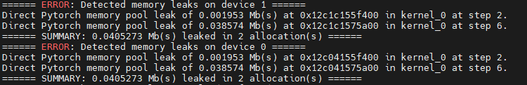
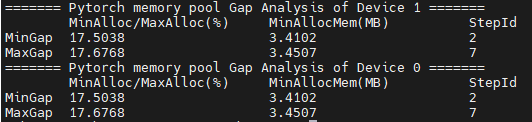
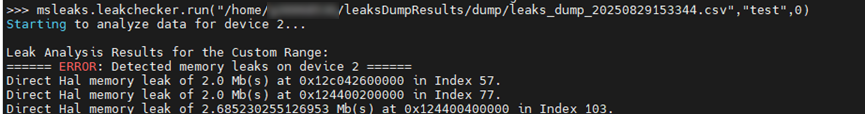

# **内存分析**

## 简介

msMemScope工具基于采集的内存数据，提供泄漏、对比、监测、拆解，低效内存识别以及OOM分析等分析能力，帮助开发者快速诊断和优化内存问题。

|分析能力|说明|
|--|--|
|内存泄漏|针对内存长时间未释放和内存泄漏等问题，需要进行内存分析时，msMemScope工具提供内存泄漏分析和kernel Launch粒度的内存变化分析功能，实现告警定位与分析。|
|内存对比|当两个Step内存使用存在差异时，可能会导致内存使用过多，甚至出现OOM（Out of Memory，内存溢出）的问题，则需要使用msMemScope工具的内存对比分析功能来定位并分析问题。|
|内存块监测|在大模型场景中，当遇到内存踩踏定位困难时，msMemScope工具支持通过Python接口和命令行两种方式，在算子执行前后对指定的内存块进行监测。根据内存块数据的变化，快速确定算子间内存踩踏的范围或具体位置。|
|内存拆解|msMemScope工具提供内存拆解功能，支持对CANN层和Ascend for PyTorch框架的内存使用情况进行拆解，输出模型权重、激活值、梯度，以及优化器等组件的内存占用情况。|
|低效内存识别|在训练推理模型过程中，可能存在部分内存块申请后未立即使用，或使用完毕后未及时释放的低效情况。msMemScope工具可帮助识别这种低效内存的使用现象，从而优化训练推理模型。|
|OOM分析|当NPU训练/推理过程中发生OOM（Out of Memory，显存溢出）时，msMemScope工具可自动采集触发OOM的操作信息、最近未释放的内存分配记录和占用最大的内存分配记录，帮助快速定位OOM根因。|
|一键分析|为了提高msMemScope内存分析的易用性，支持一键开启内存拆解和内存快照功能，对vLLM/FSDP/verl的核心函数自动打点，供用户快速分析。|
|NPU Sanitizer自定义算子打点|对于开发者自行编写的自定义算子，msMemScope联动NPU Sanitizer提供了自定义算子打点功能。开发者通过MSTX接口上报一条格式化字符串，即可将自定义算子的显存读写信息送入Sanitizer分析管线，检测多流同步错误。|
|Host堆内存泄漏检测|针对训练与推理过程中宿主侧进程堆内存长时间未释放导致的内存增长问题，msMemScope工具对检测区间内申请且未释放的Host堆内存块按调用栈聚合分析，输出泄漏概览报告与逐块明细，实现Host堆内存泄漏的定位与分析。|

## 使用前准备

msMemScope工具的安装，请参见《[msMemScope工具安装说明](../install_guide/install_guide.md)》。

## 内存泄漏分析功能介绍

### 功能说明

内存问题主要包括内存泄漏、踩踏、内存碎片，可能导致内存过多等问题，msMemScope工具支持内存泄漏问题的定位。

### 注意事项

- 在使用内存分析功能时，如果需要设置--events参数，请确保--events参数中包含alloc和free。
- 在使用内存分析功能时，请勿设置--steps参数。
- 内存泄漏分析的离线方式目前仅支持HAL内存泄漏分析。
- 内存泄漏分析暂不支持场景：VLLM-Ascend。

### 使用示例

内存泄漏分析能力支持在线和离线两种方式。

**在线方式**

在进行内存分析时，需配合使用mstx打点功能进行问题定位，mstx打点详情参考[MindStudio Tools Extension Library接口](https://gitcode.com/Ascend/mstx/blob/master/docs/zh/api_reference/README.md)。

1. 使用msMemScope工具启动用户程序，Application为用户程序。

    ```shell
    msmemscope ${Application}
    ```

2. 执行完成后，会出现如下两种回显信息。
    - 如果出现如[**图 1**  memory leak](#leak)的回显信息，表示存在内存泄漏问题。回显信息中分别展示了每张卡内存泄漏的汇总信息，包括泄漏发生的Step数、关联的kernel、地址以及泄漏大小等信息。

        **图 1**  memory leak<a id="leak"></a>

        

    - 如果出现如[**图 2**  memory fluctuation](#fluctuation)的回显信息，表示存在内存波动。回显信息中展示了单个Step内的内存波动（用最小和最大的内存池分配占用比值定义）以及最小的内存池分配占用，同时给出最小比值和最大比值作为参考，用户可根据该值判断是否存在内存泄漏风险。

        > [!NOTE]
        >
        > 在第一个Step时，内存尚未稳定，所以只支持分析从第二个Step开始的内存波动，第一个Step内存波动可忽略。

        **图 2**  memory fluctuation <a id="fluctuation"></a>

        

**离线方式**

msMemScope支持对指定范围内的内存事件进行离线泄漏分析。使用mstx标识好泄漏分析的范围后，可以使用该功能对落盘文件进行分析。

1. 对需要检测泄漏的范围进行mstx的mark打点。mstx打点详情参考[MindStudio Tools Extension Library接口](https://gitcode.com/Ascend/mstx/blob/master/docs/zh/api_reference/README.md)。

    > [!NOTE]
    >
    > - 打点的mark信息将用于离线分析接口的输入。
    > - 使用mark打点功能标记三个点，分别称为A、B、C。在A到B范围内申请的内存，需要在C点前全部释放，否则会被判定为内存泄漏。

2. 执行以下命令，使用msMemScope工具启动用户程序，获取落盘csv文件，Application为用户程序。

    ```shell
    msmemscope ${Application}
    ```

3. 执行以下命令，调用Python接口，对输出文件中的csv文件进行离线泄漏分析。

    ```python
    import msmemscope
    msmemscope.check_leaks(input_path="user/memscope.csv",mstx_info="test",start_index=0)
    ```

    其中参数信息如下：

    - input_path：csv文件所在路径，需使用绝对路径。
    - mstx_info：mark打点使用的mstx文本信息，用于标识泄漏分析的范围。
    - start_index：内存泄漏分析开始的打点位置编号，即从第几个符合条件的mstx打点位置开始分析。

    如果出现[**图 3**  offline leakage analysis](#analysis)的回显信息，表示存在内存泄漏问题。

    **图 3**  offline leakage analysis <a id="analysis"></a>

    

## Host堆内存泄漏检测功能介绍

### 功能说明

Host堆内存泄漏检测针对训练与推理过程中宿主侧进程（CPU侧）堆内存长期未释放导致的内存增长问题，对检测区间（窗口）内申请且未释放的Host堆内存块按调用栈聚合，输出泄漏概览报告与逐块明细，帮助定位泄漏调用栈与泄漏规模。

- **单账本 + 闭窗快照**：钩子侧块表为唯一账本，窗口期间数据零跨层传输，窗口结束时一次性聚合，热路径开销低（默认全量追踪，不依赖采样）。
- **泄漏定位**：输出TOP N泄漏点调用栈（默认10个）、未释放块大小排布、逐块明细（可选）。
- **诚实性标注**：块阈值过滤、采样、表满降级、截断等追踪决策在报告“数据健康度分析”章节如实标注，无运行中隐式丢包。
- **两种使用方式**：支持命令行方式和Python接口方式。

Host堆内存泄漏检测与显存（Device侧）内存泄漏分析相互独立，可分别使用；与分析项`leaks`、`decompose`、`inefficient`、`oom`互斥，不可在同一配置中同时启用。

### 使用示例

检测区间（窗口）语义如下：

- **命令行方式**：目标进程启动即开窗，进程退出时自动闭窗并输出报告。
- **Python接口方式**：`msmemscope.start()`开窗、`msmemscope.stop()`关窗，每对start/stop对应一个检测窗口、输出一份报告；`analysis`中包含`host-leaks`是窗口开启的前提（使能配置），采集停止时自动闭窗并输出报告。

**命令行方式**

1. 使用msMemScope启动用户程序，Application为用户程序及其参数。

    ```shell
    msmemscope --analysis=host-leaks [--host-leak-mode=MODE] [--block-size-threshold=N] [--sample-rate=N] ${Application}
    ```

    例如：

    ```shell
    msmemscope --analysis=host-leaks --block-size-threshold=1024 --sample-rate=1 --output-path=./output python ./train.py
    ```

    > [!NOTE]
    >
    > - 命令行方式下，`--analysis`中包含`host-leaks`时，msMemScope启动器自动按Host模式装配钩子（`LD_PRELOAD`仅装载`libmsmemscope_host_mem_hook.so`），无需手工设置环境变量。
    > - 也可通过`source msmemscope --load-api-env=host`手动装载Host钩子环境（Python接口方式必需），使用完毕后执行`source msmemscope --unload-api-env`清除。

2. 目标进程退出后，在输出目录下生成泄漏概览报告，详见[输出说明](#host堆内存泄漏检测输出说明)。

**Python接口方式**

1. 设置环境变量，装载Host钩子。

    ```shell
    source msmemscope --load-api-env=host
    ```

2. 在用户脚本中配置使能并启停检测。

    ```python
    import msmemscope
    # 配置使能: analysis中包含host-leaks为开窗前提(可随时调整host_leak_mode等参数)
    msmemscope.config(analysis=["host-leaks"], host_leak_mode="summary", block_size_threshold="1024")
    msmemscope.start()          # 开窗: 开始检测区间
    # ... 训练若干step ...
    msmemscope.stop()           # 关窗: 结束检测区间,闭窗聚合输出报告
    ```

    每对`start()`/`stop()`对应一个检测窗口，输出一份概览报告（窗口序号递增）；检测期间也可随时下发`config(analysis=[])`停止检测并闭窗。

    > [!NOTE]
    >
    > - `analysis`中包含`host-leaks`时，若当前进程的Host钩子未装配（未执行`source msmemscope --load-api-env=host`），接口将抛出`ValueError`，提示先装载环境。
    > - 窗口关闭后报告立即输出；进程退出时若有未关闭窗口，将自动闭窗。

### 参数说明

Host堆内存泄漏检测参数如[**表 1**  Host堆内存泄漏检测CLI参数说明](#host堆内存泄漏检测cli参数说明)所示。

**表 1**  Host堆内存泄漏检测CLI参数说明<a id="host堆内存泄漏检测cli参数说明"></a>

|参数|默认值|说明|
|--|--|--|
|`--analysis=host-leaks`|—（默认分析项为`leaks`）|启用Host堆内存泄漏检测。与`leaks`、`decompose`、`inefficient`、`oom`互斥，同一配置中不可同时启用。|
|`--host-leak-mode <MODE>`|`summary`|上报模式：`summary`=仅输出按调用栈聚合的概览报告；`event`=除概览报告外，额外输出逐块明细CSV。|
|`--block-size-threshold <N>`|`0`|块大小阈值（字节）：只记录size≥N的分配。默认0表示全量追踪；显式设置>0时，小于阈值的分配不进入账本，其数量与总量在报告的“数据健康度分析”章节标注。|
|`--sample-rate <N>`|`1`|显式采样率倒数（2的幂向下归一）：1=不采样；N>1表示仅记录约1/N的分配，报告标注采样视图。仅在极端分配率场景下使用。|

阈值与采样率在窗口开启时快照生效，窗口期内修改不生效（对当前窗口无影响，自下一窗口起生效）。

Python接口方式通过`msmemscope.config(**kwargs)`下发相同配置，对应键如[**表 2**  Host堆内存泄漏检测Python config键说明](#host堆内存泄漏检测python-config键说明)所示（值须为字符串）。

**表 2**  Host堆内存泄漏检测Python config键说明<a id="host堆内存泄漏检测python-config键说明"></a>

|config键|默认值|说明|
|--|--|--|
|`analysis=["host-leaks"]`（或`analysis="host-leaks"`）|—|使能Host堆内存泄漏检测（开窗前提），互斥校验与CLI相同。窗口的实际开/关由`start()`/`stop()`控制。|
|`host_leak_mode`|`"summary"`|上报模式，对应`--host-leak-mode`。|
|`block_size_threshold`|`"0"`|块大小阈值，对应`--block-size-threshold`。|
|`sample_rate`|`"1"`|采样率倒数，对应`--sample-rate`。|

### 输出说明<a id="host堆内存泄漏检测输出说明"></a>

Host堆内存泄漏检测的输出文件保存在`{output}/msmemscope_{*PID*}_{_timestamp_}_ascend/host_leak/`目录下（`{output}`为`--output-path`指定的输出目录，默认为`./memscopeDumpResults`），如[**表 3**  Host堆内存泄漏检测输出文件说明](#host堆内存泄漏检测输出文件明细表)所示。

**表 3**  Host堆内存泄漏检测输出文件说明<a id="host堆内存泄漏检测输出文件明细表"></a>

|输出文件|存在条件|内容|
|--|--|--|
|`leak_overview_{*stage*}.txt`|默认输出，summary与event模式均生成|泄漏概览报告：数据健康度分析、总泄漏量、泄漏块大小排布、开窗前free大小排布、TOP N泄漏点调用栈。`{stage}`为窗口序号。|
|`block_detail_{*stage*}.csv`|仅`--host-leak-mode=event`且窗口内存在未释放块时生成|逐块泄漏明细：`addr,size,alloc_ts,call_stack`，按块大小降序，调用栈文本内联（RFC 4180引号字段）。|

两份文件与同窗号一一对应，字段及格式详见《[输出文件说明](./output_file_spec.md)》。

### 报告解读<a id="host堆内存泄漏检测报告解读"></a>

泄漏概览报告（`leak_overview_{*stage*}.txt`）按以下章节输出：

|章节|含义|
|--|--|
|Data Health Analysis（数据健康度分析）|如实标注本窗口的追踪决策：检测窗口起止时间、上报模式、总申请/释放计数、去重调用栈数（键深K=20，类=前K帧相同的归因语义）、未归因块数（栈表超限转未知桶）、死栈淘汰统计、截断标注（bit0=块表满转溢出通道、bit1=栈表满转未知桶、bit2=溢出账本满记账停止）、溢出通道统计、开窗前free统计、采样率（非1时标注采样视图）、块阈值与未追踪统计、符号化覆盖率。窗口数据不完整时明确标注“不可作为泄漏结论”。|
|Total Unfreed（总泄漏量）|本窗口内申请且未释放的块数/字节合计（含未知桶与溢出通道存活块），闭窗遍历的精确值。|
|Unfreed Block Size Distribution（泄漏块大小排布）|未释放块按大小分桶的块数/字节/占比（默认7桶：0~256B、256B~1K、1K~4K、4K~32K、32K~256K、256K~1M、1M以上）。|
|Pre-Window Free Size Distribution（开窗前free大小排布）|开窗前申请、窗口期间释放的内存按大小归桶统计（独立通道，不参与泄漏判定，供缓存老化场景分析）。|
|TOP N Leak Sites（TOP N泄漏点）|按未释放字节降序的泄漏点调用栈列表，每行含未释放/申请/释放统计与完整符号化栈文本。未归因块所在行为未知桶行，栈文本缺失标注`(unresolved stack)`。|

### 注意事项

- 使用环境需为Linux操作系统（x86_64或aarch64）。
- Host堆内存泄漏检测与显存（Device侧）内存泄漏分析相互独立；与分析项`leaks`、`decompose`、`inefficient`、`oom`互斥，不可在同一配置中同时启用。
- 本功能只覆盖标准堆分配接口（`malloc`/`calloc`/`realloc`/`posix_memalign`/`aligned_alloc`/`memalign`/`valloc`/`pvalloc`），`mmap`等非堆分配不记账。
- 开窗前已分配的存量内存不进入账本；窗口期间释放的开窗前内存计入“开窗前free”独立通道，不并入总申请/释放计数，也不参与泄漏判定。
- 设置`--block-size-threshold`或`--sample-rate`时，报告中的未释放量为对应追踪决策下的视图，报告会如实标注，不表示全量结果。
- `block_detail_{*stage*}.csv`逐块明细仅覆盖块表口径；溢出通道块（块表满降级转入）无栈归因，不进入明细，但已计入总泄漏量与大小排布。概览总泄漏量与明细之和的差值即溢出通道块。
- fork出的子进程不纳入检测（钩子在子进程中自动停用），分布式训练场景各进程独立开窗、独立报告。
- 检测窗口内的快照与统计在闭窗时一次性拉取；极端早期退出导致统计不可得时，报告以`Snapshot: unavailable`标注，不输出臆测数据。
- 进程退出时若窗口未关闭，msMemScope将自动闭窗并输出报告（闭窗聚合最长等待120s）。

### 限制说明

- 本功能定位于区间内未释放的Host堆内存检测，报告结论针对检测窗口，不能直接外推为进程整体泄漏。
- 极高频分配（百万次/秒级）且长存活块数超大的场景下，块表安全阀（默认2000万条）触顶后申请转入溢出通道（无栈归因）；溢出账本也满时记账停止，窗口数据为截断点前的完整前缀，报告明示不可作为泄漏结论。此类场景建议显式设置块阈值或采样率。
- 栈表容量（默认40万条）触顶时，死栈（已全部释放的调用栈）会被回收腾位，其历史计数折叠并入未知桶行；全活表场景下新调用栈归入未知桶。归因粒度退化但记账不中断，报告如实标注。
- 键深K默认20帧：调用栈前20帧相同的申请归为同一“类”；K可在报告标注中查看，实际键深与运行库相关，不同库版本下K帧一致性的类语义可能不同。

## 内存对比分析功能介绍

### 功能说明

如果训练和推理的参数设置一致，但是CANN和Ascend for PyTorch或MindSpore框架的版本不配套，训练推理任务的两个不同Step的内存使用可能存在差异，会造成内存占用过多，甚至OOM的问题。msMemScope工具可帮助进行内存对比分析，从而有效定位内存相关问题。

### 注意事项

使用本对比功能之前，需要先采集两个不同Step的数据。

### 使用示例

1. 使用环境变量关闭task_queue算子下发队列优化。

    ```shell
    export TASK_QUEUE_ENABLE=0
    ```

2. 在训练推理代码中添加mstx打点代码，可参考[内存泄漏分析功能介绍](#内存泄漏分析功能介绍)。
3. 执行以下命令，使用msMemScope工具采集指定Step的内存数据，需要采集两个不同Step的数据。建议每次只采集一个Step的数据，两个不同Step的数据采集完成后，用来进行Step间内存对比分析。

    ```shell
    msmemscope [options] ${Application} --steps=Required Step --level=kernel
    ```

    其中参数信息如下：
    - options：命令行参数，具体信息可参见[命令行采集功能介绍](./memory_profile.md#命令行采集功能介绍)。
    - Application：用户程序。
    - steps：指定的Step编号。

4. 执行以下命令，对比采集到的两个Step的内存使用差异。

    ```shell
    msmemscope --compare --input-path=path1,path2 --level=kernel
    ```

    其中--compare和--input-path参数必须一起使用，单个使用无效，同时--input-path输入的两个文件路径需要逗号（全角半角逗号均可）隔开，--level也可选为op。

5. Step间对比生成的结果目录如下。

    ```shell
    |- memscopeDumpResults
           |- compare
                   |- memory_compare_{timestamp}.csv
    ```

### 输出说明

Step间内存问题可通过输出文件查询定位，输出文件详解可参见[输出文件说明](./output_file_spec.md)。

## 内存块监测功能介绍

### 功能说明

大模型场景下，单卡的计算任务十分复杂，如果内存踩踏一旦发生，定位非常困难。msMemScope工具支持通过Python接口在算子执行前后监测指定内存块，根据内存块数据的变化，定位算子间内存踩踏的范围或具体位置。

### 注意事项

 - 内存块监测功能仅支持Aten单算子和ATB算子，且可以通过--level指定op维度和kernel维度的内存块监测。
 - Ascend for PyTorch场景下，kernel算子的监测仅支持调用Python接口的方式，暂不支持watch命令行方式。调用Python接口的监测方式请参见[3](#3)。
 - 需控制内存监测算子的范围和内存块大小，避免由于设置过大，导致的dump数据耗时增加，以及磁盘空间占用过多的问题。
 - 内存块监测功能暂不支持场景：VLLM-Ascend，原因为VLLM-Ascend不支持设置`ASCEND_LAUNCH_BLOCKING=1`环境变量。

### 使用示例

1. 执行以下命令，关闭多任务下发。

    ```shell
    export ASCEND_LAUNCH_BLOCKING=1
    ```

2. 执行以下命令，开启内存块监测。

    ```shell
    msmemscope ${Application} --watch=start:outid,end,full-content
    ```

    **表 1**  参数说明

    |参数|说明|
    |--|--|
    |Application|用户的可执行脚本。如果需要使用Python接口指定被监测的Tensor，具体设置请参见[3](#3)。|
    |--watch|开启内存块监测功能。<br> - start：可选，字符串形式，表示开始监测算子。<br> - outid：可选，表示算子的output编号。当Tensor为一个列表时，可以指定需要落盘的Tensor，取值为Tensor在列表中的下标编号。<br> - end：必选，字符串形式，表示结束监测算子。<br> - full-content：可选，表示全量落盘内存数据，会将每个Tensor对应的二进制文件进行落盘。如果不选择该值，表示轻量化落盘，仅落盘Tensor对应的哈希值。<br> 示例：--watch=token0/layer0/module0/op0,token0/layer0/module0/op1,full-content|

3. <a id="3"></a>在用户的可执行脚本中，调用Python接口指定被监测的Tensor。

    增加Python的watcher模块的接口，其中watch接口表示开始监测该内存块，remove接口表示取消监测该内存块。内存块监测有两种开启方式，示例代码中的参数说明可参见[**表 2**  开启内存块监测的参数说明](#开启内存块监测的参数说明)。

    > [!NOTE]
    >
    > 建议使用方式一指定被监测的Tensor。如果需要使用方式二，需自行确认内存块地址和长度的有效性。

    - 方式一：直接输入Tensor

        示例脚本如下：

        ```python
        import torch
        import torch_npu
        import msmemscope

        torch.npu.synchronize()
        test_tensor = torch.randn(2,3).to('npu:0')        # 请根据实际情况自行创建或选择需要监测的Tensor
        msmemscope.watcher.watch(test_tensor, name="test", dump_nums=2)
        ...
        torch.npu.synchronize()
        msmemscope.watcher.remove(test_tensor)
        ```

    - 方式二：输入内存块的地址和长度

        示例脚本如下：

        ```python
        import torch
        import torch_npu
        import msmemscope

        torch.npu.synchronize()
        test_tensor = torch.randn(2,3).to('npu:0')
        msmemscope.watcher.watch(test_tensor.data_ptr(), length=1000, name="test", dump_nums=2)
        ...
        torch.npu.synchronize()
        msmemscope.watcher.remove(test_tensor.data_ptr(), length=1000)
        ```

    **表 2**  开启内存块监测的参数说明 <a id="开启内存块监测的参数说明"></a>

    |参数|说明|
    |--|--|
    |name|必选，用来最后dump的时候标识监测的Tensor。|
    |dump_nums|可选，表示指定dump的次数，不输入取值表示无限制。|
    |test_tensor.data_ptr()|必选，表示被监测Tensor的地址。仅当使用方式二开启内存块监测时需输入该参数。|
    |length|必选，表示输入监测内存块的长度，当输入length时，无关键字的参数只能为地址整型变量。length的大小建议小于等于已知被监测Tensor的内存块的大小。仅当使用方式二开启内存块监测时需输入该参数。|

4. 命令执行完成后，内存块监测生成的结果目录如下。

    ```text
    ├── memscopeDumpResults
    │    └── watch_dump
          │    ├── {deviceid}_{tid}_{opName}_{调用次数}-{watchedOpName}_{outid}_{before/after}.bin        # 当输入full-content参数时，落盘bin文件
          │    ├── watch_dump_data_check_sum_{deviceid}_{timestamp}.csv         # 当未输入full-content参数时，落盘csv文件
    ```

### 输出说明

内存块监测功能输出的文件为bin文件或csv文件。

- bin文件记录的是Tensor的详细落盘结果。
- csv文件仅记录了Tensor对应的哈希值。

## 内存拆解功能介绍

### 功能说明

msMemScope工具通过增加Python接口，支持用户自行对代码段做描述。

### 注意事项

- 使用示例中的方式一和方式二，最多可添加3个不重复的标签。
- 内存拆解功能可通过两种方式开启，方式一为自动拆解（自动使能），方式二为一键分析功能开启，具体操作可参见[自动拆解功能介绍](#自动拆解功能介绍)和[一键分析功能介绍](#一键分析功能介绍)。内存拆解支持以下应用场景。

    |场景|说明|
    |----|-----|
    |训练|支持对Ascend for PyTorch（python原生训练）和pytorch fsdp、fsdp2的训练过程开启内存拆解，可对训练过程中的权重、梯度、优化器状态、激活值等内存申请进行拆解分析。|
    |推理|支持为vLLM推理框架开启内存拆解功能，可对推理过程中的load_weight、profile_run、kv_cache和activate等环节的内存占用进行拆解分析。|
    |强化学习|强化学习（verl）涉及推理和训练两个阶段，目前暂不支持内存拆解（verl的内存拆解能力规划中）；如需获取verl场景的内存快照，可使用一键分析功能，具体可参见[一键分析功能介绍](#一键分析功能介绍)。|

### 自动拆解功能介绍

配置`analysis=decompose`（Python接口或命令行`--analysis=decompose`）后，msMemScope自动使能框架级内存拆解钩子，无需手动调用接口。钩子采用惰性激活机制，仅在实际导入的框架上生效，未使用框架的钩子静默不生效。自动拆解支持的场景、框架、版本与拆解内容如下表所示。

|场景|框架|版本|拆解内容|
|----|----|----|----|
|训练|Ascend for PyTorch（python原生训练）|不限制|权重、梯度、优化器状态等内存申请。|
|训练|pytorch fsdp1|2.6+|FSDP分布式训练的激活值、分片权重、all-gather缓冲、梯度等内存申请。|
|训练|pytorch fsdp2|2.6-2.9、2.10+|FSDP2分布式训练的激活值、分片权重、all-gather缓冲、梯度等内存申请。|
|推理|vllm-ascend|11.0|推理过程中的load_weight、profile_run、kv_cache、activate等环节的内存占用。|

> [!NOTE]
>
> 版本键说明："2.6+"表示2.6及以上版本；"2.6-2.9"表示2.6~2.9各分支的全部版本（含补丁，不含2.10）；"2.10+"表示2.10及以上版本。

### 使用示例

在msMemScope工具中，增加Python接口，使用describe标记一个Tensor、一个函数或一段代码，共有三种使用方式。

- 方式一：通过装饰器修饰某个函数，函数内所有内存申请事件的owner属性都会打上标签test1。

    ```python
    import msmemscope.describe as describe

    @describe.describer(owner="test1")
    def train1():
        pass
    ```

- 方式二：通过with语句，对代码块做标记，代码块内所有内存申请事件的owner属性都会打上标签test2。

    代码示例1：

    ```python
    import msmemscope.describe as describe

    with describe.describer(owner="test2"):
        train2()
    ```

    代码示例2：

    ```python
    import msmemscope.describe as describe

    describe.describer(owner="test3").__enter__()
    train3()
    describe.describer(owner="test3").__exit__()
    ```

- 方式三：标记Tensor，该Tensor对应的内存申请事件的owner属性会添加用户指定的标记。

    ```python
    import msmemscope.describe as describe

    t = torch.randn(10,10).to('npu:0')
    describe.describer(t, owner="test4")
    ```

### 输出说明

内存拆解的结果会保存在memscope_dump_{_timestamp_}.csv或memscope_dump_{_timestamp_}.db文件中，文件中的owner字段记录了各内存申请事件的显存类别和组件名称，具体信息可参见[输出文件说明](./output_file_spec.md)。

## 低效内存识别功能介绍

### 功能说明

在训练推理模型时，可能存在部分内存块申请后没有立即使用，或者使用结束后未及时释放等情况，从而导致内存使用增高的现象，对于内存来说，这种现象是低效的。

低效内存（Inefficient Memory）是指在模型运行过程中，Device侧有关内存申请、释放以及访问操作的时机不合理的某个Tensor对象。

msMemScope工具针对op算子粒度支持**过早申请**（Early Allocation）、**过迟释放**（Late Deallocation）、**临时闲置**（Temporary Idleness）三种低效内存的识别，具体说明如[**表 1**  低效内存说明](#低效内存说明)所示。

**表 1**  低效内存说明 <a id="低效内存说明"></a>

|分类|说明|
|--|--|
|过早申请|对于某个Tensor对象，在其申请内存的算子与第一次访问的算子之间，存在着其他算子包含了其他Tensor对象的释放操作，这个Tensor对象就是过早申请了。|
|过迟释放|对于某个Tensor对象，在其最后一次访问的算子与释放内存的算子之间，存在着其他算子包含了其他Tensor对象的申请操作，这个Tensor对象就是过迟释放了。|
|临时闲置|对于某个Tensor对象，其任意两次内存访问操作的算子之间，存在超过某个阈值的算子数量，则这个对象即为临时闲置对象。|

### 注意事项

msMemScope工具仅支持识别ATB LLM和Ascend for PyTorch单算子场景的低效内存。

### 使用示例

执行以下命令，开启低效内存识别功能。其中Application为用户脚本。

```shell
msmemscope ${Application} --analysis=inefficient
```

低效内存识别也可离线进行分析，可通过接口自定义设置，具体操作可参见[API参考](../api_reference/api.md)。

### 输出说明

低效内存识别的结果会保存在memscope_dump_{_timestamp_}.csv文件中，具体信息可参见[输出文件说明](./output_file_spec.md)。

## OOM分析功能介绍

### 功能说明

在NPU训练/推理过程中，当发生OOM（Out of Memory，显存溢出）时，仅凭错误码难以定位是哪些内存分配占用了显存。msMemScope工具提供OOM分析功能，在OOM发生时自动采集诊断信息，包括：

1. **触发信息**：哪个函数触发了OOM、申请了多大内存、返回码及调用栈。
2. **最近未释放记录**：按时间排序的最近N条已申请但未释放的内存分配。
3. **最大未释放记录**：按大小排序的最大N条已申请但未释放的内存分配。

### 注意事项

- OOM分析功能需配合`--analysis=oom`参数使用，会自动联动开启alloc/free事件采集，无需额外配置`--events`参数。
- K值范围[1, 1000]，默认值为10，超出范围或非法取值时报错。K值越大，采集的记录越多，OOM时刻的dump耗时也会相应增加。
- OOM数据写入现有的`memscope_dump_{_timestamp_}.csv`文件中，不会创建新文件。

### 使用示例

执行以下命令，开启OOM分析功能。其中`K`为可选值，表示采集Top-K条记录，Application为用户脚本。

```shell
msmemscope ${Application} --analysis=oom:K
```

例如：

```shell
# 基础用法（默认K=10）
msmemscope --analysis=oom python train.py

# 自定义K值
msmemscope --analysis=oom:50 python train.py

# 叠加其他分析功能
msmemscope --analysis=oom:30,leaks python train.py
```

命令执行完成后，OOM诊断信息会写入`memscope_dump_{_timestamp_}.csv`文件，可通过筛选`Event`=`OOM_DETAIL`查看OOM相关记录。

### 输出说明

OOM分析的结果会保存在memscope_dump_{_timestamp_}.csv文件中，按Event字段筛选OOM_DETAIL即可查看。具体字段说明可参见[输出文件说明](./output_file_spec.md)。

## 一键分析功能介绍

### 功能说明

msMemScope工具支持在当前主流训练或推理场景下，开启内存拆解或内存快照功能。其中内存拆解已支持自动使能，配置`analysis=decompose`即可开启，无需调用接口，具体可参见[自动使能机制](#自动使能机制)；内存快照暂不支持自动使能，仍需通过手动接口开启，具体可参见[手动接口说明](#手动接口说明)。

### 注意事项

一键分析功能可快速开启内存拆解或内存快照采集，其注意事项可具体参见[内存拆解功能介绍](#内存拆解功能介绍)和[内存快照采集](./memory_profile.md#python接口采集功能介绍)的内容。

### 自动使能机制

内存拆解（decompose）已支持自动静默使能：配置`analysis=decompose`（Python接口或命令行`--analysis=decompose`）后，msMemScope自动遍历所有已注册的框架劫持映射，全量注册内存拆解钩子。钩子采用惰性激活机制——仅在目标框架模块被实际导入时才生效，未安装框架的钩子静默不生效，用户无需感知当前使用的框架及版本，也无需手动调用接口。自动拆解支持的框架范围可参见[自动拆解功能介绍](#自动拆解功能介绍)。

在vLLM推理框架下，使用一键分析功能开启内存拆解，仅需配置`analysis=decompose`。

```python
import msmemscope
msmemscope.config(
events="alloc,free",
format="db",
analysis="decompose",
output_path="/vllm-ascend/wlz_data_test"
)
msmemscope.start()
# ... 训练或推理逻辑 ...
msmemscope.stop()
```

命令行模式同样无需额外参数：`msmemscope --events=alloc,free --analysis=decompose python train.py`。

### 手动接口说明

一键分析功能包含两个接口。内存快照（snapshot）场景暂不支持自动使能，仍需手动调用以下接口开启。

- init_framework_hooks(framework,version,component,type):

    该接口用于初始化分析补丁。参数说明参见下表。

    |参数|说明|
    |-----|-------|
    |framework|支持的框架。当前支持vllm_ascend、pytorch、verl和mindspeed_llm，各框架支持的版本、组件与功能组合如下表所示。|
    |version|框架所对应的版本，各框架支持的版本如下表所示。|
    |component|指定需要hook的组件或模块，各框架支持的组件如下表所示。|
    |type|对应的hook函数。当前支持decompose（内存拆解）和snapshot（内存快照），各框架/版本/组件组合可用的功能如下表所示。|

    一键分析支持的场景、框架、版本、组件与功能组合如下表所示。

    |场景|框架|版本|组件|功能|
    |----|----|----|----|----|
    |推理|vllm_ascend|11.0|worker|decompose、snapshot|
    |训练|pytorch|2.6+|fsdp1|decompose|
    |训练|pytorch|2.6-2.9、2.10+|fsdp2|decompose|
    |训练|mindspeed_llm|0.12.1|training|snapshot|
    |强化学习|verl|0.7.0|TaskRunner|snapshot|

    > 版本键说明与自动拆解一致，可参见[自动拆解功能介绍](#自动拆解功能介绍)。
    > 内存拆解（decompose）场景下钩子已自动使能，一般无需手动调用；若手动调用该接口且type为decompose，自动使能将会让位（互斥语义），以手动注册为准。

- cleanup_framework_hooks()

    该接口用于清除之前所有已应用的补丁函数。

### 使用示例

在vLLM推理框架下，使用一键分析功能开启内存快照。

1. 导入msMemScope工具，需先设置config，后通过`cleanup_framework_hooks`接口清空历史记录接口，使用`init_framework_hooks`接口配置需要一键分析的框架类型、版本、组件和功能。

    使用示例如下：

    ```python
    import msmemscope
    msmemscope.config(
    events="alloc,free",
    format="db",
    output_path="/vllm-ascend/wlz_data_test"
    )
    msmemscope.cleanup_framework_hooks()
    msmemscope.init_framework_hooks("vllm_ascend","11.0","worker","snapshot")
    ```

2. 设置`msmemscope.start()`和`msmemscope.stop()`，采集数据。采集完成后，落盘数据中会包含内存快照数据。

### 输出说明

一键分析仅支持开启内存拆解和内存快照功能，具体的输出信息请分别参见[内存拆解功能介绍](#内存拆解功能介绍)和[内存快照采集](./memory_profile.md#python接口采集功能介绍)。

## NPU Sanitizer自定义算子打点功能介绍

### 功能说明

NPU Sanitizer（`torch_npu.npu._sanitizer`）用于检测NPU多流程序中的同步错误（如数据竞争、未同步的跨流访问等）。对于经过 `torch.ops` 注册的ATen算子，Sanitizer通过`TorchDispatchMode`自动截获下发信息。但对于自定义算子或封装直调底层kernel的算子，自动截获机制无法生效。

msMemScope联动NPU Sanitizer提供了**自定义算子打点**功能：开发者在自定义算子调用处通过MSTX接口上报一条格式化字符串，msMemScope将其转换为Sanitizer可识别的kernel launch事件，送入原生分析管线进行同步错误检测。

流程分为四步：

1. **使能 Sanitizer**：通过 `msmemscope.enable_npu_sanitizer()` 联动使能NPU Sanitizer。
2. **打点上报**：在自定义算子调用处，调用MSTX原生接口（Python：`mstx.mark()`，C：`mstxMarkA()`），按规范格式传入一条字符串。Python场景中第二个参数传入`torch_npu.npu.current_stream().npu_stream`指定打点所在的stream，C场景中传入当前上下文的`stream`对象。
3. **劫持解析**：msMemScope在C++层识别`sanitizer-op:`前缀的消息，解析`name`、`read`、`write`字段。
4. **触发分析**：组装kernel launch事件，调用原生Sanitizer的`_handle_kernel_launch`接口送入分析管线。

### 消息字符串格式

自定义算子打点使用**一条**MSTX mark，格式如下：

```text
sanitizer-op: name=<operator_name>;read=<alias:addr:size>,...;write=<alias:addr:size>,...
```

**字段说明**

| 字段 | 类型 | 必填 | 描述 |
|------|------|------|------|
| `name` | string | 是 | 算子全限定名，建议格式 `module.func_name` |
| `read` | string | 否 | 读显存列表，每项格式 `参数名:地址:字节数`，多项以逗号分隔 |
| `write` | string | 否 | 写显存列表，格式同 `read` |

**约束规则**

- `;` 为顶级字段分隔符，`=` 为键值分隔符，`,` 为列表项分隔符，`:` 为参数名-地址-大小分隔符
- 地址支持十进制和十六进制（`0x`前缀）两种格式
- 同一地址同时出现在 `read` 和 `write` 中，表示in-place读写
- 参数名由调用者自拟即可，长度小于32字节
- 消息总长度不超过1024字节

**消息示例**

```text
sanitizer-op: name=my_ext.my_fused_op;read=input_a:0x7f00:1024,input_b:0x7f04:512;write=output:0x7f08:2048
```

### 注意事项

- Sanitizer必须通过msMemScope方式使能（即调用`msmemscope.enable_npu_sanitizer()`），`sanitizer-op:`前缀的消息才会被截获并触发分析。
- 该功能仅在eager模式下可用，不支持图模式。
- 打点接口调用开销极小（MSTX mark为微秒级），对于高频调用的轻量自定义算子，建议仅在涉及跨流的算子打点。

### 使用示例

**Python场景**

1. 通过 `msmemscope.enable_npu_sanitizer()` 使能Sanitizer。
2. 在自定义算子调用处，调用 `mstx.mark()` 按规范构造字符串上报。

```python
import torch
import torch_npu
import mstx
import msmemscope


def run_my_custom_op(tensor_a, tensor_b, tensor_c):
    """自定义算子：读取 a、b，写入 c"""
    a_size = tensor_a.numel() * tensor_a.element_size()
    b_size = tensor_b.numel() * tensor_b.element_size()
    c_size = tensor_c.numel() * tensor_c.element_size()

    # 一次 mstx.mark() 调用上报全部读写信息，第二个参数为执行打点的stream
    mstx.mark(
        f"sanitizer-op: name=my_ext.my_fused_op;"
        f"read=a:{tensor_a.data_ptr()}:{a_size},"
        f"b:{tensor_b.data_ptr()}:{b_size};"
        f"write=c:{tensor_c.data_ptr()}:{c_size}",
        torch_npu.npu.current_stream().npu_stream
    )

    # 实际自定义算子的执行逻辑
    # ...


def test():
    # 通过 msMemScope 使能 NPU Sanitizer
    msmemscope.enable_npu_sanitizer()

    device = torch.device('npu:0')
    torch.npu.set_device(device)

    tensor_a = torch.randn(1024).to(device)
    tensor_b = torch.randn(512).to(device)
    tensor_c = torch.empty(2048).to(device)

    run_my_custom_op(tensor_a, tensor_b, tensor_c)

    print("Test finished.")


if __name__ == "__main__":
    test()
```

**C场景**

在C/C++自定义算子中，调用 `mstxMarkA()` 按规范构造字符串上报。

```c
#include "mstx/ms_tools_ext.h"

void my_fused_op(float* a, int na, float* b, int nb, float* c, int nc,
                 aclrtStream stream) {
    char buf[512];

    // 一次 mstxMarkA() 调用，上报全部读写信息
    snprintf(buf, sizeof(buf),
        "sanitizer-op: name=my_ext.my_fused_op;"
        "read=a:%p:%zu,b:%p:%zu;"
        "write=c:%p:%zu",
        (void*)a, na * sizeof(float),
        (void*)b, nb * sizeof(float),
        (void*)c, nc * sizeof(float));
    mstxMarkA(buf, stream);

    // 执行 kernel
    launch_my_kernel(a, b, c, na, nb, nc);
}
```
