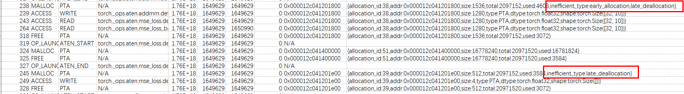

# 低效内存识别案例
## 概述
本案例介绍了内存工具msmemscope的低效内存识别功能，msmemscope针对op算子粒度支持过早申请（Early Allocation）、过迟释放（Late Deallocation）、临时闲置（Temporary Idleness）三种低效内存的识别，有助于用户优化显存使用。

## 前期准备
请参见[安装指南](docs/zh/install_guide.md)安装msmemscope工具。

此外在运行本样例中的python场景时，需要配置torch以及torch_npu，具体请参见[Pytorch框架训练环境准备](https://www.hiascend.com/document/detail/zh/Pytorch/720/configandinstg/instg/insg_0001.html)文档。

## 执行样例
### 参数说明
以下仅提供本功能样例中使用到的参数解释。其他参数的详细说明请参见[API参考](docs/zh/api.md)。
| 参数 | 可选/必选 | 说明 |
|------|-----------|------|
| analysis| 可选 | 启用相关内存分析功能。默认值为leaks，开启低效内存识别需添加inefficient参数。 |


### 低效内存识别
1.配置阶段：使用接口方式需要提前配置环境变量LD_PRELOAD和LD_LIBRARY_PATH，需要用户根据内存工具安装目录进行更改。
```bash
TOOL_PATH='msmemscope_path'
export LD_PRELOAD=${TOOL_PATH}/lib64/libleaks_ascend_hal_hook.so:${TOOL_PATH}/lib64/libascend_mstx_hook.so:${TOOL_PATH}/lib64/libascend_kernel_hook.so
export LD_LIBRARY_PATH=${TOOL_PATH}/lib64/:${LD_LIBRARY_PATH}
```
在用户脚本中可以添加memscope.config()以及memscope.start()和memscope.stop()来控制采集项和采集范围，这里仅提供最基础的样例，参考test_inefficient.py。其他可配置的采集参数请参见[API参考](docs/zh/api.md)。

2.运行阶段：
```bash
cd ./example/inefficient
bash test_inefficient.sh
```

## 结果说明
识别出的低效内存信息会附加于dump文件中，如下图所示：



