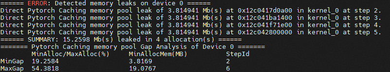

# 内存泄漏分析案例

## 概述
本案例介绍了内存工具msmemscope的内存泄漏分析功能，目前主要用于处理Step内发生的显存泄漏。Step内的内存问题主要包括内存泄漏、踩踏、内存碎片，这些问题会致使内存使用过多或者内存池空闲。

## 前期准备
请参见[安装指南](docs/zh/install_guide.md)安装msmemscope工具。

此外在运行本样例中的python场景时，需要配置torch以及torch_npu，具体请参见[Pytorch框架训练环境准备](https://www.hiascend.com/document/detail/zh/Pytorch/720/configandinstg/instg/insg_0001.html)文档。

## 执行样例
### 参数说明
以下仅提供本功能样例中使用到的参数解释。其他参数的详细说明请参见[API参考](docs/zh/api.md)。
| 参数 | 可选/必选 | 说明 |
|------|-----------|------|
| data_format | 可选 | 指定落盘文件的格式，默认为csv格式，可更改为db格式。 |
| output | 可选 | 指定落盘文件的位置，默认为当前目录下。 |
| events | 可选 | 设置采集的内存事件，默认值为alloc，free，launch。使用内存泄漏分析功能时，需确保events参数中包含alloc和free。 |


### Python场景接口方式泄漏分析
在python场景下，推荐使用接口方式进行泄漏分析。

1.配置阶段：使用接口方式需要提前配置环境变量LD_PRELOAD和LD_LIBRARY_PATH，需要用户根据内存工具安装目录进行更改。
```bash
TOOL_PATH='msmemscope_path'
export LD_PRELOAD=${TOOL_PATH}/lib64/libleaks_ascend_hal_hook.so:${TOOL_PATH}/lib64/libascend_mstx_hook.so:${TOOL_PATH}/lib64/libascend_kernel_hook.so
export LD_LIBRARY_PATH=${TOOL_PATH}/lib64/:${LD_LIBRARY_PATH}
```
在用户脚本中可以添加memscope.config()以及memscope.start()和memscope.stop()来控制采集项和采集范围，在step结束处添加memscope.step()标识一个step的结束。这里仅提供最基础的样例，参考test_leaks.py。其他可配置的采集参数请参见[API参考](docs/zh/api.md)。

2.运行阶段：
```bash
cd ./example/leaks/python
bash test_leaks.sh
```


### 非Python场景命令行方式泄漏分析
在非python场景下，可以使用命令行方式进行泄漏分析。

1.编译阶段：编译前，请确保source了安装的cann包。在用户脚本可以通过mstx打点并使用信息"step start"标识step，详情可参考样例文件。执行如下命令完成用例编译：
```bash
cd ./example/collect/c
make
```

2.运行阶段
```bash
msmemscope ./test_kernel.fatbin
```

## 结果说明
对于step内出现的内存池泄漏（如pytorch内存池，mindspore内存池等）会直接打屏显示：



同时也会输出内存波动来辅助分析模型的激活值占用情况，对于HAL层面出现的泄漏会在落盘的log文件中展示。

